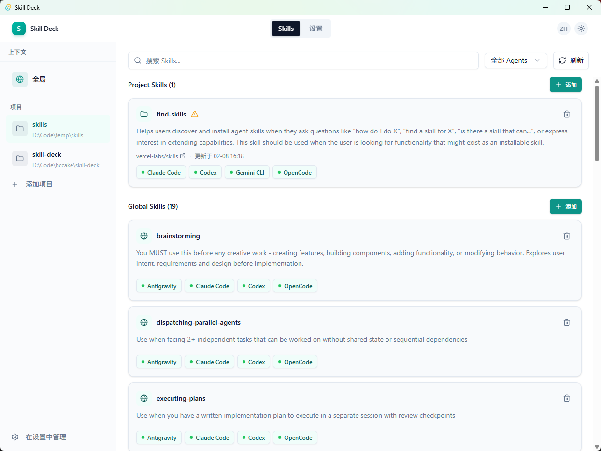

<div align="center">
  <!-- TODO: 添加 Logo -->
  <!--  -->
  <h1>Skill Deck</h1>
  <p>
    <strong>兼容 skills CLI 的原生桌面界面</strong>
  </p>

  <p>
    
    
    
  </p>

  

  <a href="README.md">English</a>
</div>

---

Skill Deck 是一款轻量级的原生桌面应用，用于管理和浏览 **Skills**——[`vercel-labs/skills`](https://github.com/vercel-labs/skills) 的图形化辅助工具。

**核心特点：**
- **原生 Rust 实现** — 不调用 `skills` CLI 二进制文件，无需 Node.js
- **完全兼容** — 使用相同的配置格式；CLI 和 GUI 可以互换使用
- **辅助工具，非替代品** — 自由切换 CLI 和 GUI，或同时使用两者

目标很简单：让 Skills 更容易检视、理解和应用到不同的项目和编辑器中——而不改变 Skills 本身的工作方式。

---

## ✨ 特性

- 🗂 **统一视图** — 在一处浏览所有已安装的 Skills
- 🌍 **全局与项目级作用域** — 在全局或项目级别管理 Skills
- 🧠 **清晰可见** — 一目了然地了解每个 Skill 的应用位置
- 🔄 **多编辑器支持** — 自动检测已安装的编辑器（VS Code、Cursor、Windsurf 等），并在多个编辑器间同步 Skills
- 📦 **双安装模式** — 安装 Skills 时可选择 Symlink（符号链接）或 Copy（文件复制）
- 🔍 **发现与安装** — 从 GitHub 仓库或本地路径安装 Skills
- 🌐 **双语界面** — 支持中英文界面切换
- ⚡ **快速轻量** — 基于 Tauri v2 构建，启动迅速，资源占用低

> ⚠️ 底层模型不支持禁用 Skill。Skills 只能安装或移除。

---

## 📦 安装

### 方式一：下载预编译包（推荐）

从 [GitHub Releases](https://github.com/hccake/skill-deck/releases) 下载对应平台的安装包：

- **Windows**: `Skill-Deck_x.x.x_x64_en-US.msi`
- **macOS**: `Skill-Deck_x.x.x_universal.dmg`（支持 Intel 和 Apple Silicon）
- **Linux**: `skill-deck_x.x.x_amd64.deb` 或 `skill-deck-x.x.x-1.x86_64.rpm`

> ⚠️ **Early Alpha 提示**：Skill Deck 当前处于早期开发阶段（v0.x.x），功能和 API 可能频繁变动。
> - ✅ 用于测试和反馈
> - ⚠️ 使用前备份重要配置
> - ❌ 暂不建议在生产环境使用

### 方式二：从源码构建

**前置要求**：
- Node.js >= 18
- pnpm >= 8
- Rust >= 1.70
- 系统依赖：见 [Tauri 前置条件](https://tauri.app/v2/guides/prerequisites)

```bash
# 克隆仓库
git clone https://github.com/hccake/skill-deck.git
cd skill-deck

# 安装依赖
pnpm install

# 开发模式运行
pnpm tauri dev

# 构建生产版本
pnpm tauri build
```

构建产物位于 `src-tauri/target/release/bundle/`。

---

## 🚀 快速开始

### 1. 添加项目

点击左侧栏 "Projects" 右侧的 `+` 按钮，选择你的代码项目目录。

### 2. 准备技能来源

找到你想安装的 Skill 的 GitHub 仓库地址或本地路径。例如：
- `https://github.com/vercel-labs/skills`
- `vercel-labs/skills`（GitHub 简写）
- `/path/to/local/skill`（本地路径）

你也可以直接粘贴 `skills` CLI 的安装命令 —— Skill Deck 会自动解析其中的来源地址、技能名称和目标 Agent：

```bash
npx skills add vercel-labs/agent-skills --skill frontend-design -a claude-code
```

### 3. 安装技能

点击 "Global Skills" 或任意项目右侧的 `+ Add` 按钮 → 输入技能来源（或粘贴 CLI 命令）→ 选择目标编辑器（VS Code / Cursor 等）→ 选择安装模式（Symlink / Copy）→ 确认安装。

粘贴 CLI 命令时，命令中的 `--skill` 和 `--agent` 参数会自动预选到向导中，你仍可以在确认前修改选择。

### 4. 在编辑器中使用

安装完成后，在对应编辑器中打开项目，Skill 将自动加载到 AI 助手的技能列表中。

---

## 📄 许可证

[MIT License](LICENSE)

---

## 🙏 致谢

- [vercel-labs/skills](https://github.com/vercel-labs/skills) — 原始 CLI 工具
- [Tauri](https://tauri.app/) — 跨平台桌面应用框架
