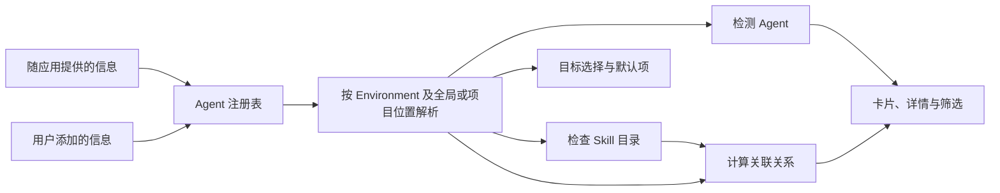

# Agent 模型

AI Agent 是能够根据任务目标和当前上下文决定后续步骤、调用工具并执行操作的 AI 智能体。它独立于 Skill Deck 安装和运行；Skill Deck 只记录各类 Agent 的 Skill 读取位置和 Agent 检测位置，再根据当前 Environment 和 Skill 位置解析实际路径与状态。随应用提供的信息和用户添加的信息进入同一个注册表，并使用同一套读取、检测和关联规则。

Skill 读取位置说明 Agent 在全局或具体 Project 中查找 Skill 时会扫描哪些目录，Agent 检测位置说明 Skill Deck 可以通过哪些文件或目录推测该 Agent 是否安装。系统分别计算检测结果、目录检查结果和关联关系：检测结果说明当前 Environment 是否命中检测条件；目录检查结果说明指定位置是否存在有效 Skill；关联 Agent 则是按照读取规则能够读取某个 Skill 的外部 Agent。界面从关联 Agent 中选出已经检测到的 Agent，用于卡片、详情和筛选。

## Agent 注册表

运行时注册表由随应用提供的信息和有效的用户添加信息合并而成。`AgentId` 使用开放的 kebab-case 字符串。如果某个 Agent 尚未随应用收录，用户可以自行添加其 Skill 读取位置和 Agent 检测位置，无需等待 Skill Deck 更新。

| 信息来源 | 维护方式 | 维护权限 | Skill 工作流 |
|---|---|---|---|
| 随应用提供 | 随应用维护；参考第三方 `skills` CLI 的变化，并以对应 Agent 的官方资料和实际行为为主要依据 | 只读 | 与用户添加的信息相同 |
| 用户添加 | 用户在本机添加和维护 | 可以添加、编辑和删除 | 与随应用提供的信息相同 |

信息来源决定维护权限。安装、更新、移除、复制、管理 Agent、检测、关联和默认目标都使用同一份注册表快照与同一套规则。

第三方 `skills` CLI 的 Agent 注册表用于发现可能出现的 Agent、路径和适配方式。Skill Deck 在更新随应用提供的信息前，需要核对对应 Agent 的官方资料和实际行为；确认后的 Skill 读取位置和 Agent 检测位置再按桌面端工作流纳入自身注册表。具体参考原则见[skills CLI 参考与兼容](./skills-cli-reference.md#参考-cli-中的-agent-信息和新功能)。

表单和变更会记录打开时的注册表版本。注册表发生实际变化后，用户需要重新确认；保存等价信息不会改变版本。用户添加的信息无法读取时，应用继续展示随应用提供的信息，并将加载失败的内容单独标记为不可用。

## Skill 读取位置与 Agent 检测位置

Skill Deck 为每个 Agent 保存以下跨 Environment 共享的稳定内容：

- `id` 与 `displayName`；
- Agent 在全局和具体 Project 中分别使用的 Skill 读取位置；
- 每种读取场景是否扫描通用 Skill 目录、Agent 专用 Skill 目录或两者；
- 一个或多个用于判断 Agent 是否安装的检测位置；
- 随应用提供的别名、旧版路径和适配信息。

通用 Skill 目录包括全局的 `~/.agents/skills` 和项目根目录下的 `.agents/skills`。这些位置在 Agent Skills 生态中被广泛用作 Skill 的存放位置，但不属于 Agent Skills 格式规范。Skill Deck 根据 Agent 在全局和 Project 中的扫描规则，判断它是否会从这些位置读取 Skill，并据此计算 Agent 与 Skill 的关联关系。Skill Deck 与第三方 `skills` CLI 共用这些位置时的数据兼容规则，见[skills CLI 参考与兼容](./skills-cli-reference.md)。Agent 专用 Skill 目录由具体 Agent 产品规定。

Agent 在全局或 Project 中使用的扫描方式由以下稳定值表示：

| 值 | 含义 |
|---|---|
| `Standard` | 只扫描通用 Skill 目录 |
| `Private` | 只扫描 Agent 专用 Skill 目录 |
| `Both` | 同时扫描两类目录 |

`Standard` 表示 Agent 在对应的全局或 Project 中扫描 `.agents/skills` 目录，不表示其中的 Skill 适用于所有 Agent 或任务。

Agent 在全局和 Project 中分别声明支持情况和扫描方式，`Both` 表示该 Agent 在其中一种场景下同时扫描通用 Skill 目录和 Agent 专用 Skill 目录。界面使用相应的中文说明，并分开展示检测结果和目录检查结果。

注册表中的 Skill 读取位置和 Agent 检测位置在所有 Environment 间共享。实际路径、检测结果和目录状态在当前 Environment 中解析；切换 Environment 后，同一份声明会得到新的运行时结果。符号链接或复制属于每次 Skill 安装和维护操作，见[Skill 生命周期](./skill-lifecycle.md)。

### 自定义路径

用户添加的 Agent 信息支持以下路径声明：

- Agent 在全局读取时使用的 Skill 读取位置，可以相对于当前 Environment 的 Home 或 ConfigHome，也可以使用绝对路径；
- Agent 在 Project 内读取时使用的 Skill 读取位置，以项目根目录为基准并使用相对路径；
- 检测路径可以使用 Home、ConfigHome、项目根目录或绝对路径；
- 项目相对路径只有结合当前已添加项目的记录才能解析为绝对路径，代码通过 `RegisteredProject` 取得这条记录。

绝对路径按其所在的操作系统用户空间解释。与当前 Environment 不匹配的路径声明会被标记为不可用，原始配置继续保留。应用所在系统、Windows/WSL 切换、全局与项目位置和路径解析条件见[Environment、Skill 位置与项目管理](./environments-and-projects.md)。

随应用提供的信息可以包含旧版路径、别名和专用适配信息。用户添加的信息使用前述通用读取位置、路径和检测条件。

## 检测与目录检查

### 检测

检测根据已经记录的位置和条件，推测当前 Environment 中是否可能安装了 Agent：

| 状态 | 含义 |
|---|---|
| 已检测到（`Detected`） | 检测位置和必要的专用检测条件已经命中，推测该 Agent 可能已安装 |
| 未检测到（`NotDetected`） | 检测可以完成，但当前没有命中检测条件 |
| 暂时无法判断（`Indeterminate`） | Environment、项目、路径或相关信息暂时无法可靠检查 |

“已检测到”只说明当前 Environment 中的检测条件已经命中。Agent 卸载后留下的目录或其他同名目录都可能造成误判，因此检测结果不是 Agent 已安装并且能够运行的保证。

检测结果用于提示、排序、默认推荐和界面展示。用户仍可明确选择尚未检测到的用户添加 Agent；已经保存的 Agent ID 不会仅因本次未检测到而被移除。Environment 暂时不可用时，检测结果为“暂时无法判断”（`Indeterminate`）。

### 目录检查

目录检查分别读取当前全局或项目位置中的通用 Skill 目录和 Agent 专用 Skill 目录。目标可读且包含有效 `SKILL.md` 时，该位置确认存在当前 Skill。符号链接、junction 和普通目录使用同一套有效性判断；失效链接、指向文件的目录链接、不可读取目标和缺少有效 `SKILL.md` 的目录返回无效结果。

目录检查只说明一个具体位置的状态。界面将读取方式、目录状态、Agent 可用性和维护异常分开展示。

### 关联 Agent

关联 Agent 表示在当前 Environment 和 Skill 位置中，按读取规则能够读取某个 Skill 的 Agent。Agent 必须支持这个 Environment 和 Skill 位置，并满足以下条件之一：

- Agent 读取通用 Skill 目录，且该目录中存在当前 Skill；
- Agent 专用 Skill 目录中存在当前 Skill，无论内容通过有效链接还是普通目录提供。

关联关系由 Agent 的读取规则和当前目录检查结果决定，与检测状态无关。专用安装目标同样需要检查实际目标位置，并在关联关系中保留所属 Agent ID。

### 界面展示与筛选

读取通用 Skill 目录的 Agent 数量较多。为了让卡片和详情保持紧凑，界面只展示关联 Agent 中当前已检测到的 Agent；未展示的 Agent 仍然属于关联 Agent。Agent 筛选也使用这组已经检测到的关联 Agent 匹配 Skill。

筛选候选和关联关系分别计算。筛选候选来自当前 Environment 和 Skill 位置中已经检测到的运行时 Agent，即使当前没有 Skill 与它关联，也可以出现在筛选器中。切换或重新加载期间，已经选择的 Agent 可以暂时保留；目标位置确认不支持该 Agent 后，前端清除筛选条件。空结果表示当前筛选条件下没有 Skill，Agent 自身状态仍由检测结果表达。

## Agent 选择与安装位置分组

安装和管理 Agent 使用同一份选择快照。每个标准 Agent 都明确声明自己读取通用 Skill 目录、Agent 专用 Skill 目录或两者都读取。界面按读取方式组织信息：

- 读取通用 Skill 目录的 Agent 显示在第一个自动可用信息区；同时读取两类目录的 Agent 也属于这一组；
- 只读取专用 Skill 目录的 Agent 对应“选择后可使用”中的安装选项；
- 同时读取两类目录的 Agent 只有在专用 Skill 目录还能形成独立安装位置时，才会在自动可用信息区下提供“同时写入 Agent 专用 Skill 目录（可选）”设置。

每个安装选项对应一个可以独立选择和写入的 Agent 专用 Skill 目录。多个 Agent 的专用目录指向同一文件系统位置时，后端将它们合并为一个安装选项。界面只显示一个 Checkbox，但保留组内所有 Agent ID；预览和执行阶段也只写入一次。

如果一个合并选项同时包含“只读取专用目录”和“两类目录都读取”的 Agent，该选项只显示在“选择后可使用”区域。其中读取通用 Skill 目录的 Agent 仍然显示在自动可用信息区。

Agent 专用 Skill 目录与当前通用 Skill 目录解析到同一文件系统身份时，后端将该 Agent 视为可直接使用，不再生成单独安装选项或专用目录写入选项。该规则依据实际文件系统身份生效，不依赖保存信息中的路径写法。

管理 Agent 时，应用还会检查每个安装位置中已有的链接、副本、失效链接和无法识别的内容。这些现有状态不会影响选项属于“选择后可使用”还是“同时写入 Agent 自己的 Skill 目录（可选）”。无法识别的现有安装保持只读，避免覆盖不属于当前 Skill 的内容。

安装请求可以携带注册表中尚不存在的 Agent ID。应用保留原始 ID，并在选择内容之前说明本次无法处理这些 Agent。未知 Agent 不显示 Checkbox，也不参与检测分组、安装位置合并和安装方式计算；用户无需在当前流程中手动移除它们，它们不会阻止当前 Skill 的安装，其他有效 Agent 安装项也可以继续执行。

复制与安装使用同一套 Agent 信息、安装选项和选择请求。用户为一个目标 Environment 选择一次 Agent，这套选择会应用到其中的全部目标项目。Backend 根据勾选的安装选项解析目录，并在各项目中生成实际写入路径。检测状态只用于界面提示，不决定复制时是否向 Agent 专用 Skill 目录写入。

物理身份和写入安全见[执行与恢复](./execution-and-recovery.md)；管理 Agent 的业务结果见[Skill 生命周期](./skill-lifecycle.md)。

## 默认目标

每个 Environment 分别保存全局位置和项目位置的默认 Agent ID 集合，安装向导据此生成初始选择。安装向导优先使用本次操作明确指定的 Agent；没有明确指定时读取已有默认目标，缺少默认目标时使用随应用提供的初始推荐。用户可以在本次操作中继续增删目标。Settings 不提供独立的默认目标管理页面。

读取默认值时，应用按照有效注册表以及当前 Environment 和 Skill 位置筛选可用 ID，并保持确定性顺序。检测暂时不可用时，已保存的默认项继续保留。

多个只读取专用 Skill 目录的 Agent 指向同一文件系统位置时，默认设置保存该安装选项中的全部 Agent ID。项目默认设置不包含具体项目路径，因此先依据项目相对配置进行临时分组；用户选择实际项目后，再按真实文件系统位置重新解析。

写入 `skills` CLI 能够识别的选择字段时，只写入当前参考版本已知的 Agent。具体规则见[skills CLI 参考与兼容](./skills-cli-reference.md)。

## Eve 专用安装目标

Eve 使用专用目标模型。在识别为 Eve 的项目中，用户可以选择：

- `eve:root`：项目根 Agent；
- `eve:<subagent>`：已经发现的具名子 Agent。

Eve 目标沿用 Eve 的 Agent ID，并将根 Agent 或子 Agent 作为本次操作的具体位置。安装内容从通用 Skill 目录中该 Skill 的内容快照派生，Project lock 保存目标位置，后续读取和更新依据该记录重新定位目标。

全局安装使用普通 Agent 目标。兼容字段的编码规则见[skills CLI 参考与兼容](./skills-cli-reference.md)。

## 删除用户添加的 Agent 信息

删除用户添加的 Agent 信息前，应用展示已经确认的相关目录、Skill 数量、默认项引用和后续管理影响，并要求输入 Agent ID 二次确认。

删除操作只移除 Skill Deck 保存的 Skill 读取位置和 Agent 检测位置，目录中的 Skill 文件继续保留。信息删除成功后，应用清理当前 Environment 的默认目标引用；清理失败时返回警告，已经完成的删除不会回滚。

## 领域规则

1. 随应用提供和用户添加的 Agent 信息使用同一注册表与 Skill 工作流，信息来源决定维护权限。
2. Agent 在全局和 Project 中分别声明 Skill 读取支持和扫描方式；`Both` 表示该 Agent 在其中一种场景下同时扫描两类 Skill 目录。
3. Agent 的 Skill 读取位置和 Agent 检测位置在所有 Environment 中共享；解析得到的路径和运行状态只在当前会话中使用。
4. 检测结果影响提示、排序、默认推荐和界面展示，不参与决定 Agent 与 Skill 的关联关系；用户明确选择的目标和已经保存的默认项都代表用户意图。
5. 目录检查来自当前 Environment 对实际目录的读取结果。
6. 关联 Agent 按读取规则能够读取目标 Skill，与检测状态无关。
7. 筛选候选可以没有关联 Skill；空筛选结果只说明当前条件下没有 Skill。
8. 指向同一实际目录的目标按文件系统身份分组，同时保留全部 Agent ID。
9. 目标 Agent 表示本次操作目标；筛选候选表示可以用于筛选的 Agent；关联 Agent 表示当前读取关系；界面展示集合表示页面实际列出的 Agent；Agent 专用安装项表示写入 Agent 专用 Skill 目录的链接或副本。
10. 安装请求中的未知 Agent 保留原 ID 并显示为不可用目标，只有注册表中的有效目标可以进入安装计划。
