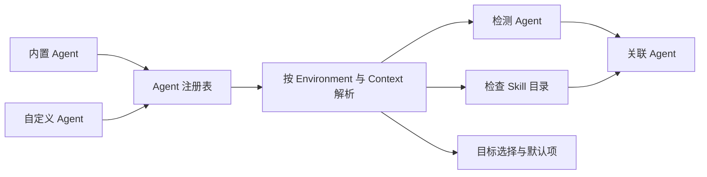

# Agent

Agent 是能够读取或接收 Skill 的 AI 编程助手。Agent 定义声明稳定的读取范围、路径规则和检测条件；当前 Environment 与 Context 再根据这些声明解析出实际结果。内置 Agent（`Built-in`）和自定义 Agent（`Custom`）使用同一个注册表和同一套 Skill 工作流。

Agent 定义说明读取范围和路径规则，检测结果说明当前 Environment 是否发现 Agent，目录检查说明指定位置是否存在有效 Skill，关联 Agent 表示当前能够读取某个 Skill 的 Agent。四类信息分别记录，并由对应工作流使用。

## Agent 注册表

运行时注册表由内置定义和有效的自定义定义合并而成。`AgentId` 使用开放的 kebab-case 字符串，自定义定义可以在软件发布周期之外扩展注册表。

| 来源 | 维护方式 | 定义权限 | Skill 工作流 |
|---|---|---|---|
| `Built-in` | 随项目代码维护，并与上游 `skills` CLI 同步 | 只读 | 与自定义 Agent 相同 |
| `Custom` | 用户在本机创建和维护 | 可以创建、编辑、复制和删除 | 与内置 Agent 相同 |

来源类型决定定义的维护权限。安装、更新、移除、复制、管理 Agent、检测、关联和默认目标都使用同一份注册表快照与同一套规则。

表单和变更会记录打开时的注册表版本。注册表发生实际变化后，用户需要重新确认；保存等价定义保持原版本。定义存储异常时，应用继续展示可确认的内置 Agent，并将加载失败的自定义定义单独标记为不可用。

## Agent 定义

Agent 定义保存跨 Environment 共享的稳定声明：

- `id` 与 `displayName`；
- Global 和 Project 两个范围各自的读取声明；
- 是否读取通用 Skill 目录；
- 需要时，此 Agent 自己的 Skill 目录声明；
- 声明式检测路径；
- 内置 Agent 专用的别名、旧版路径和适配信息。

通用 Skill 目录是当前 Context 中由 Skill Deck 与 `skills` CLI 共同理解的主目录；标准路径见[skills CLI 兼容](./skills-cli-compatibility.md)。此 Agent 的 Skill 目录是 Agent 自己读取 Skill 的位置。

一个范围的读取方式使用以下稳定值：

| 值 | 含义 |
|---|---|
| `Shared` | 只读取通用 Skill 目录 |
| `Private` | 只读取此 Agent 的 Skill 目录 |
| `Both` | 同时读取两个目录 |

Global 与 Project 分别声明支持情况和读取方式，`Both` 表示其中一个范围同时读取两个目录。界面使用相应的中文说明，运行状态仍由检测和目录检查结果表达。

Agent 定义只保存跨 Environment 共享的声明。实际路径、检测结果和目录状态在当前 Environment 中解析；切换 Environment 后，同一份定义会得到新的运行时结果。符号链接或复制属于每次 Skill 安装和维护操作，见[Skill 生命周期](./skill-lifecycle.md)。

### 自定义路径

自定义 Agent 支持以下路径声明：

- Global 路径可以相对于当前 Environment 的 Home 或 ConfigHome，也可以使用绝对路径；
- Project 路径以 Project 根目录为基准，使用相对路径；
- 检测路径可以使用 Home、ConfigHome、Project 根目录或绝对路径；
- 项目相对路径只有结合明确的 `ProjectBinding` 才能解析为绝对路径。

绝对路径按其所在的操作系统用户空间解释。与当前 Environment 不匹配的路径声明返回不可用结果，原始定义继续保留。Environment、Context 和路径解析条件见[Environment 与 Context](./environments-and-contexts.md)。

内置 Agent 可以包含旧版路径、别名和专用适配信息。自定义 Agent 使用前述通用读取范围、路径和检测条件。

## 检测与目录检查

### 检测

检测确认当前 Environment 中是否能够发现 Agent：

| 值 | 含义 |
|---|---|
| `Detected` | 至少一个声明的检测条件得到确认 |
| `Not detected` | 检测可以完成，但当前没有发现 Agent |
| `Indeterminate` | Environment、Project、路径或相关信息暂时无法可靠检查 |

检测结果用于提示、排序和默认推荐。用户仍可显式选择自定义 Agent，已经保存的 Agent ID 继续保留。Environment 暂时不可用时，检测结果为 `Indeterminate`。

### 目录检查

目录检查分别读取当前 Context 的通用 Skill 目录和此 Agent 的 Skill 目录。目标可读且包含有效 `SKILL.md` 时，该位置确认存在当前 Skill。符号链接、junction 和普通目录使用同一套有效性判断；失效链接、指向文件的目录链接、不可读取目标和缺少有效 `SKILL.md` 的目录返回无效结果。

目录检查描述单个位置的结果。读取方式、目录状态、Agent 可用性和维护异常分别表达。

### 关联 Agent

关联 Agent 表示当前确实能够读取某个 Skill 的 Agent。它必须支持当前范围、检测结果为 `Detected`，并满足以下条件之一：

- Agent 读取通用 Skill 目录，且该目录中存在当前 Skill；
- Agent 自己的 Skill 目录中存在当前 Skill，无论内容通过有效链接还是普通目录提供。

关联关系以当前检测结果和目录检查为准。专用适配目标同样检查实际目标位置，并使用所属 Agent ID 表达关系。

### 可供筛选的 Agent

筛选候选和关联 Agent 分别计算。筛选候选来自当前范围可用的运行时 Agent，即使当前没有 Skill 与它关联，也可以出现在筛选器中。

常规筛选候选展示当前已经检测到的 Agent。切换或重新加载期间，已经选择的 Agent 可以暂时保留；目标 Context 确认不支持该 Agent 后，前端清除筛选条件。空结果表示当前筛选条件下没有 Skill，Agent 自身状态仍由检测结果表达。

## 目标选择与目录分组

目标 Agent 表示用户在安装或维护操作中选择的 Agent。它描述本次操作意图，关联 Agent 描述当前已经存在的读取关系。

Agent 选择按当前范围的读取能力解释：

- 读取通用 Skill 目录的 Agent 属于“可直接使用”；`Both` 也属于这一组；
- 只读取自身 Skill 目录的 Agent 属于“需要单独接入”；
- “额外保留”是“可直接使用”Agent 的维护选项，用于继续保留其自身目录中已经存在的目录项。

Agent 目录项是 Agent 自身 Skill 目录中提供 Skill 的链接或副本。多个 Agent 的目录解析到同一文件系统身份时，选择和文件操作按同一组处理，同时保留各自的 Agent ID。分组依据实际文件系统身份，展示路径和链接类型只用于说明当前目录状态。

物理身份和写入安全见[执行与恢复](./execution-and-recovery.md)；管理 Agent 的业务结果见[Skill 生命周期](./skill-lifecycle.md)。

## 默认目标

默认目标按当前 Environment 分别保存 Global 和 Project 的 Agent ID 集合，用于生成安装向导的初始选择。用户可以在本次操作中继续增删目标。

读取默认值时，应用按照有效注册表和当前范围筛选可用 ID，并保持确定性顺序。检测暂时不可用时，已保存的默认项继续保留。

多个需要单独接入的 Agent 解析到同一文件系统身份时，默认设置保存该选择组的全部 Agent ID。Project 默认设置没有具体 Project Context，使用项目相对定义做保守分组；进入实际 Project Context 后再按真实文件系统身份解析。

与 `skills` CLI 共用选择字段时的投影规则见[skills CLI 兼容](./skills-cli-compatibility.md)。

## Eve 适配目标

Eve 使用专用目标模型。在识别为 Eve 的 Project Context 中，用户可以选择：

- `eve:root`：项目根 Agent；
- `eve:<subagent>`：已经发现的具名子 Agent。

Eve 目标沿用 Eve 的 Agent ID，并将根 Agent 或子 Agent 作为本次操作的具体位置。安装内容从主 Skill 内容快照派生，Project lock 保存目标位置，后续读取和更新按该记录恢复。

Global Context 使用普通 Agent 目标。共享字段编码见[skills CLI 兼容](./skills-cli-compatibility.md)。

## 删除自定义 Agent

删除自定义 Agent 前，应用展示当前确认的相关目录、Skill 数量、默认项引用和后续管理影响，并要求输入 Agent ID 二次确认。

删除操作移除 Agent 定义，目录中的 Skill 文件继续保留。定义删除成功后，应用清理当前 Environment 的默认目标引用；清理失败时返回警告，定义删除结果保持有效。

## 领域规则

1. 内置与自定义 Agent 使用同一注册表和 Skill 工作流，来源类型决定定义维护权限。
2. Global 与 Project 独立声明，`Both` 表示其中一个范围同时读取两个目录。
3. Agent 定义在所有 Environment 中共享，解析路径和运行时结果保留在当前会话。
4. 检测结果影响提示、排序和关联 Agent；显式选择和已保存默认项分别保留用户意图。
5. 目录检查来自当前 Environment 对实际目录的读取结果。
6. 关联 Agent 已经检测到，并且当前能够读取目标 Skill。
7. 筛选候选可以没有关联 Skill；空筛选结果只说明当前条件下没有 Skill。
8. 指向同一实际目录的目标按文件系统身份分组，同时保留全部 Agent ID。
9. 目标 Agent、筛选候选、关联 Agent 和 Agent 目录项分别表达操作目标、筛选范围、当前关系和文件系统位置。
