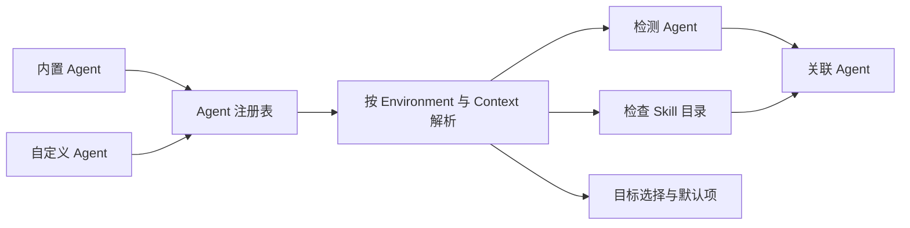

# Agent

Agent 是能够读取或接收 Skill 的 AI 编程助手。Agent 定义声明稳定的读取范围、路径规则和检测条件；当前 Environment 与 Context 再根据这些声明解析出实际结果。内置 Agent（`Built-in`）和自定义 Agent（`Custom`）使用同一个注册表和同一套 Skill 工作流。

定义、检测、目录检查和关联 Agent 回答的是不同问题：定义说明 Agent 能从哪里读取，检测说明当前 Environment 能否观察到它，目录检查确认某个位置是否有有效 Skill，关联 Agent 则说明它当前确实能够读取某个 Skill。这些事实不能合并成一个状态。

## Agent 注册表

运行时注册表由内置定义和有效的自定义定义合并而成。`AgentId` 是开放的 kebab-case 字符串，不是随软件发布扩展的固定枚举。

| 来源 | 维护方式 | 定义权限 | Skill 工作流 |
|---|---|---|---|
| `Built-in` | 随项目代码维护，并与上游 `skills` CLI 同步 | 只读 | 与自定义 Agent 相同 |
| `Custom` | 用户在本机创建和维护 | 可以创建、编辑、复制和删除 | 与内置 Agent 相同 |

来源类型只影响定义的维护权限，不改变安装、更新、移除、复制、`Manage Agents`、检测、关联或默认目标的语义。正常 Skill 工作流使用同一份注册表快照，不把两类 Agent 建模成两套目标。

基于旧注册表事实打开的表单或变更，在注册表发生实际变化后必须重新确认；保存等价定义不应制造新的变化。定义存储异常时，应用保留能够确认的事实：内置定义仍可用时继续提供内置 Agent；无法加载的自定义定义单独标为不可用，不把整个列表伪装成空列表。

## Agent 定义

Agent 定义保存跨 Environment 共享的稳定声明：

- `id` 与 `displayName`；
- Global 和 Project 两个范围各自的读取声明；
- 是否读取通用 Skill 目录；
- 需要时，此 Agent 自己的 Skill 目录声明；
- 声明式检测路径；
- 内置 Agent 专用的别名、旧版路径和适配信息。

通用 Skill 目录是当前 Context 中由 Skill Deck 与 `skills` CLI 共同理解的主目录；标准路径见[skills CLI 兼容](./skills-cli-compatibility.md)。此 Agent 的 Skill 目录是 Agent 自己读取 Skill 的位置。

一个范围的读取方式使用以下稳定值：

| 值 | 含义 |
|---|---|
| `Shared` | 只读取通用 Skill 目录 |
| `Private` | 只读取此 Agent 的 Skill 目录 |
| `Both` | 同时读取两个目录 |

Global 与 Project 分别声明是否支持以及如何读取；`Both` 只描述其中一个范围，不会把两个范围合并。界面可以使用更短的中文说明，但不能把这些内部值当成 Agent 的运行状态。

定义不保存某个 Environment 的解析路径、检测结果、目录检查结果或运行时能力。切换 Environment 后重新解析同一份定义，不为每个 WSL 发行版复制 Agent 定义。定义也不包含 `symlink` 或 `copy`；落盘方式属于每次 Skill 安装或维护操作，见[Skill 生命周期](./skill-lifecycle.md)。

### 自定义路径

自定义 Agent 使用受控的路径声明：

- Global 路径可以相对于当前 Environment 的 Home 或 ConfigHome，也可以使用绝对路径；
- Project 路径只能相对于 Project 根目录，不能使用绝对路径；
- 检测路径可以使用 Home、ConfigHome、Project 根目录或绝对路径；
- 项目相对路径只有结合明确的 `ProjectBinding` 才能解析为绝对路径。

绝对路径属于一个操作系统用户空间。Windows Host 路径不会自动转换为 WSL 路径，Linux/macOS 路径也不会转换为 Windows 路径。不适用于当前 Environment 的声明返回不可用结果，不改写原始定义。Environment、Context 和路径解析条件见[Environment 与 Context](./environments-and-contexts.md)。

内置 Agent 可以使用兼容旧版本的路径、别名和专用适配信息；这些兼容细节不开放为普通自定义 Agent 的可配置字段。

## 检测与目录检查

### 检测

检测判断当前 Environment 中是否能观察到 Agent：

| 值 | 含义 |
|---|---|
| `Detected` | 至少一个声明的检测条件得到确认 |
| `Not detected` | 检测可以完成，但当前没有发现 Agent |
| `Indeterminate` | Environment、Project、路径或相关信息暂时无法可靠检查 |

检测结果用于提示、排序和默认推荐，不删除 Agent ID，也不阻止用户显式选择自定义 Agent。Environment 暂时不可用时保持 `Indeterminate`，不能降级成“未安装”。

### 目录检查

目录检查分别观察当前 Context 的通用 Skill 目录和此 Agent 的 Skill 目录。只有目标可读取且包含有效 `SKILL.md`，才确认该位置存在当前 Skill。有效的 symlink、junction 和普通目录使用相同的 Skill 有效性判断；失效链接、指向文件的目录链接、不可读取目标或缺少有效 `SKILL.md` 的目录，都不能证明 Agent 可以读取该 Skill。

目录检查只描述单个位置，不聚合成名为 `Presence` 的产品状态。读取方式、目录事实、可用结果和维护异常保持独立表达。

### 关联 Agent

关联 Agent 表示当前确实能够读取某个 Skill 的 Agent。它必须支持当前范围、检测结果为 `Detected`，并满足以下条件之一：

- Agent 读取通用 Skill 目录，且该目录中存在当前 Skill；
- Agent 自己的 Skill 目录中存在当前 Skill，无论内容通过有效链接还是普通目录提供。

尚未建立单独接入、检测为 `Not detected` 或 `Indeterminate`、不支持当前范围，或者相关目录不可读取的 Agent，不属于当前 Skill 的关联 Agent。专用适配目标也根据实际目标是否存在有效 Skill 判断，并继续使用所属 Agent ID 表达关系。

实现中传给前端的 `associatedAgents` 是公共字段名，不是新的产品状态；长期文档只使用“关联 Agent”这一领域含义。

### 可供筛选的 Agent

可供筛选的 Agent 与关联 Agent 不是同一个集合。筛选候选来自当前范围的运行时 Agent 集合，只要 Agent 在当前范围可用，就可以出现在筛选器中，即使当前没有任何 Skill 与它关联。

常规筛选候选只展示当前已经检测到的 Agent。已经选择的 Agent 在切换或重新加载期间暂时无法检测时可以保留，以免用户意图突然消失；目标 Context 不支持该 Agent 时，前端才清除筛选条件。筛选结果为空只表示当前条件下没有 Skill，不表示 Agent 不存在或不可用。

## 目标选择与目录分组

目标 Agent 表示用户准备在安装或维护操作中选择的 Agent，不等于当前已经关联 Skill 的 Agent。

Agent 选择按当前范围的读取能力解释：

- 读取通用 Skill 目录的 Agent 属于“可直接使用”；`Both` 也属于这一组；
- 只读取自身 Skill 目录的 Agent 属于“需要单独接入”；
- “额外保留”不是第三种类型，而是“可直接使用”Agent 的维护选项，用于继续保留其自身目录中已经存在的目录项。

Agent 目录项是 Agent 自己的 Skill 目录中用于提供 Skill 的链接或副本。多个 Agent 的目录解析到同一文件系统身份时，它们仍是不同 Agent，但选择和文件操作必须作为同一组处理。分组以实际文件系统身份为准，不能从展示路径、symlink 或 junction 类型推断。

物理身份和写入安全由[执行与恢复](./execution-and-recovery.md)负责；Manage Agents 的业务结果见[Skill 生命周期](./skill-lifecycle.md)。

## 默认目标

默认目标按当前 Environment 分别保存 Global 和 Project 的 Agent ID 集合，只影响安装向导的初始选择，不限制用户本次操作中的显式增删。

读取默认值时，应用按照有效注册表和当前范围过滤已经不存在或不支持的 ID，并保持确定性顺序。检测暂时不可用不会删除已保存的默认项，避免用户的选择丢失。

多个需要单独接入的 Agent 解析到同一文件系统身份时，默认设置保存该选择组的全部 Agent ID。Project 默认设置没有具体 Project Context，使用项目相对定义做保守分组；进入实际 Project Context 后再按真实文件系统身份解析。

与 `skills` CLI 共用选择字段时的投影规则见[skills CLI 兼容](./skills-cli-compatibility.md)。

## Eve 适配目标

Eve 是内置 Agent 中的专用适配器，只在被识别为 Eve 的 Project Context 中提供具体目标：

- `eve:root` 表示项目 root agent；
- `eve:<subagent>` 表示已经发现的具名 subagent；
- Global Context 不提供 Eve 目标；
- 目标进入统一的 Agent 写入意图，不展开为新的 Agent ID。

Eve 目标使用从主 Skill 内容快照派生的兼容内容，不改变原内容快照的身份。Project lock 保存 root/subagent 的位置，后续读取和更新按该元数据恢复目标；共享字段编码见[skills CLI 兼容](./skills-cli-compatibility.md)。

## 删除自定义 Agent

删除自定义 Agent 前，应用根据当前可用事实展示受影响的目录、Skill 数量、默认项引用和失去管理能力的风险，并要求输入 Agent ID 二次确认。

删除只移除定义，不删除对应目录中的 Skill 文件。定义删除成功后，应用尝试清理当前 Environment 的默认目标引用；清理失败返回警告，但不撤销已经确认的定义删除。

## 领域不变量

1. 内置与自定义 Agent 使用同一注册表和 Skill 工作流；来源只影响定义维护权限。
2. Global 与 Project 独立声明，`Both` 只描述一个范围的读取能力。
3. 定义在所有 Environment 共享，解析路径和运行时观察结果不写回定义。
4. 检测影响提示、排序和关联 Agent，但不决定显式选择或默认 ID 的存续。
5. 目录检查来自当前 Environment 的实际观察，不由 lock 或检测结果猜测。
6. 关联 Agent 必须已经检测到，并且当前确实能够读取 Skill。
7. 筛选候选可以没有关联 Skill；筛选为空不等于 Agent 不存在。
8. 指向同一实际目录的目标按文件系统身份分组，同时保留全部 Agent ID。
9. 目标 Agent、筛选候选、关联 Agent 和 Agent 目录项表达不同事实，不能互换。
