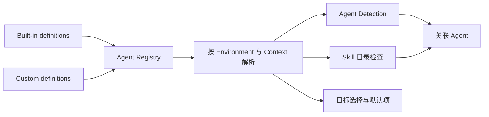

# Agent

Agent 表示读取或接收 Skill 的 AI coding agent。Agent definition 声明稳定的读取能力、路径规则和检测条件；当前 Environment 与 Context 将这些声明解析为 runtime facts。Built-in 与 Custom Agent 进入同一个 Registry，并在 Skill 工作流中使用相同的领域规则。

Definition、Detection、目录检查和关联 Agent 回答不同问题：definition 声明 Agent 能够从哪里读取，Detection 判断当前 Environment 中能否观察到 Agent，目录检查确认某个位置是否存在有效 Skill，关联 Agent 则表示当前实际能够读取该 Skill 的 Agent。这些事实不能合并成一个状态。

## Agent Registry

运行时 Registry 由 Built-in definitions 与有效的 Custom definitions 合并而成。`AgentId` 是开放的 kebab-case string，不是随软件发布扩展的闭合枚举。

| 来源 | 维护方式 | 定义权限 | Skill 工作流 |
|---|---|---|---|
| Built-in | 随项目代码维护，并与 vendored skills CLI 同步 | 只读 | 与 Custom 相同 |
| Custom | 用户在本机创建和维护 | 可以创建、编辑、复制和删除 | 与 Built-in 相同 |

来源类型不改变安装、更新、移除、复制、Manage Agents、Detection、关联 Agent 或默认目标语义。正常 Skill 工作流消费统一的 Registry snapshot，不把 Built-in 与 Custom 建模为两套目标。

Registry revision 是全部 active definitions 的内容指纹。只有有效定义的内容发生变化时 revision 才变化；保存等价定义不会机械生成新 revision。仍基于旧 revision 的表单或 mutation 必须刷新，不能覆盖新状态。应用启动时从 definition storage 重新加载记录，但不承诺运行期间直接修改存储文件能够热更新 Registry。

Definition storage 异常按可用事实处理：

- 存储位置无法初始化时，应用不能构造可信 Registry，Registry 进入不可用状态；
- 存储位置已确定但 Custom definitions 无法加载时，Built-in definitions 仍然有效，Custom storage 进入只读状态；
- 单条 Custom definition 无效时，其他有效 definitions 继续进入 Registry，并保留该无效记录的处理入口。

## Agent Definition

Agent definition 保存跨 Environment 共享的稳定声明：

- `id` 与 `displayName`；
- Global 和 Project 两套独立 scope definition；
- 是否读取通用 Skill 目录；
- 需要时，此 Agent 的 Skill 目录声明；
- declarative detection paths；
- Built-in 专用的 alias、legacy path 和 adapter metadata。

通用 Skill 目录是当前 Context 中由 Skill Deck 与 skills CLI 共同理解的主 Skill 位置，其标准路径见[skills CLI 兼容](./skills-cli-compatibility.md)。此 Agent 的 Skill 目录是该 Agent 自己读取 Skill 的位置。一个 scope 的内部读取模式包括：

| 模式 | 读取能力 |
|---|---|
| `Shared` | 仅读取通用 Skill 目录 |
| `Private` | 仅读取此 Agent 的 Skill 目录 |
| `Both` | 同时读取两个目录 |

Global 与 Project 分别声明是否支持和如何读取；`Both` 只描述其中一个 scope，不会把两个 scope 合并。用户界面可以使用符合上下文的简短文案，但不能把这些内部模式展示成 Agent 的运行状态。

Definition 不保存某个 Environment 的 resolved path、Detection 结果、目录检查结果或 runtime capability。切换 Environment 后重新解析同一份 definition，不为每个 WSL 发行版复制 Agent catalog。

Definition 也不包含 `symlink` 或 `copy`。Materialization mode 属于每次 Skill 安装或维护操作，见[Skill 生命周期](./skill-lifecycle.md)。

### Custom Path

Custom Agent 使用受控 path declaration：

- Global 路径可以相对于当前 Environment 的 Home 或 ConfigHome，也可以使用 absolute path；
- Project 路径只能相对于 Project root，不能使用 absolute path；
- Detection path 可以使用 Home、ConfigHome、Project root 或 absolute path；
- Project-relative path 只有结合明确的 `ProjectBinding` 才能解析为绝对路径。

Absolute path 属于一个操作系统用户空间。Windows Host path 不自动转换为 WSL path，Linux/macOS path 也不转换为 Windows path。不适用于当前 Environment 的声明返回 unavailable，不会改写原 definition。Environment、Context 和路径解析条件见[Environment 与 Context](./environments-and-contexts.md)。

Custom Agent 使用受控的 Standard adapter 和 `AnyPathExists` Detection。`FirstExisting`、environment-variable fallback、legacy migration、alias 和专用 adapter 属于 Built-in compatibility metadata，不开放为普通 Custom definition 字段。

## Detection 与目录检查

### Detection

Detection 判断当前 Environment 中是否观察到 Agent：

| 状态 | 含义 |
|---|---|
| `Detected` | 至少一个声明的检测条件得到确认 |
| `Not detected` | 检测条件可以检查，但当前没有发现 Agent |
| `Indeterminate` | Environment、Project Context、路径或 metadata 暂时无法可靠检查 |

Detection 用于提示、排序和默认推荐，不删除 Agent ID，也不阻止用户显式选择 Custom Agent。Environment 暂时不可用时结果保持 `Indeterminate`，不能降级成“未安装”。

### 目录检查结果

目录检查分别观察当前 Context 的通用 Skill 目录和此 Agent 的 Skill 目录。只有目标可读取且包含有效 `SKILL.md` 时，才确认该位置存在当前 Skill。有效 symlink、junction 和普通目录使用相同的 Skill 有效性判断；broken link、指向文件的目录链接、不可读取目标或缺少有效 `SKILL.md` 的目录都不能证明 Agent 可以读取该 Skill。

目录检查结果只描述单个位置，不聚合成名为 `Presence` 的产品或领域状态。读取方式、目录情况、可用结果和维护异常保持独立表达。

### 关联 Agent

关联 Agent 表示当前实际能够读取某个 Skill 的 Agent。Agent 必须支持当前 scope、Detection 为 `Detected`，并满足以下任一条件：

- Agent 读取通用 Skill 目录，并且该目录中存在当前 Skill；
- 此 Agent 的 Skill 目录中存在当前 Skill，无论内容通过有效链接还是普通目录提供。

尚未建立单独接入、`Not detected`、`Indeterminate`、不支持当前 scope，或者相关目录不可读取的 Agent 不属于当前 Skill 的关联 Agent。专用 adapter 根据其实际 target 是否存在有效 Skill 判断，并继续使用所属 Agent ID 表达关系。

## 目标选择与目录分组

目标 Agent 表示用户准备在安装或维护操作中选择的 Agent，不等于当前已经能够读取 Skill 的关联 Agent。

Agent 选择按当前 scope 的读取能力解释：

- 读取通用 Skill 目录的 Agent 属于“可直接使用”；`Both` 也属于这一组；
- 只读取此 Agent 的 Skill 目录的 Agent 属于“需要单独接入”；
- “额外保留”不是第三种 Agent 类型，而是“可直接使用”Agent 的维护选项，用于继续保留其自身目录中已经存在的 Agent 目录项。

Agent 目录项表示此 Agent 的 Skill 目录中用于提供 Skill 的链接或副本。多个 Agent 的目录解析到同一 filesystem identity 时，它们仍是不同 Agent，但涉及该目录的选择和文件操作必须作为同一组处理。目录分组以实际 filesystem identity 为准，不能从展示路径、symlink 或 junction 类型推断。

Physical identity 和实际写入安全由[执行与恢复](./execution-and-recovery.md)负责；Manage Agents 的业务结果见[Skill 生命周期](./skill-lifecycle.md)。

## 默认目标

默认目标按当前 Environment 分别保存 Global 和 Project 的 Agent ID 集合，只影响安装向导的初始选择，不限制用户本次操作中的显式增删。

读取默认值时，应用按照 active Registry 和当前 scope 过滤已经不存在或不支持的 ID，并保持确定性顺序。Detection 不删除已保存默认项，避免 Agent 暂时无法检测时丢失用户选择。

多个需要单独接入的 Agent 解析到同一 filesystem identity 时，默认设置保存该选择组的全部 Agent ID。Project 默认设置没有具体 Project Context，使用 Project-relative definition 做保守分组；进入实际 Project Context 后再按真实 filesystem identity 解析。

与 skills CLI 共用选择字段时的投影规则见[skills CLI 兼容](./skills-cli-compatibility.md)。

## Eve Adapter Target

Eve 是 Built-in Agent 中的专用 adapter，只在被识别为 Eve 的 Project Context 中提供具体目标：

- `eve:root` 表示项目 root agent；
- `eve:<subagent>` 表示已经发现的具名 subagent；
- Global Context 不提供 Eve target；
- target 进入统一 Agent write intent，不展开为新的 Agent ID。

Eve target 使用从主 Skill payload 派生的兼容内容，不改变原 payload identity。Project lock 保存 root/subagent placement，后续读取和更新按该 metadata 恢复目标；共享字段编码见[skills CLI 兼容](./skills-cli-compatibility.md)。

## Custom Agent 删除

删除 Custom Agent 前，应用根据当前可用事实展示受影响的目录、Skill 数量、默认项引用和失去管理能力的风险，并要求 Agent ID 二次确认。

删除只移除 definition，不删除对应目录中的 Skill 文件。Definition 删除成功后，应用尝试清理当前 Environment 的默认目标引用；清理失败返回警告，但不撤销已经确认的 definition 删除。

## 领域不变量

1. Built-in 与 Custom 使用同一 Registry 和 Skill workflow；来源只影响定义维护权限。
2. Global 与 Project scope 独立声明，`Both` 只描述一个 scope 的读取能力。
3. Definition 在所有 Environment 共享，resolved path 和 runtime observation 不写回 definition。
4. Detection 影响提示、排序和关联 Agent，不决定显式选择或默认 ID 的存续。
5. 目录检查来自当前 Environment 的实际观察，不由 lock 或 Detection 猜测。
6. 关联 Agent 必须已经检测到并且当前确实能够读取 Skill。
7. 指向同一实际目录的目标按 filesystem identity 分组，同时保留全部 Agent ID。
8. 目标 Agent、关联 Agent 和 Agent 目录项表达不同事实，不能互换。
