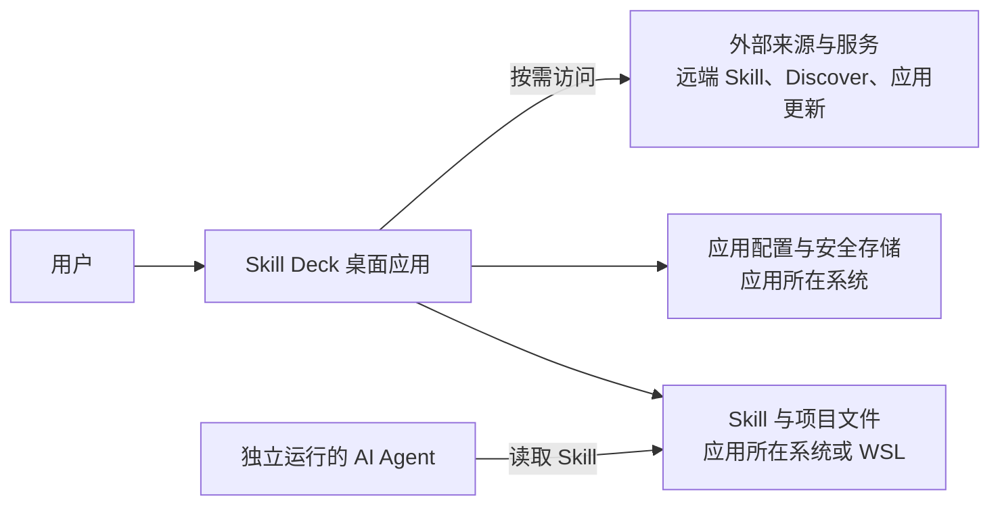
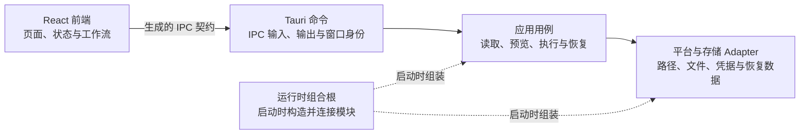

# 系统架构

Skill Deck 是一款运行在用户电脑上的跨平台桌面应用，支持 Windows、macOS 和 Linux。Skill 和项目的读取与管理在应用所在操作系统中完成；Windows 用户切换到 WSL 后，则在所选发行版中完成。浏览 Discover、获取远端 Skill 或检查更新时，应用会按需访问相应的外部服务。

系统边界、模块职责、主要调用关系、窗口与进程、平台适配模块（Adapter）、数据归属和安全保证由本文件维护。用户可见行为、领域规则和具体写入协议见相应主文档。

## 架构目标

- Windows、macOS 和 Linux 复用相同的业务用例，路径和文件操作由对应平台 Adapter 实现；
- Windows 可以把文件操作切换到用户选择的 WSL 发行版，桌面应用仍然运行在 Windows 中；
- 外部 AI Agent 独立读取约定位置中的 Skill；第三方 `skills` CLI 和 Skill Deck 使用相同的通用 Skill 存放位置和兼容的 lock 数据，各自独立管理 Skill；
- 主窗口和安装向导共享 Rust 运行时，但只获得各自工作需要的命令权限；
- React 与 Rust 使用同一份生成的进程间通信（IPC）契约；
- 安装、更新、来源修复、复制、移除和管理 Agent 复用同一套预览、执行与恢复接口；
- 文件写入、凭据和外部进程分别经过适合自身风险的安全接口。

## 系统边界



在 macOS 和 Linux 上，Skill Deck 直接在当前系统中读写 Skill 与项目文件。Windows 上默认在 Windows 中执行这些文件操作；用户启用 WSL 支持并选择发行版后，相关操作转到该发行版中完成，桌面应用仍然运行在 Windows。Windows 及其系统工具负责 WSL 和发行版的安装与生命周期，完整的切换和项目访问规则见[Environment、Skill 位置与项目管理](./environments-and-projects.md)。

AI Agent 独立安装和运行，并从自身支持的目录中读取 Skill。Skill Deck 根据 Agent 的 Skill 读取路径管理通用目录和专用目录，不启动或托管 AI Agent。第三方 `skills` CLI 也独立运行，与 Skill Deck 之间没有运行时调用关系；两者的数据兼容和参考关系见[skills CLI 参考与兼容](./skills-cli-reference.md)。

应用配置保存在桌面应用所在系统中，GitHub Token 由操作系统安全存储保管；具体的数据归属见下文。

## 进程与窗口

主窗口和安装向导是同一桌面应用中的两个 WebView，加载同一套 React 应用并进入不同路由。每个 WebView 独立维护自己的前端状态，两个窗口共享一个 Rust 进程及其中的常驻模块。

两个窗口使用不同的 Tauri 窗口权限配置（capability）。主窗口和安装向导分别只能调用自身工作需要的命令。窗口权限用于限制可调用入口；实际业务条件仍由 Rust 后端判断。

安装向导如何固定本次安装目标、主窗口如何展示安装状态等用户可见行为见[产品行为与交互](./product.md)。

## 应用内部结构

下图表示典型业务请求的调用方向，并单独标出应用启动时的组装关系。完整的命令和代码依赖以源码为准。



`core` 为后端模块提供 Agent、Skill、来源和 lock 等共享类型与基础规则。它不属于请求处理流程中的某个阶段。发行版发现、连接和路径映射等平台管理命令可以直接使用 `environment` 模块；具体调用和依赖由源码维护。

### 前端模块

| 模块 | 职责 |
|---|---|
| `App.tsx`、`pages/`、`layouts/`、`components/` | 组织窗口路由、页面布局、交互和可见状态 |
| `stores/` | 保存前端快照和界面状态，协调异步请求与状态刷新 |
| `hooks/` | 连接页面与状态模块，监听后端事件并封装可复用的交互状态 |
| `workflows/` | 跨页面或对话框的预览、执行和结果归并 |
| `lifecycle/` | 协调未保存内容、关闭、退出、重启和写操作中断 |
| `lib/` | 提供前端复用的筛选、展示、操作位置和 Discover 逻辑 |
| `hooks/useTauriApi.ts`、`bindings.ts` | 提供类型安全的 IPC 调用；前后端类型绑定（bindings）由 Rust 命令和类型生成 |

前端负责展示状态、收集用户选择和协调请求。涉及文件访问时，前端提交 `SkillLocationRef`、业务标识和必要的用户输入，Rust 后端负责解析实际路径并判断操作是否允许。前端快照按操作位置隔离，异步结果只有在请求编号和相关修订信息仍然匹配时才会更新当前状态。

### Rust 模块

| 模块 | 职责 |
|---|---|
| `commands/` | 维护 Tauri command 与 IPC 类型，读取调用窗口和共享状态，并组织只属于当前功能的简短流程 |
| `application/` | 维护跨命令、跨执行阶段或跨 Environment 复用的业务流程，组织当前运行状态、预览、执行、结果和恢复入口 |
| `core/` | 维护 Agent、Skill、来源、lock、配置和注册表的共享类型、解析规则与基础实现 |
| `environment/` | 解析操作位置和文件系统能力，提供 Windows、Unix 与 WSL 的路径、读取、获取和写入 Adapter |
| `storage/` | 提供原子文档、兼容 lock、凭据和恢复数据的持久化 Adapter |
| `runtime/` | 在应用启动时构造并持有常驻模块，连接应用用例与具体 Adapter |

`RuntimeServiceGraph` 是 Rust 后端的组合根，也是 Tauri Managed State。Tauri 在启动阶段创建该组合根，命令处理函数从中取得长生命周期状态、共享业务流程和平台能力。只服务于单个命令的流程可以保留在对应命令模块中；需要跨入口复用、长期持有状态或隔离平台差异时，再提取到相应模块。`RuntimeAdmissionCoordinator` 由组合根持有，统一协调安装向导会话、Skill 写操作、设置变更、应用生命周期和应用更新之间的运行许可。

`application/mutation` 统一提供预览凭据签发与校验、变更计划组装和计划执行 Interface（调用方依赖的执行接口）。安装、更新、来源修复、复制、移除和调整 Agent 关联等应用用例负责各自的业务策略，把已经决定的写入内容交给规划模块，并调用该 Interface。`RuntimePlanExecutor` 作为运行时 Adapter 协调变更任务，具体 Environment Adapter 负责目标文件系统上的读取与写入。写入的一致性和恢复协议见[执行与恢复](./execution-and-recovery.md)。

## IPC 契约

Rust 中注册的命令和类型是 IPC 契约的权威来源。`tauri-specta` 据此生成 `src/bindings.ts`，`hooks/useTauriApi.ts` 在生成结果之上提供类型安全的调用和统一的 `Result` 解包。

IPC 使用 `EnvironmentRef` 和 `SkillLocationRef` 标识操作位置，不把真实文件路径或运行时连接作为前端凭据。这两个类型不包含连接或内容修订号；需要并发保护的用例通过独立的修订号、预览凭据以及当前连接和内容状态，判断请求是否仍然有效。命令入口的路径与权限校验见下文“安全保证”。

### 窗口命令权限

Tauri 的 capability 和 permission 配置采用默认拒绝策略。每个窗口只能调用明确允许的命令，内容安全策略（CSP）和插件资源范围进一步限制 WebView 可以访问的外部资源。新增或修改命令的同步步骤见[贡献指南](../CONTRIBUTING.md)。

## 外部网络访问

外部网络能力由 Skill 目录、Skill 来源、来源证据、连接测试和应用更新等具体产品 Module 提供。Command 只进入这些 Module 的 Interface；Application 不依赖通用 HTTP 请求、网络用途枚举、代理路由计划、reqwest、Git 进程、WSL session 或 Tauri Updater 类型。产品 Module 隐藏具体外部实现；只有平台实现或外部能力确实存在变化时才建立 seam，单一具体流程直接由 Runtime Module 实现。

Rust 运行时持有当前已经验证的代理设置，设置保存成功后才原子替换。HTTP 请求、Git 命令和 Updater 操作在实际执行前读取当前设置；底层客户端或进程已经开始的单次执行继续使用创建时的配置，后续执行使用新设置。连接测试使用页面传入的设置草稿，不替换运行时设置。

Discover 页面通过受限的 Tauri 命令访问 `www.skills.sh`。当前 Discovery 数据契约使用 `/api/search`；排行榜、详情及前端补全的站内地址使用相同的规范站点。本次主机名统一不改变 API 版本或响应模型。官方发布者信息在搜索或榜单首次实际使用时由后台加载，核心内容只读取当时已经完成的进程内缓存，不等待这项辅助请求。加载失败不会写入缓存，后续实际请求可以再次尝试。Discover 返回的安全审计信息只随 Discover 内容展示；应用不会把已安装 Skill 或用户手动输入的来源自动发送给第三方审计服务。

前端脚本没有访问通用外部 HTTP 接口的权限，`connect-src` 只允许应用自身和 Tauri IPC。Discover 富文本中的 HTTPS 图片属于 CSP 允许的 WebView 子资源，由平台 WebView 按系统网络设置加载，不经过 Rust HTTP Transport，也不使用应用保存的自定义代理。图片加载失败不影响正文展示。

Runtime 内部的共享 HTTP Transport 为 Discover、GitHub API 和 Well-known Adapter 复用 reqwest 连接池。Direct 明确关闭客户端自动代理发现，Custom Proxy 只配置用户保存的一个代理地址。HTTP Transport 执行调用方给出的总时限、取消和响应读取上限，不判断请求用途、目标主机或 DNS 地址类型；响应格式、Content-Type、大小和解包规模由消费该内容的产品 Module 维护。

用户输入的 Well-known 来源允许使用 HTTP 或 HTTPS，并按普通客户端行为访问公开、本机或局域网地址。来源获取不预解析目标域名、不区分公网与私网地址，也不把解析结果固定到客户端。索引、详情、制品和重定向使用相同的 HTTP 或 HTTPS 访问规则；内容格式、摘要和解包检查继续由 Well-known 来源 Module 负责。

普通 HTTP 请求的连接与响应读取共用调用方给出的总时限，取消信号会中止当前请求。每个独立请求生成 `operation_id`；同一次 Well-known 获取中的索引、详情和制品请求复用同一标识，使本地日志可以关联失败阶段。日志不主动记录认证 Header、密码或响应正文。

应用更新在创建官方 Tauri Updater 对象时读取当前代理设置，并通过插件的 `proxy` 或 `no_proxy` 配置映射 Direct 或 Custom Proxy。官方插件负责读取 Tauri endpoint、按配置顺序检查版本、域名解析、重定向、下载安装包、验证签名和执行安装；Skill Deck 不增加 host allowlist、自定义重定向、读取停滞时限或运行时响应大小限制。`ApplicationUpdateCoordinator` 只维护运行许可、期望版本确认、取消窗口、进度、安装阶段切换和操作总时限。下载调用开始后即可取消，制品下载完成并进入签名校验和安装后关闭取消入口。发布流程继续检查清单和安装资产大小，这些检查不改变客户端运行时行为。连接测试使用独立且明确展示的 10 秒诊断时限。

GitHub API 请求使用固定的 API 版本和 JSON 媒体类型。客户端同时识别主要限流响应头和 secondary rate limit 响应正文；来源证据协调器负责记录 provider 级等待时间、合并并发检查，并在等待期结束前阻止 Automatic 和 Force 请求再次访问 GitHub。

Skill 来源 Module 根据操作位置选择 Native 或 WSL Git Adapter，并按目标 Environment、远端 URL 和当前代理设置生成进程级策略。HTTP 请求、Native Git 和各 WSL Git 的代理策略相互独立；WSL Git 也可以显式继承 Native Git 的策略。

选择保留 Git 原有连接方式时，Adapter 不传入覆盖项。远端 URL 命中代理使用范围时，Adapter 通过单次命令的 `git -c http.proxy=<proxy>` 注入对应 Environment 的代理地址；未命中使用范围时不传入 `http.proxy` 覆盖，由 Git 使用已有配置和环境设置。其他协议同样不接收 `http.proxy` 覆盖。

传给 WSL 的代理 URL 必须从对应发行版内部可访问。WSL Adapter 原样传入页面解析后的地址，不探测网络模式、不解析宿主网关，也不改写回环地址。该过程不会读取、写入或清除用户的持久化 Git 代理配置。

## 主要运行流程

### 读取 Skill

```text
React 页面与状态模块
  -> Tauri 命令
  -> Skill 读取用例
  -> 平台读取 Adapter
  -> 后端返回的完整快照
  -> 前端状态
```

一次 Skill 工作台读取使用同一份 Agent 注册表和目录观察结果，同时返回 Skill、可供筛选的 Agent 和项目路径状态。前端直接接收完整快照，不需要拼接不同时间取得的数据。

### 修改 Skill

```text
React 工作流
  -> 预览用例
  -> 用户确认
  -> 执行用例
  -> 平台与存储 Adapter
  -> 结构化结果和最新快照
```

安装、更新、来源修复、复制、移除和管理 Agent 共用这条主链。执行用例会先取得运行许可，再重新读取当前目录、lock、Agent 选择和运行状态，确认预览仍然有效。预览与执行之间的校验、原子写入、取消和恢复由[执行与恢复](./execution-and-recovery.md)维护；来源获取与安装规则见[Skill 生命周期](./skill-lifecycle.md)，远端版本比较与缓存规则见[更新检查](./update-checking.md)。

## 平台实现

Rust 根据文件操作实际由哪里执行选择 `ExecutionBackend`：

| 文件操作的执行位置 | `ExecutionBackend` | 文件系统语义 |
|---|---|---|
| Windows 本机 | `NativeWindows` | Windows 路径、junction、reparse point、大小写折叠和文件占用 |
| macOS 或 Linux 本机 | `NativeUnix` | POSIX 符号链接、权限、可执行位和文件系统身份 |
| Windows 上选定的 WSL 发行版 | `WslPosix` | 发行版中的 Linux/POSIX 语义，通过 `wsl.exe` 执行 |

macOS 和 Linux 使用 `NativeUnix`。Windows 默认使用 `NativeWindows`；用户启用 WSL 支持并选择发行版后，相关路径解析和文件操作使用 `WslPosix`。代码中的 `EnvironmentRef::Native` 表示桌面应用所在系统，`EnvironmentRef::Wsl` 表示 Windows 上选定的 WSL 发行版。

`WslRuntime` 是所有 WSL 操作的统一入口，负责发行版发现、连接状态、运行许可和失效处理。WSL Adapter 通过 `wsl.exe` 启动随应用提供的 POSIX shell 脚本，并在建立连接时检查 Git、POSIX shell 和当前操作需要的 GNU 工具。

关闭 WSL 支持会使当前连接及其内存状态失效。保存在发行版中的项目、Skill、lock 和恢复数据继续保留，重新启用并连接后，由新建的运行时实例重新读取。读取、来源获取和单次原子操作可以在写入开始前重新连接；已经开始的多步骤写入不会自动重放。

项目跨越 Windows 与 WSL 文件系统时，Skill Deck 可以映射路径并读取可访问的内容；受保护写入交给能够原生访问目标文件系统的 Environment 执行。Windows 与 WSL 之间的切换、路径映射和项目访问状态见[Environment、Skill 位置与项目管理](./environments-and-projects.md)。

## 子进程

Skill Deck 启动外部进程时，根据操作是否需要向用户显示界面选择启动方式：

- Git、`wsl.exe` 和其他内部命令作为后台进程运行，由应用监督并捕获输出；Windows 使用隐藏窗口参数；
- 用户明确要求打开文件、目录或外部应用时，使用允许目标程序显示界面的前台启动方式。

后台进程模块统一构造进程并设置 Windows 隐藏窗口参数。发起调用的模块负责超时、取消、输入输出、重试和错误转换。

## 数据与状态归属

| 数据或状态 | 保存位置或负责人 |
|---|---|
| 应用设置 | 桌面应用所在操作系统的用户配置目录 |
| 用户添加的 Agent 信息 | 桌面应用所在操作系统的共享配置 |
| 已添加项目 | 应用所在操作系统或 Windows 上对应的 WSL 发行版 |
| 全局和项目 Skill | Skill 实际所在的全局或项目目录 |
| 全局和项目 lock | 对应 Skill 位置的 lock 文件 |
| GitHub Token | 操作系统安全存储；环境变量只在运行时读取 |
| 更新检查状态 | 桌面应用的本地状态存储 |
| 内容快照 | 实际获取内容的 Environment 所管理的临时存储 |
| 恢复记录与恢复数据 | 执行写入的 Environment；关闭 WSL 支持不会删除持久化数据 |
| 恢复索引 | Rust 进程内存，根据持久化恢复数据重建 |
| 运行许可和当前操作状态 | Rust 进程内存，应用重新启动后重新建立 |
| 项目和 Skill 的前端快照 | 对应 WebView 的内存状态，按操作位置隔离 |

应用设置与用户添加的 Agent 信息保存在桌面应用所在操作系统中。项目、Skill 和 lock 跟随实际操作位置保存：macOS、Linux 和 Windows 默认保存在当前系统中，切换到 WSL 后则保存在所选发行版中。Agent 路径声明保存在共享配置中，实际路径按照当前操作位置解析。

## 安全保证

- 窗口 capability、CSP 和插件允许范围限制 WebView 可以调用的命令和访问的网络资源；
- 窗口权限只限制调用入口，业务授权和运行许可由 Rust 后端负责；
- Rust 后端从 Tauri 调用上下文取得窗口身份，不接收前端提交的窗口角色；
- 受管理资源通过业务标识重新解析，前端显示或提交的路径不能单独作为文件访问凭据；
- 用户提交的项目路径和路径转换请求按照目标系统的路径规则验证；
- 写入前重新确认目标文件系统、目录身份、路径关系和当前运行状态；
- Windows、Unix 和 WSL Adapter 使用目标文件系统的原生路径与原子文件操作能力；
- GitHub Token 保存在操作系统安全存储，不进入 lock、更新检查状态或用户可见诊断；
- 前端错误协议使用稳定的错误类别和参数；帮助用户排查本机 Git 配置的诊断可以作为有界参数返回，其他内部错误细节保留在本机日志。

路径安全、原子写入和恢复保证见[执行与恢复](./execution-and-recovery.md)。

## 相关文档

| 主题 | 主文档 |
|---|---|
| 用户可见功能、反馈和交互 | [产品行为与交互](./product.md) |
| Agent 读取、检测和关联规则 | [Agent 模型](./agent-model.md) |
| Windows、macOS、Linux、WSL、项目和路径 | [Environment、Skill 位置与项目管理](./environments-and-projects.md) |
| 来源、发现、安装、更新、复制和移除 | [Skill 生命周期](./skill-lifecycle.md) |
| 预览、执行、取消、原子写入和恢复 | [执行与恢复](./execution-and-recovery.md) |
| 远端版本比较、缓存、重试和限流 | [更新检查](./update-checking.md) |
| 第三方 `skills` CLI 的参考与兼容 | [skills CLI 参考与兼容](./skills-cli-reference.md) |
| 命令、类型绑定、权限和开发验证 | [贡献指南](../CONTRIBUTING.md) |
