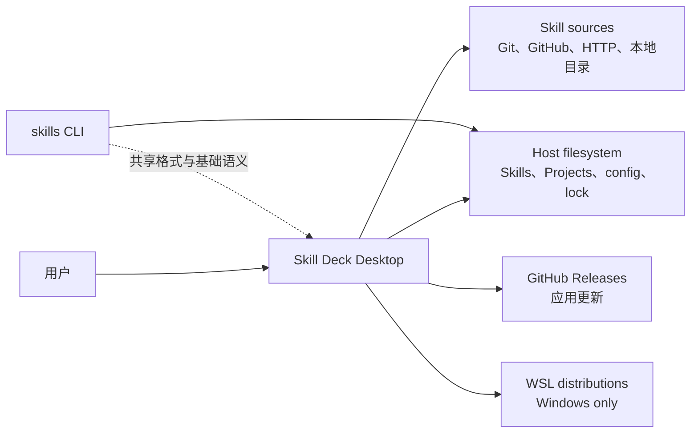
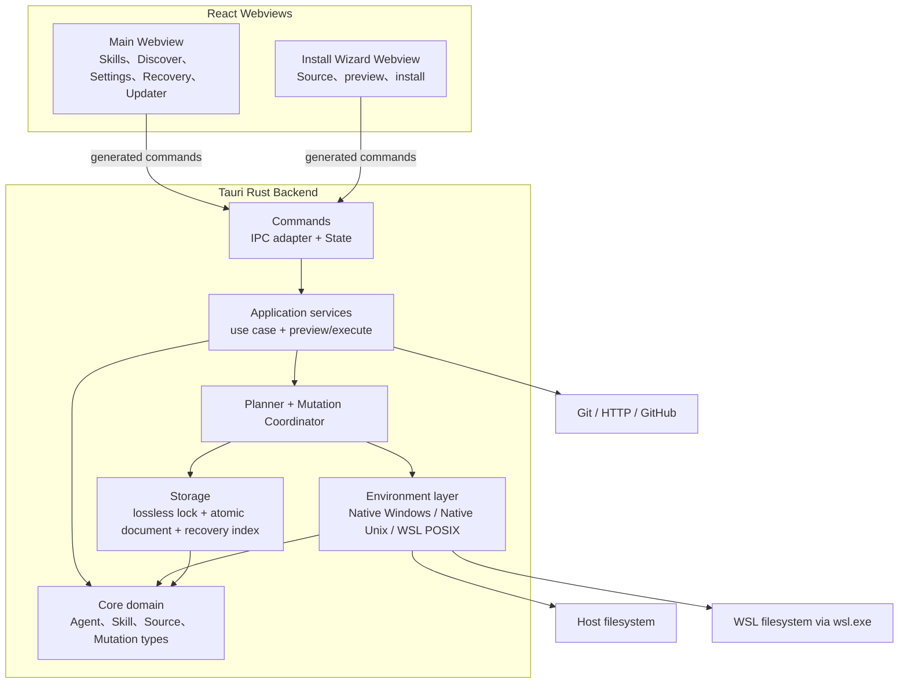
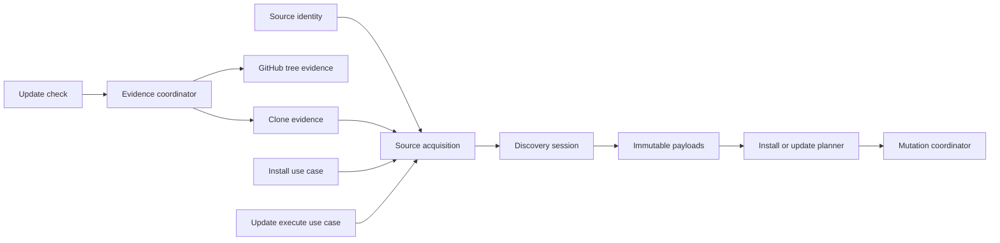

# 系统架构

## 架构目标

Skill Deck 是无服务器的跨平台桌面应用。架构需要同时满足以下目标：

- 用户数据保留在 Host 或选定 WSL Environment 中；
- Windows、macOS、Linux 共享业务语义，只在 filesystem primitive 和 platform integration 上分开；
- WSL 复用 Linux/POSIX 行为，同时保留 `wsl.exe` transport 边界；
- Built-in 与 Custom Agent 使用同一运行时 Registry 和 Skill 工作流；
- install、update、remove、copy 和 Manage Agents 共享 preview、执行和恢复机制；
- React 与 Rust 之间只有一份 generated type contract；
- 主窗口与安装向导使用最小 command 权限；
- GitHub Release 制品能够完成应用内签名更新。

## System Context



Skill Deck 与 skills CLI 可以读取部分相同的 Skill 目录和 lock 文件，但二者不是彼此的 runtime dependency。兼容边界见[skills CLI 兼容](./skills-cli-compatibility.md)。

Windows 上的 WSL distro 是外部执行环境。应用负责发现、按需连接和执行有界操作，不提供发行版安装、终止、注销或重启功能。连接已存在但处于停止状态的发行版时，`wsl.exe` 可能在连接过程中按需启动它。

## Container 与技术边界



Main Webview 和 Wizard Webview 共享同一 Rust process、runtime state 和 `SingleMutationController`。它们不是两个 backend，而是两个权限和交互范围不同的客户端。

## Frontend ownership

Frontend 按 presentation、workflow 和 IPC adapter 分层：

| 区域 | 职责 |
|---|---|
| `pages/`、`components/`、`layouts/` | 页面结构、可访问性交互和可视状态 |
| `stores/` | 按 Environment/Context 隔离的客户端 snapshot、请求 generation 和 UI state |
| `workflows/` | 跨组件的 preview/execute 用户流程和结果归并 |
| `lifecycle/` | 未保存内容、关闭、退出、重启和 mutation interruption 协调 |
| `hooks/useTauriApi.ts` | generated command 的薄封装和 `Result` 解包 |
| `bindings.ts` | 由 Rust command/type 生成的 IPC contract，不手工编辑 |

组件不直接拥有 filesystem、Agent resolution、lock 或 mutation 规则。Frontend 传递 `ContextRef`、业务 identity 和用户选择，Backend 重新解析 runtime facts 并作最终授权。

异步 state 以 Environment/Context key 和 request generation 隔离。旧请求不能覆盖用户已经切换到的新 Context。Dialog 和 Wizard 在打开时冻结操作 Context，避免中途切换导致目标漂移。

Environment store 负责首次发现、恢复焦点和同一 Webview 内的并发请求合并（singleflight），但不维护精确 cooldown 时钟或自动解锁。Backend 是请求当前能否执行以及 backoff/cooldown 的唯一权威；Frontend 的用户重试只重新发出请求，不以本地计时判断执行资格。当前只有 Main Webview 可以调用发现命令；当第二个 Webview、后台任务或其他非界面调用方获得权限时，由 Backend 继续统一协调不同调用方的请求资格。

## Backend ownership

| 层 | 职责 | 不负责 |
|---|---|---|
| `commands` | Tauri DTO、State 注入、调用来源和 admission adapter | Host/WSL 业务分支、filesystem 算法 |
| `application` | use case、runtime facts、preview/execute、planner、payload session、resource/recovery service | platform-specific primitive |
| `application/mutation` | 统一 `MutationPlan`、`ExecutionUnit`、coordinator phases 和结果 | Agent 或 Skill 的产品策略 |
| `environment` | Context resolution、Environment runtime、physical identity、Native/WSL operation | UI 状态和产品文案 |
| `storage` | atomic document、optimistic lock commit、recovery repository | 用例编排 |
| `core` | Agent、Skill、Source、lock schema projection 和纯领域规则 | Tauri State、窗口和 transport |

Tauri 启动入口是唯一 composition root。它集中构造跨请求共享的 Registry、session、maintenance、mutation、recovery 和 application service。Command 只从 runtime graph 取得 service，不在每次调用时重新创建长期状态。这样所有 workflow 共享同一份 Environment identity、Payload session、Recovery repository 和 revision authority。

应用只保留标准本地日志，不维护独立的产品级 diagnostics store、导出协议或 Webview 复制入口。业务反馈使用 stable error code、parameters 和受控 identity；technical details 只用于开发和本机日志，不作为 Frontend 契约，也不自动上传 telemetry。

长期状态使用内部 `EnvironmentKey` 作为 HashMap、session、reconnect lock、maintenance 和 Recovery index 的 key。`Host` 保持独立；`Wsl` 的 distro name 以不区分大小写的规范化值作为 identity。`EnvironmentRef` 的 IPC 结构和用户看到的 display name 不被规范化改写。

### Child process intent

Skill Deck 根据用户是否明确要求显示外部界面来区分子进程。后台进程（Background Process）用于内部枚举、计算或有界业务操作，由应用监督或捕获输出，不得自行创建可见界面；前台启动（Foreground Launch）用于用户明确要求打开资源或外部应用，允许目标程序显示窗口。平台相关的进程参数由统一的后台进程边界负责，Git、WSL 和后续内部进程不能在业务调用点各自复制 Windows 隐藏策略。该边界只负责进程构造和平台设置，不统一接管超时、取消、输入输出、重试或错误转换；这些执行生命周期仍由 Git、WSL 等调用方按各自协议负责。前台启动不经过该边界。Rust 静态检查默认禁止业务代码直接构造系统进程；统一边界、前台启动和确有需要的测试只能在局部说明原因后豁免。

## IPC 与类型

Rust command surface 是 IPC 的权威。`tauri-specta` 从 Rust command 和 type 生成 `src/bindings.ts`，Frontend wrapper 只负责将 generated `Result` 转换为成功值或结构化错误。

新增或修改 command 时需要同步完成：

1. Rust command 与 DTO；
2. canonical command registration；
3. generated bindings；
4. `useTauriApi` wrapper；
5. 允许调用它的 window permission/capability；
6. command surface、ACL 和 Frontend tests。

具体操作见[贡献指南](../CONTRIBUTING.md)。文档不维护完整 command 清单。

### 跨窗口 Agent 配置请求

安装向导与主窗口通过进程内的 Tauri event 协作配置未知 Agent，不维护跨窗口请求队列或持久化状态。

- Install Wizard 发出包含 Agent ID 的配置请求，Backend 聚焦 Main 并向 Main 定向发送 event；
- Main 路由到 `Settings > Agents` 并预填 Agent ID，导航前经过未保存修改保护；
- 保存或取消后，Main 向 Install Wizard 发送包含 Agent ID 和结果的完成 event；
- Wizard 收到保存结果后重新读取 Agent Registry，确认 Agent 已存在后再恢复选择。

窗口刷新或应用重启后不恢复未完成请求；用户可以从安装向导重新发起配置。Main 与 Install Wizard 是独立 WebView，二者在首次渲染前都从共享偏好恢复 locale/theme，不能依赖某个页面偶然加载 Settings store。Window ACL 与必要的 caller window 校验共同限制请求和完成操作的来源。

## 运行时主链

### Skill mutation

```text
React workflow
  -> generated IPC contract
  -> application use case
  -> planner
  -> mutation coordinator
  -> platform backend
  -> lock/recovery storage
```

Preview 返回用户决策所需的稳定 facts 和 token，不产生最终写入。对于安装、跨 Environment Copy，以及 Repair 中已经在 preview 前完成 payload 准备的流程，Execute pin 同一份 payload；更新 preview 不获取来源，Execute 在用户确认后才 acquisition。Install 和 Repair 在当前 Environment 中完成获取与写入，Copy 才可能分离来源与目标 Environment。所有流程都会重新获取当前 authority、重建计划并验证 token，再交给 coordinator。执行细节见[执行与恢复](./execution-and-recovery.md)。

### Source acquisition

Source parser 先产生稳定来源描述，再由 Source 类型和当前 Environment 选择 acquisition backend。Host 来源由 Native backend 获取；WSL Local Source 直接在发行版的原生路径中读取，WSL Git Source 在归属该发行版的受控临时空间中获取。不同 backend 复用同一套 discovery 业务语义，具体兼容规则见[skills CLI 兼容](./skills-cli-compatibility.md#sourcediscovery-与-well-known)。

只有跨 Environment Copy 的来源 Environment 与最终写入 Environment 可以不同。安装、更新和修复都在当前 Environment 中获取内容并写入。跨 backend 只传递经过校验的 manifest 和 content-addressed blobs，不传递原始 Source path，也不把临时路径当作长期 identity。Copy 的 payload 固定后，目标 Execute 不要求来源 Environment 继续在线，但仍要求目标 Environment 可用；Payload 的完整性与生命周期由[执行与恢复](./execution-and-recovery.md#payload)定义。

Source acquisition 是安装与更新执行共享的底层能力，负责按 Source 与 Environment 获取受控来源快照、运行 discovery 并固定选中 payload。安装、更新检查和更新执行保留各自的 application use case 与 planner：安装负责用户选择和目标，更新检查负责远端比较，更新执行负责根据 lock 恢复原 Skill placement。系统不建立同时承担解析、检测、获取、hash、lock 和 materialization 的统一 Provider 基类。

Provider evidence 与 acquisition transport 是两个独立维度。GitHub evidence 可以通过 Trees API 获得而不下载完整 payload；GitLab 和 generic Git evidence 组合共享 acquisition 能力，通过一次 clone 计算多个 Skill 的 content hash；Local 与 well-known 使用各自的 acquisition 路径，但只有存在稳定远端证据时才进入自动更新比较。Clone、discovery、payload 构建和 CLI-compatible hash 是共享能力，provider-specific 比较和 use case 策略不进入 acquisition kernel。



Evidence coordinator 以规范化 remote source 与 ref 组织进程级状态，不包含 Environment；Host 与 WSL 的更新检查因此可以共享同一份远端证据。Coordinator 统一持有同源 in-flight、provider cooldown、网络退避和检测并发 gate，所有实际 clone 则通过独立的 clone gate。自动检查、主动检查和 evidence 有效期的用户行为由[Skill 生命周期](./skill-lifecycle.md#更新检查与重新安装)定义。

可执行 payload snapshot 仍属于实际执行 acquisition 的 Environment。对安装、更新和修复，这个 Environment 同时也是目标 Environment；跨 Environment Copy 则由来源 Environment 固定 payload，再由目标 Environment 完成写入。检测完成后可以短期保留 discovery session，但更新执行默认在目标 storage owner Environment 重新获取来源；只有 acquisition transport、ref、目标 Environment 和已解析 ref revision 都一致时，才复用已经固定的 snapshot。这样 Host 与 WSL 可以共享远端判断，又不会跨 backend 复用未经相应 Environment 固定的 payload。

### Environment maintenance

应用启动后注册 Host maintenance 状态并异步完成清理与 Recovery reindex，不阻塞主窗口。每个 Environment 的 maintenance 处于 `Pending`、`Ready` 或 `Failed`；依赖 Payload 的写操作只在对应 Environment ready 后开始，读取和 Settings 不受影响。WSL Environment 可用后，以 runtime event 的连接 revision 作为幂等键运行同一流程：同一或更旧 revision 的 `Pending`、`Ready`、`Failed` 都不重复执行，更高 revision 在当前任务结束后执行一轮完整维护。单个 Environment 初始化失败不会阻止其他 Environment 工作。

Runtime Maintenance 不暴露独立 retry command；重新进入 Environment 或重启应用会重新建立更完整的运行状态。用户可见的状态反馈由[产品设计](./product.md#context-侧栏)定义。

### Window lifecycle 与 updater

窗口关闭、应用退出和重启先经过未保存内容保护，再检查当前 mutation/updater activity。主窗口请求退出或重启时，如果实际 activity owner 位于 Wizard，Backend 会把动作委派给对应窗口，而不是让两个窗口分别猜测状态。

应用更新与 Skill mutation 共享 lifecycle admission。Updater 在安装前重新确认 expected version，并依赖 Tauri updater 的签名验证。应用下载完成后通过受保护流程重启。

## Security boundaries

### Window command ACL

Main 与 Wizard 是同一应用的 UI 分区，共享应用级业务 command capability。Tauri 仍保持 default-deny，CSP、sanitizer 和实际使用的 plugin resource scope 继续限制可调用能力；新增 command 必须显式进入允许集合。只有真正依赖窗口身份的 lifecycle 或 request command 才做 caller-window 校验，例如把重启、关闭或完成通知交给当前 activity owner。窗口 ACL 是 defense-in-depth，不是两个独立的业务权限矩阵；Backend 仍必须重新校验 typed identity、revision、路径和 ownership。

### Typed resource authorization

Frontend 展示的绝对路径不是授权凭据。打开或读取资源时，Frontend 提交 `ContextRef`、Skill identity、config identity 或 opaque recovery ID，Backend 重新解析实际目标并验证目录 identity。

Recovery opener 不接受任意 backup path。Skill content read 和 resource opener 也不会直接信任来自 Webview 的 filesystem path。

### WSL execution

WSL transport 使用 bundled、versioned 的固定 script asset。业务参数通过 positional arguments 或结构化 stdin 传入，不拼接进 script source。每项 typed operation 负责自己的 request/response、协议解析和 error mapping；共享 runner 只处理 `wsl.exe` process、timeout、cancellation 和有界输出。

业务 adapter 依赖 typed WSL operation，不直接操作底层 runner。WSL transport 失败与业务级 permission、conflict 或 unsafe path 错误保持区分，避免把普通操作失败误判为整个 Environment 不可用。

## Platform backend

| Execution Environment | Backend | 主要语义 |
|---|---|---|
| Windows Host | `NativeWindows` | Windows path、junction/reparse、case folding 和 locked-file 行为 |
| macOS Host | `NativeUnix` | POSIX symlink、permission、mode 和 filesystem identity |
| Linux Host | `NativeUnix` | POSIX symlink、permission、mode 和 filesystem identity |
| WSL distro | `WslPosix` | distro-scoped Linux/POSIX 语义，通过 `wsl.exe` transport 执行 |

Backend 由 Execution Environment 决定。Storage owner 不改变 backend，但决定受保护写入边界、physical target identity、风险提示和恢复归属。WSL projection 同时返回 POSIX physical identity 与 Windows path evidence：WSL-native storage 保持大小写敏感，Host-owned storage 保守按大小写不敏感，owner 无法确认或与当前 Environment 不一致时 mutation 在 planning 阶段失败并引导切换。Cross-storage 路径可以只读观察；跨 Environment copy 只能把已固定的内容交给目标 storage owner Environment，由它的 backend 执行受保护写入。

Windows 可以发现和连接 WSL；非 Windows 平台只返回 Host Environment。打开资源时，Windows 可以将 WSL locator 转换为 distro-scoped UNC，macOS 使用系统 `open`，Linux 使用 `xdg-open`。

## 数据与状态位置

| 状态 | Owner |
|---|---|
| 应用设置和 Project registry | 对应 Environment 的 config storage |
| Global/Project Skill lock | 对应 Context 的 lock storage |
| Custom Agent definitions | 本机共享 definition storage，通过当前 Environment 解析 |
| Payload session | acquiring backend 所属的 bounded cache/storage |
| Recovery marker 与 index | 写入 backend 与应用 runtime recovery graph |
| Frontend snapshot | Environment/Context-keyed Zustand stores |

Project、Environment、Agent ownership 和 materialization 细节不会写入 skills CLI lock。Filesystem observation、Agent definition 和 lock metadata 各自承担不同事实。

## 架构约束

- 不建立同时抽象所有 filesystem primitive 的大接口。Planner 共享领域计划，backend 执行 coarse-grained prepared operation。
- WSL 不是第二套业务域，不向发行版安装 daemon、sidecar 或常驻 helper。
- Tauri command 保持薄层，不直接实现 Host/WSL 写入分支。
- Frontend revision 只服务 UI 协调，不能授权 Backend execute。
- Runtime path 可以展示，不能替代 typed identity。
- generated bindings、permission、capability 和 command registration 必须保持同源一致。
- 单个 Environment 或远端来源失败不能让无关 Context 失去可用性。
- 生产代码启动子进程时必须先明确后台进程或前台启动意图，不能绕过统一边界直接构造系统进程。
