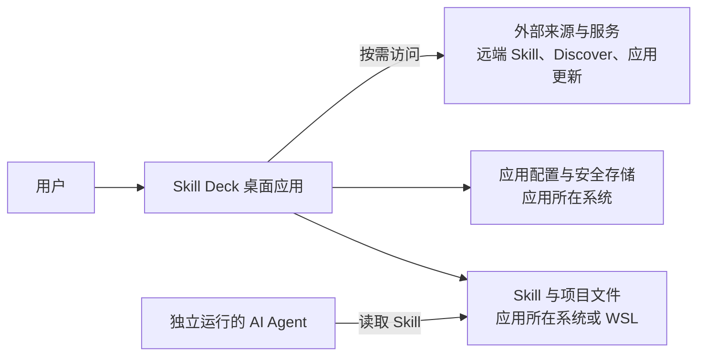
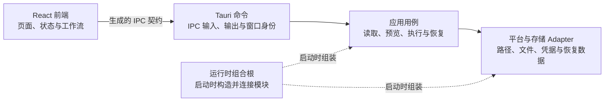

# 系统架构

Skill Deck 是一款运行在用户电脑上的跨平台桌面应用，支持 Windows、macOS 和 Linux。Skill 和项目的读取与管理在应用所在操作系统中完成；Windows 用户切换到 WSL 后，则在所选发行版中完成。浏览 Discover、获取远端 Skill 或检查更新时，应用会按需访问相应的外部服务。

系统边界、模块职责、主要调用关系、窗口与进程、平台适配模块（Adapter）、数据归属和安全保证由本文件维护。用户可见行为、领域规则和具体写入协议见相应主文档。

## 架构目标

- Windows、macOS 和 Linux 复用相同的业务用例，路径和文件操作由对应平台 Adapter 实现；
- Windows 可以把文件操作切换到用户选择的 WSL 发行版，桌面应用仍然运行在 Windows 中；
- 外部 AI Agent 独立读取约定位置中的 Skill；第三方 `skills` CLI 和 Skill Deck 使用相同的通用 Skill 存放位置和兼容的 lock 数据，各自独立管理 Skill；
- 主窗口和安装向导共享 Rust 运行时，但只获得各自工作需要的命令权限；
- React 与 Rust 使用同一份生成的进程间通信（IPC）契约；
- 安装、更新、来源修复、复制、移除和管理 Agent 复用同一套预览、执行与恢复接口；
- 文件写入、凭据和外部进程分别经过适合自身风险的安全接口。

## 系统边界



在 macOS 和 Linux 上，Skill Deck 直接在当前系统中读写 Skill 与项目文件。Windows 上默认在 Windows 中执行这些文件操作；用户启用 WSL 支持并选择发行版后，相关操作转到该发行版中完成，桌面应用仍然运行在 Windows。Windows 及其系统工具负责 WSL 和发行版的安装与生命周期，完整的切换和项目访问规则见[Environment、Skill 位置与项目管理](./environments-and-projects.md)。

AI Agent 独立安装和运行，并从自身支持的目录中读取 Skill。Skill Deck 根据 Agent 的 Skill 读取路径管理通用目录和专用目录，不启动或托管 AI Agent。第三方 `skills` CLI 也独立运行，与 Skill Deck 之间没有运行时调用关系；两者的数据兼容和参考关系见[skills CLI 参考与兼容](./skills-cli-reference.md)。

应用配置保存在桌面应用所在系统中，GitHub Token 由操作系统安全存储保管；具体的数据归属见下文。

## 进程与窗口

主窗口和安装向导是同一桌面应用中的两个 WebView，加载同一套 React 应用并进入不同路由。每个 WebView 独立维护自己的前端状态，两个窗口共享一个 Rust 进程及其中的常驻模块。

两个窗口使用不同的 Tauri 窗口权限配置（capability）。主窗口和安装向导分别只能调用自身工作需要的命令。窗口权限用于限制可调用入口；实际业务条件仍由 Rust 后端判断。

安装向导如何固定本次安装目标、主窗口如何展示安装状态等用户可见行为见[产品行为与交互](./product.md)。

## 应用内部结构

下图表示典型业务请求的调用方向，并单独标出应用启动时的组装关系。完整的命令和代码依赖以源码为准。



`core` 为后端模块提供 Agent、Skill、来源和 lock 等共享类型与基础规则。它不属于请求处理流程中的某个阶段。发行版发现、连接和路径映射等平台管理命令可以直接使用 `environment` 模块；具体调用和依赖由源码维护。

### 前端模块

| 模块 | 职责 |
|---|---|
| `App.tsx`、`pages/`、`layouts/`、`components/` | 组织窗口路由、页面布局、交互和可见状态 |
| `stores/` | 保存前端快照和界面状态，协调异步请求与状态刷新 |
| `hooks/` | 连接页面与状态模块，监听后端事件并封装可复用的交互状态 |
| `workflows/` | 跨页面或对话框的预览、执行和结果归并 |
| `lifecycle/` | 协调未保存内容、关闭、退出、重启和写操作中断 |
| `lib/` | 提供前端复用的筛选、展示、操作位置和 Discover 逻辑 |
| `hooks/useTauriApi.ts`、`bindings.ts` | 提供类型安全的 IPC 调用；前后端类型绑定（bindings）由 Rust 命令和类型生成 |

前端负责展示状态、收集用户选择和协调请求。涉及文件访问时，前端提交 `SkillLocationRef`、业务标识和必要的用户输入，Rust 后端负责解析实际路径并判断操作是否允许。前端快照按操作位置隔离，异步结果只有在请求编号和相关修订信息仍然匹配时才会更新当前状态。

Library 页面通过 `LibraryWorkspace` 统一维护每个 Environment 的 catalog、当前库、详情和请求 generation。Workspace command 返回明确的成功、command failure、catalog failure 和未执行结果；command failure 保留最近一次成功快照。删除库时，Workspace 直接提交后端返回的 catalog snapshot，并根据删除前顺序计算新的选中项。页面路由只把已经提交的 `selectedLibraryId` 同步到查询参数。删除确认使用独立会话固定 Environment 和 LibraryId，Dialog 不直接调用 IPC。

安装向导和 Skill 库添加流程共享来源输入解析、来源发现状态、候选选择列表和跨主机确认。`useSourceDiscovery` 只接收 Environment，管理 `operationId`、克隆进度、过期响应、错误与重试；目标容器分别把发现结果提交给安装规划或 `LibraryWorkspace`。Skill 库添加状态由 Dialog 内部的 `useLibraryAddFlow` 维护，Library 页面只捕获目标并在流程结束后展示 Workspace 已提交的状态。

### Rust 模块

| 模块 | 职责 |
|---|---|
| `commands/` | 维护 Tauri command 与 IPC 类型，读取调用窗口和共享状态，并组织只属于当前功能的简短流程 |
| `application/` | 维护跨命令、跨执行阶段或跨 Environment 复用的业务流程，组织当前运行状态、预览、执行、结果和恢复入口；定义这些流程依赖的 Interface，不持有具体 Adapter，也不持有装配代码 |
| `core/` | 维护 Agent、Skill、来源、lock、配置和注册表的共享类型、解析规则与基础实现 |
| `environment/` | 解析操作位置和文件系统能力，提供 Windows、Unix 与 WSL 的路径、读取、获取和写入 Adapter |
| `storage/` | 提供原子文档、兼容 lock、凭据和恢复数据的持久化 Adapter |
| `runtime/` | 在应用启动时构造并持有常驻模块；实现 `application/` 所定义 Interface 的具体 Adapter，以及各服务的 type alias 与装配函数都归入本模块 |
| `models/` | 维护跨命令复用的 IPC 数据类型：应用配置与代理设置、安装范围与模式、安装目标展示信息、可用 Skill 与来源解析结果。只属于单个 Module 的类型归该 Module 的 Interface，不放在这里 |
| `error.rs` | 定义 `AppError` 与各类失败原因枚举，是全部命令统一的错误契约 |
| `background_process.rs` | 构造不显示终端窗口的同步与异步子进程，并管理进程组的挂起、恢复与整树终止 |
| `test_support/` | 提供仅在测试编译期生效的夹具：`native_workflow.rs` 承载 native 全链路集成场景，`git_fixture.rs` 提供本地 Git 仓库夹具 |

`RuntimeServiceGraph` 是 Rust 后端的组合根，也是 Tauri Managed State。Tauri 在启动阶段创建该组合根，命令处理函数从中取得长生命周期状态、共享业务流程和平台能力。只服务于单个命令的流程可以保留在对应命令模块中；需要跨入口复用、长期持有状态或隔离平台差异时，再提取到相应模块。`RuntimeAdmissionCoordinator` 由组合根持有，统一协调安装向导会话、Skill 写操作、设置变更、应用生命周期和应用更新之间的运行许可。

Skill Deck 以单应用实例作为持久化写入模型。Tauri single-instance 插件限制正常运行时的应用实例数量，所有持久化写入口在产生副作用前取得 `RuntimeAdmissionCoordinator` 许可。Skill Library catalog 是应用私有数据，不接受其他进程或工具写入；Runtime Library Adapter 按 Environment 串行化 catalog、成员目录和内部恢复 I/O。进程退出后，一致性由原子文档、成员条件提交和持久化恢复数据维护，不使用跨进程 Library 文件锁。该决策见 [ADR-0010](./adr/0010-use-single-writer-library-persistence.md)。

`application/mutation` 统一提供预览凭据签发与校验、变更计划组装和计划执行 Interface（调用方依赖的执行接口）。安装、更新、来源修复、复制、移除和调整 Agent 关联等应用用例负责各自的业务策略，把已经决定的写入内容交给规划模块，并调用该 Interface。`RuntimePlanExecutor` 作为运行时 Adapter 协调变更任务，具体 Environment Adapter 负责目标文件系统上的读取与写入。写入的一致性和恢复协议见[执行与恢复](./execution-and-recovery.md)。

`application/agent_selection` 是 Scope 内 Agent Skill 根目录的唯一聚合入口。它在一次解析中生成公开选择快照以及内部的通用目录和 Agent 安装选项目录位置。Skill 目录观察只向这些位置追加安全目录名并读取实际目录状态，不再遍历 Agent runtime 或解释私有路径和 Eve 目标。

`application/library_candidates` 从库应用 repository 读取当前应用状态、库 catalog 和真实成员定位信息，生成带证据的候选快照。该 Module 不读取 Agent facts，也不解析目标目录。安装、复制、移除和管理 Agent 使用同一次规划持有的 Agent 目录表，把候选快照中的 Agent 选择投影为库适用位置。

`application/scope_skill_planning` 是 Scope 内 Skill 目录的统一规划 Module。安装、复制、移除和管理 Agent 通过 `plan_direct_change` 提交直接安装 Skill 的目录变化；管理库应用通过 `plan_library_change` 提交操作前后的库应用状态。Module 使用 `PhysicalTargetKey` 合并指向同一物理目录的位置；任一位置需要直接安装版本时选择直接安装版本，否则选择第一个同名库候选。链接、复制和转换内容只决定直接安装版本的写入方式，不改变选举优先级。每个物理目录产生一条计划记录，并由该记录生成执行条目、观察依赖和用户可见摘要。低层 election 保持私有，业务流程不能自行组装物理目录选举输入。该架构决策见 [ADR-0011](./adr/0011-centralize-scope-skill-version-election.md)。

Skill 库由三个应用层 Module 维护。`SkillLibraryModule` 负责库目录、成员内容、来源记录和库内部事务；`LibraryUpdateService` 负责更新执行期间的初始状态读取、来源内容获取、最新状态校验和逐项提交；`LibraryApplicationModule` 负责单个 Scope 的有序库选择、Agent 选择、应用记录和未完成操作。它与库候选 Source 共享同一个 repository，但两者分别承担写入应用状态和读取候选证据的职责。库应用 Record 只保存业务状态；Repository Interface 显式接收 Context，并根据当前 Environment Adapter 和 Scope 路由文件。

库的使用状态区分已确认生效和只被未完成操作引用两种。成员锁定判定两者的并集，与库页面的展示投影使用同一份分类逻辑。列出全部库时，应用记录按当前 Environment 的 Skill 位置各读取一次并批量聚合成页面投影，读取次数不随库数量增长。

`SkillSourceModule` 根据统一来源信息重新取得已保存 Skill 的完整内容，并按等价来源合并请求。全局或项目与 Skill 库分别提供已经绑定目标的更新对象 Adapter；更新证据模块只通过 `snapshot(names)` 在远端请求前后读取对象，不解释 Skill 位置、库身份、lock 或 `catalog`。记录 Adapter 把明确名称左连接到来源记录，并区分记录缺失、记录无法解释和记录可用于更新。目标协调器在用户确认后才调用来源模块，并分别提交 lock 或 `catalog` 变更。

路径观察接收已经解析的根目录和 Skill 原始名称，统一计算安全目录名、观察目标与内容并发现物理目录冲突。全局和项目根目录仍由操作位置解析负责，库根目录仍由库仓储负责。内容校验通过一次 Rust 调用内有效的 `ValidatedSkillPayload` 向协调器提供完整内容和规范来源信息；两类协调器不共享提交中间类型。

Skill 库运行时只接受当前 `catalog` schema。每个成员只保存一份原始 `sourceRecord`，记录 Adapter 在内存中投影规范来源字段；单个来源字段无法解释时，其他成员仍可读取。开发阶段留下的旧格式由启用新生命周期前的受控清理处理，应用不提供迁移读取或公开重置入口。

## IPC 契约

Rust 中注册的命令和类型是 IPC 契约的权威来源。`tauri-specta` 据此生成 `src/bindings.ts`，`hooks/useTauriApi.ts` 在生成结果之上提供类型安全的调用和统一的 `Result` 解包。

IPC 使用 `EnvironmentRef` 和 `SkillLocationRef` 标识操作位置，不把真实文件路径或运行时连接作为前端凭据。这两个类型不包含连接或内容修订号；需要并发保护的用例通过独立的修订号、预览凭据以及当前连接和内容状态，判断请求是否仍然有效。命令入口的路径与权限校验见下文“安全保证”。

来源发现通过 `discover_skill_source` 接收 Environment、来源、`operationId` 和选择意图。主窗口与安装向导窗口调用同一个命令；命令把克隆进度发送到发起调用的 WebView，并返回可供内容取得、安装预览和库添加预览继续使用的发现会话。安装目标从预览阶段开始使用 `SkillLocationRef`，来源发现不会构造临时的全局 Skill 位置。

### 窗口命令权限

Tauri 的 capability 和 permission 配置采用默认拒绝策略。每个窗口只能调用明确允许的命令，内容安全策略（CSP）和插件资源范围进一步限制 WebView 可以访问的外部资源。新增或修改命令的同步步骤见[贡献指南](../CONTRIBUTING.md)。

## 外部网络访问

外部网络能力由 Skill 目录、Skill 来源、来源证据、连接测试和应用更新等具体产品 Module 提供。Command 只进入这些 Module 的 Interface；Application 不依赖通用 HTTP 请求、网络用途枚举、代理路由计划、reqwest、Git 进程、WSL session 或 Tauri Updater 类型。产品 Module 隐藏具体外部实现；只有平台实现或外部能力确实存在变化时才建立 seam，单一具体流程直接由 Runtime Module 实现。

Rust 运行时持有当前已经验证的代理设置，设置保存成功后才原子替换。HTTP 请求、Git 命令和 Updater 操作在实际执行前读取当前设置；底层客户端或进程已经开始的单次执行继续使用创建时的配置，后续执行使用新设置。连接测试使用页面传入的设置草稿，不替换运行时设置。

Discover 页面通过受限的 Tauri 命令访问 `www.skills.sh`。当前 Discovery 数据契约使用 `/api/search`；排行榜、详情及前端补全的站内地址使用相同的规范站点。本次主机名统一不改变 API 版本或响应模型。官方发布者信息在搜索或榜单首次实际使用时由后台加载，核心内容只读取当时已经完成的进程内缓存，不等待这项辅助请求。加载失败不会写入缓存，后续实际请求可以再次尝试。Discover 返回的安全审计信息只随 Discover 内容展示；应用不会把已安装 Skill 或用户手动输入的来源自动发送给第三方审计服务。

前端脚本没有访问通用外部 HTTP 接口的权限，`connect-src` 只允许应用自身和 Tauri IPC。Discover 富文本中的 HTTPS 图片属于 CSP 允许的 WebView 子资源，由平台 WebView 按系统网络设置加载，不经过 Rust HTTP Transport，也不使用应用保存的自定义代理。图片加载失败不影响正文展示。

Runtime 内部的共享 HTTP Transport 为 Discover、GitHub API 和 Well-known Adapter 复用 reqwest 连接池。Direct 明确关闭客户端自动代理发现，Custom Proxy 只配置用户保存的一个代理地址。HTTP Transport 执行调用方给出的总时限、取消和响应读取上限，不判断请求用途、目标主机或 DNS 地址类型；响应格式、Content-Type、大小和解包规模由消费该内容的产品 Module 维护。

用户输入的 Well-known 来源允许使用 HTTP 或 HTTPS，并按普通客户端行为访问公开、本机或局域网地址。来源获取不预解析目标域名、不区分公网与私网地址，也不把解析结果固定到客户端。索引、详情、制品和重定向使用相同的 HTTP 或 HTTPS 访问规则；内容格式、摘要和解包检查继续由 Well-known 来源 Module 负责。

普通 HTTP 请求的连接与响应读取共用调用方给出的总时限，取消信号会中止当前请求。每个独立请求生成 `operation_id`；同一次 Well-known 获取中的索引、详情和制品请求复用同一标识，使本地日志可以关联失败阶段。日志不主动记录认证 Header、密码或响应正文。

应用更新在创建官方 Tauri Updater 对象时读取当前代理设置，并通过插件的 `proxy` 或 `no_proxy` 配置映射 Direct 或 Custom Proxy。官方插件负责读取 Tauri endpoint、按配置顺序检查版本、域名解析、重定向、下载安装包、验证签名和执行安装；Skill Deck 不增加 host allowlist、自定义重定向、读取停滞时限或运行时响应大小限制。`ApplicationUpdateCoordinator` 只维护运行许可、期望版本确认、取消窗口、进度、安装阶段切换和操作总时限。下载调用开始后即可取消，制品下载完成并进入签名校验和安装后关闭取消入口。发布流程继续检查清单和安装资产大小，这些检查不改变客户端运行时行为。连接测试使用独立且明确展示的 10 秒诊断时限。

GitHub API 请求使用固定的 API 版本和 JSON 媒体类型。客户端同时识别主要限流响应头和 secondary rate limit 响应正文；来源证据协调器负责记录 provider 级等待时间、合并并发检查，并在等待期结束前阻止 Automatic 和 Force 请求再次访问 GitHub。

Skill 来源 Module 根据操作位置选择 Native 或 WSL Git Adapter，并按目标 Environment、远端 URL 和当前代理设置生成进程级策略。HTTP 请求、Native Git 和各 WSL Git 的代理策略相互独立；WSL Git 也可以显式继承 Native Git 的策略。

选择保留 Git 原有连接方式时，Adapter 不传入覆盖项。远端 URL 命中代理使用范围时，Adapter 通过单次命令的 `git -c http.proxy=<proxy>` 注入对应 Environment 的代理地址；未命中使用范围时不传入 `http.proxy` 覆盖，由 Git 使用已有配置和环境设置。其他协议同样不接收 `http.proxy` 覆盖。

传给 WSL 的代理 URL 必须从对应发行版内部可访问。WSL Adapter 原样传入页面解析后的地址，不探测网络模式、不解析宿主网关，也不改写回环地址。该过程不会读取、写入或清除用户的持久化 Git 代理配置。

## 主要运行流程

### 读取 Skill

```text
React 页面与状态模块
  -> Tauri 命令
  -> Skill 读取用例
  -> 平台读取 Adapter
  -> 后端返回的完整快照
  -> 前端状态
```

一次 Skill 工作台读取使用同一份 Agent 注册表和目录观察结果，同时返回 Skill、可供筛选的 Agent 和项目路径状态。前端直接接收完整快照，不需要拼接不同时间取得的数据。

### 修改 Skill

```text
React 工作流
  -> 预览用例
  -> 用户确认
  -> 执行用例
  -> 平台与存储 Adapter
  -> 结构化结果和最新快照
```

安装、更新、来源修复、复制、移除和管理 Agent 共用这条主链。执行用例会先取得运行许可，再重新读取当前目录、lock、Agent 选择和运行状态，确认预览仍然有效。预览与执行之间的校验、原子写入、取消和恢复由[执行与恢复](./execution-and-recovery.md)维护；来源获取与安装规则见[Skill 生命周期](./skill-lifecycle.md)，远端版本比较与缓存规则见[更新检查](./update-checking.md)。

## 平台实现

Rust 根据文件操作实际由哪里执行选择 `ExecutionBackend`：

| 文件操作的执行位置 | `ExecutionBackend` | 文件系统语义 |
|---|---|---|
| Windows 本机 | `NativeWindows` | Windows 路径、junction、reparse point、大小写折叠和文件占用 |
| macOS 或 Linux 本机 | `NativeUnix` | POSIX 符号链接、权限、可执行位和文件系统身份 |
| Windows 上选定的 WSL 发行版 | `WslPosix` | 发行版中的 Linux/POSIX 语义，通过 `wsl.exe` 执行 |

macOS 和 Linux 使用 `NativeUnix`。Windows 默认使用 `NativeWindows`；用户启用 WSL 支持并选择发行版后，相关路径解析和文件操作使用 `WslPosix`。代码中的 `EnvironmentRef::Native` 表示桌面应用所在系统，`EnvironmentRef::Wsl` 表示 Windows 上选定的 WSL 发行版。

`WslRuntime` 是所有 WSL 操作的统一入口，负责筛选 WSL 2 发行版、连接状态、运行许可和失效处理。建立连接时，Host 只读取用户、UID、Home、配置目录和 Agent 路径环境变量，再部署摘要匹配的 Environment Worker，通过二进制协议确认发行版、用户、UID 和 Home。Git 等具体能力在对应请求首次执行时检查，不参与 Environment 连接。`WslWorkspace` 是 Host 内访问 Worker 的唯一入口；Worker 断开后，Workspace 在当前 capability cycle 内重新建立连接，并且只对尚未产生副作用且不依赖 Worker handle 的读取最多重放一次。

Windows 安装包把固定的 musl Worker 和 manifest 作为 Tauri resource 一起交付。Tauri 启动时把明确的 resource 目录交给 `WslRuntime`，Host 不根据可执行文件位置、当前目录或环境变量猜测 Worker 制品。Host 在部署前核对 manifest 与实际字节摘要；发行版内已有相同摘要的普通文件时保留该文件并确认执行权限，缺失或摘要不同的普通文件通过同目录临时文件原子替换。目录、符号链接和其他非普通目标会阻止部署并保持原样。应用升级或回退时，当前 Host 始终使用自身安装资源恢复匹配 Worker，不维护多版本清单。

本节中的 Windows Host process 指运行在 Windows 上的 Skill Deck Tauri Rust 主进程，简称 Host；它是进程职责，不表示 Windows Environment。Windows Environment 表示 Windows 用户空间中的数据和文件系统归属，Environment Worker 表示 Host 为某个 WSL 2 发行版启动的辅助进程。

Environment Worker 使用 `environment-engine` 封装与 transport 无关的 Linux 文件系统机制。Native Linux 只复用能够替换现有实现的 Engine Module；当前 inspection 和 lock 已经共享，payload、fingerprint、Recovery 和 Library 继续保留各自的数据与恢复格式。Skill 与 Agent 扫描、文档读取、受限单文档写入、目录计数、Eve 和 Project 读取、目标投影、目录项事实、内容 manifest、来源清单和 Payload 构建都由 Worker 执行。Windows 路径与 WSL 路径的双向转换也通过 typed Worker request 完成，Worker 以结构化参数调用发行版提供的 `wslpath`，Host 不为路径转换启动独立 shell operation。Worker 使用有界 FIFO 和固定读取并发数调度阻塞文件操作，stdout 只由 protocol writer 写入。超过单帧大小的结果通过声明总长度和 SHA-256 的有界 binary transfer 返回；Host 校验 owner request、chunk 顺序、累计长度、摘要和 completion barrier 后才把结果交给 Adapter。

WSL Git clone、连接探测和本地来源由所选发行版中的 Worker 执行，使 Git 使用该发行版的可执行文件、SSH、凭据、代理配置和 Linux 检出语义。Source 与 Payload 使用绑定当前 Worker generation 的会话内 handle；Worker 重启后，旧 handle 立即失效，Host 不重放依赖旧 handle 的请求。Git 临时来源和未完成的 Payload stage 由 Worker 管理并在 release、取消、会话清理或 Worker 退出时删除。

Discover、GitHub API、Well-known、direct download、GitHub Token 和 HTTP 代理继续由 Windows Host 负责。Host 下载并验证的 Skill 内容通过 Worker 明确准备的临时文件逐个传入；Worker 在接收过程中执行长度和 SHA-256 校验，完整 manifest 校验通过后才原子发布 Payload。Worker 不持有 HTTP client、GitHub Token 或 Windows HTTP 代理状态。

WSL 中每个写入任务由 Worker 在一个不可自动重放的事务请求内完成。Worker 重新检查目标和内容证据，持久化恢复标记后通过 `MutationAccepted` barrier 通知 Host，再依次完成目录 stage、原子替换、结果校验和 lossless lock 提交。成功结果保留 `CleanupOnly` 标记，Host 确认收到结果后发送 acknowledgement，Worker 只清理摘要完全匹配的标记和备份。Host 继续负责整个变更计划的任务顺序、部分成功、进度和后续任务使用的 lock 证据。

WSL 项目记录和最近选择的 Agent 记录使用独立的单文档条件写入。Host 传入读取时取得的内容 revision，Worker 在原子替换前重新核对目标，并只接受不存在或普通文件。revision 已变化时返回结果过期；持久化请求在连接中断后不自动重放。该流程只处理一个 JSON 文档，不创建用户可见恢复记录，也不提供任意目录操作能力。

每个 Environment 独立拥有自己的 Skill Library catalog、成员目录、应用记录和内部恢复状态。Host 使用统一的 Application 规则解析当前 Environment 返回的 catalog，处理名称、来源记录、应用限制和批量结果；WSL Worker 从 handshake 确认的 Home 推导该发行版的 Library 根目录，并在一个 Library gate 内完成 catalog 读取、成员目录事务和首次访问恢复。Worker 把 catalog 作为经过摘要校验的文档处理，不复制 `LibraryCatalog` 业务模型。成员内容复用绑定当前 Worker generation 的 Payload handle，持久化请求在连接中断后不自动重放。

关闭 WSL 支持会使当前连接及其内存状态失效。保存在发行版中的项目、Skill、lock 和恢复数据继续保留，重新启用并连接后，由新建的运行时实例重新读取。读取、来源获取和单次原子操作可以在写入开始前重新连接；已经发送的写入事务不会自动重放，Host 根据 `MutationAccepted` 和发行版中的恢复标记判断是否需要恢复检查。

项目跨越 Windows 与 WSL 文件系统时，Skill Deck 可以映射路径并读取可访问的内容；受保护写入交给能够原生访问目标文件系统的 Environment 执行。Windows 与 WSL 之间的切换、路径映射和项目访问状态见[Environment、Skill 位置与项目管理](./environments-and-projects.md)。

## 子进程

Skill Deck 启动外部进程时，根据操作是否需要向用户显示界面选择启动方式：

- Git、`wsl.exe` 和其他内部命令作为后台进程运行，由应用监督并捕获输出；Windows 使用隐藏窗口参数；
- 用户明确要求打开文件、目录或外部应用时，使用允许目标程序显示界面的前台启动方式。

后台进程模块统一构造进程并设置 Windows 隐藏窗口参数。发起调用的模块负责超时、取消、输入输出、重试和错误转换。

## 数据与状态归属

| 数据或状态 | 保存位置或负责人 |
|---|---|
| 应用设置 | 桌面应用所在操作系统的用户配置目录 |
| 用户添加的 Agent 信息 | 桌面应用所在操作系统的共享配置 |
| 已添加项目 | 应用所在操作系统或 Windows 上对应的 WSL 发行版 |
| 全局和项目 Skill | Skill 实际所在的全局或项目目录 |
| 全局和项目 lock | 对应 Skill 位置的 lock 文件 |
| GitHub Token | 操作系统安全存储；环境变量只在运行时读取 |
| 更新检查状态 | 桌面应用的本地状态存储 |
| 内容快照 | 实际获取内容的 Environment 所管理的临时存储 |
| 恢复记录与恢复数据 | 执行写入的 Environment；关闭 WSL 支持不会删除持久化数据 |
| 恢复索引 | Rust 进程内存，根据持久化恢复数据重建 |
| 运行许可和当前操作状态 | Rust 进程内存，应用重新启动后重新建立 |
| 项目和 Skill 的前端快照 | 对应 WebView 的内存状态，按操作位置隔离 |
| Skill 库、库成员内容和应用记录 | 对应 Environment 用户主目录下的 `~/.skill-deck/skill-libraries`；Windows 与各 WSL 发行版相互隔离 |

应用设置与用户添加的 Agent 信息保存在桌面应用所在操作系统中。项目、Skill 和 lock 跟随实际操作位置保存：macOS、Linux 和 Windows 默认保存在当前系统中，切换到 WSL 后则保存在所选发行版中。Agent 路径声明保存在共享配置中，实际路径按照当前操作位置解析。

`EnvironmentRef` 和 `EnvironmentKey` 用于当前 Host 的运行时路由和进程内索引。Environment 本地文档的归属已经由 Store、Adapter 和存储路径确定，不再重复保存 Native、WSL 发行版等运行时身份；同一 Linux 用户空间由 Linux Native 或 Windows WSL 顺序访问时，读取相同业务状态。Host 本地配置需要恢复用户选择或跨 Environment 路由时可以保存 `EnvironmentRef`。该决策见 [ADR-0012](./adr/0012-environment-local-documents-omit-runtime-environment.md)。

## 安全保证

- 窗口 capability、CSP 和插件允许范围限制 WebView 可以调用的命令和访问的网络资源；
- 窗口权限只限制调用入口，业务授权和运行许可由 Rust 后端负责；
- Rust 后端从 Tauri 调用上下文取得窗口身份，不接收前端提交的窗口角色；
- 受管理资源通过业务标识重新解析，前端显示或提交的路径不能单独作为文件访问凭据；
- 用户提交的项目路径和路径转换请求按照目标系统的路径规则验证；
- 写入前重新确认目标文件系统、目录身份、路径关系和当前运行状态；
- Windows、Unix 和 WSL Adapter 使用目标文件系统的原生路径与原子文件操作能力；
- GitHub Token 保存在操作系统安全存储，不进入 lock、更新检查状态或用户可见诊断；
- 前端错误协议使用稳定的错误类别和参数；帮助用户排查本机 Git 配置的诊断可以作为有界参数返回，其他内部错误细节保留在本机日志。

路径安全、原子写入和恢复保证见[执行与恢复](./execution-and-recovery.md)。

## 相关文档

| 主题 | 主文档 |
|---|---|
| 用户可见功能、反馈和交互 | [产品行为与交互](./product.md) |
| Agent 读取、检测和关联规则 | [Agent 模型](./agent-model.md) |
| Windows、macOS、Linux、WSL、项目和路径 | [Environment、Skill 位置与项目管理](./environments-and-projects.md) |
| 来源、发现、安装、更新、复制和移除 | [Skill 生命周期](./skill-lifecycle.md) |
| 预览、执行、取消、原子写入和恢复 | [执行与恢复](./execution-and-recovery.md) |
| 远端版本比较、缓存、重试和限流 | [更新检查](./update-checking.md) |
| 第三方 `skills` CLI 的参考与兼容 | [skills CLI 参考与兼容](./skills-cli-reference.md) |
| 命令、类型绑定、权限和开发验证 | [贡献指南](../CONTRIBUTING.md) |
