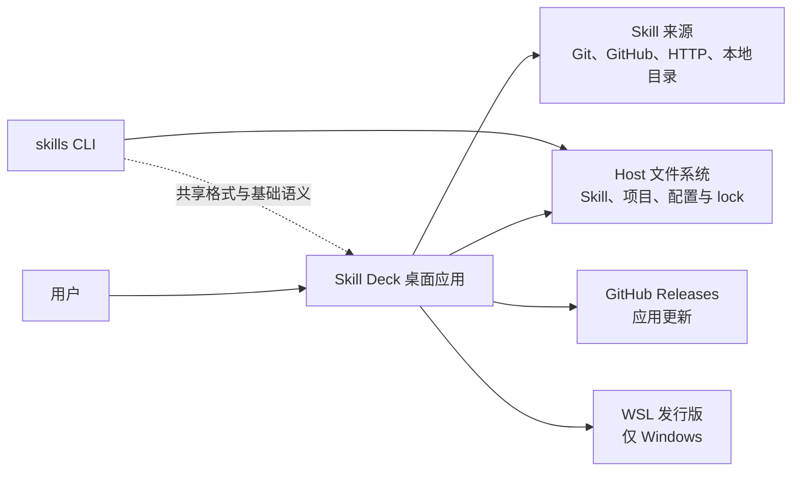
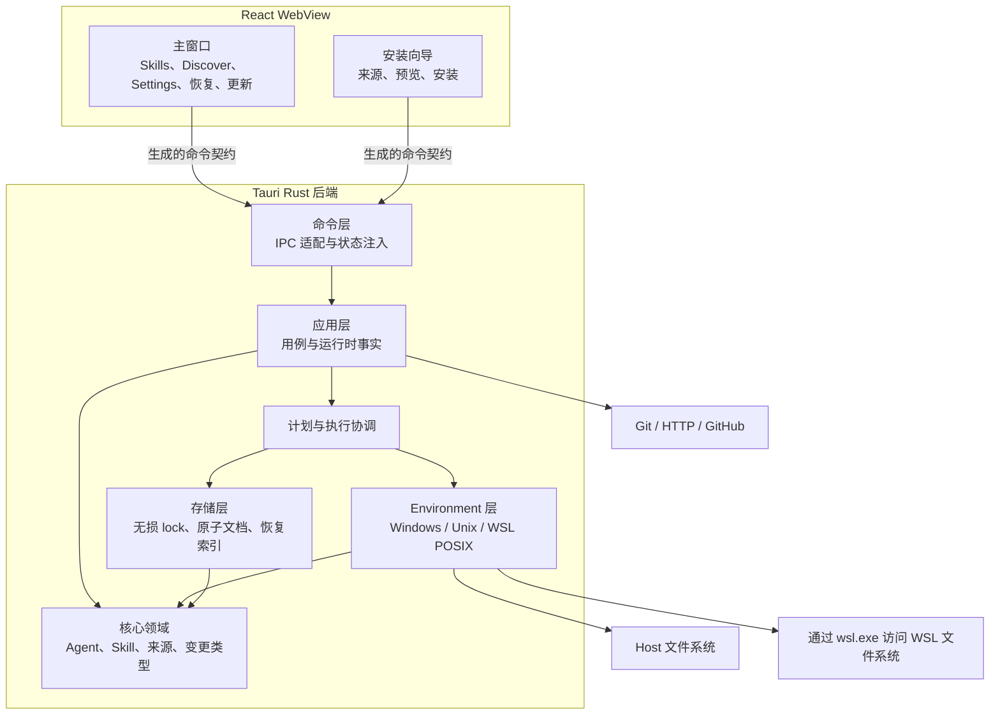

# 系统架构

## 架构目标

Skill Deck 是无服务器的跨平台桌面应用。架构需要同时满足以下目标：

- 用户数据保留在 Host 或选定的 WSL Environment 中；
- Windows、macOS 和 Linux 共享业务语义，只在文件系统能力和平台集成上分开；
- WSL 复用 Linux/POSIX 行为，同时保留 `wsl.exe` 的传输边界；
- 内置与自定义 Agent 使用同一运行时注册表和 Skill 工作流；
- 安装、更新、移除、复制和管理 Agent 共用预览、执行与恢复机制；
- React 与 Rust 之间只有一份生成的类型契约；
- 主窗口和安装向导只获得完成各自工作所需的命令权限；
- GitHub Release 制品能够完成签名校验和应用内更新。

## 系统边界



Skill Deck 与 `skills` CLI 可以读取部分相同的 Skill 目录和 lock 文件，但二者不是彼此的运行时依赖。桌面应用不调用 `skills` 可执行文件，也不要求用户安装 Node.js。共享格式和稳定差异见[skills CLI 兼容](./skills-cli-compatibility.md)。

Windows 上的 WSL 发行版是外部执行环境。应用负责发现、按需连接和执行有界操作，不负责安装、终止、注销或重启发行版。连接已存在但处于停止状态的发行版时，`wsl.exe` 可能在连接过程中按需启动它。

## 进程与技术分层



主窗口和安装向导共享同一个 Rust 进程、运行时状态和 `SingleMutationController`。它们是同一应用的两个交互窗口，不是两个独立后端，也不是两个独立业务安全域。

## 前端职责

| 区域 | 职责 |
|---|---|
| `pages/`、`components/`、`layouts/` | 页面结构、可访问性交互和可视状态 |
| `stores/` | 按 Environment/Context 隔离的客户端快照、请求版本和界面状态 |
| `workflows/` | 跨组件的预览、执行和结果归并 |
| `lifecycle/` | 未保存内容、关闭、退出、重启和写操作中断协调 |
| `hooks/useTauriApi.ts` | 生成命令的薄封装和 `Result` 解包 |
| `bindings.ts` | 由 Rust 命令和类型生成的 IPC 契约，不手工编辑 |

组件不拥有文件系统、Agent 解析、lock 或写入规则。前端只传递 `ContextRef`、业务标识和用户选择，后端重新解析当前事实并作最终决定。对话框和安装向导在打开时固定操作 Context，避免用户切换页面后目标随全局状态漂移。

### Skill 运行时快照

Skill 工作台的一次读取由后端在同一份 Agent 运行时快照上完成，并同时返回：

- 当前 Context 的 Skill；
- 当前范围可供筛选的 Agent；
- Project 路径是否可用等路径状态。

前端按 Context 保存整份结果，不再额外请求 Agent 列表并拼接不同版本的数据。旧请求只能写回它启动时对应的 Context，也不能覆盖用户已经切换到的新 Context。筛选候选与 Skill 的关联 Agent 都由同一次读取中的目录事实计算，因此共享一致的 Agent 版本。

这一约束只适用于 Skill 工作台的读取一致性；Agent 设置、安装向导等独立用例仍可以按自己的 Context 获取 Agent 信息，但不能把不同请求的结果拼成同一份 Skill 快照。

前端可以合并同一窗口中的重复请求并展示冷却状态，但后端仍是当前是否允许请求、是否需要退避的唯一权威。用户点击重试时，前端只重新发出请求，不用本地倒计时推断后端一定可执行。

## 后端职责

| 层 | 负责 | 不负责 |
|---|---|---|
| `commands` | Tauri DTO、状态注入、调用来源和入口适配 | Host/WSL 业务分支、文件系统算法 |
| `application` | 用例、运行时事实、预览与执行、来源会话、资源与恢复服务 | 平台特有的底层操作 |
| `application/mutation` | `MutationPlan`、`ExecutionUnit`、阶段顺序和结果 | Agent 或 Skill 的产品策略 |
| `environment` | Context 解析、Environment 运行时、物理身份和 Native/WSL 操作 | 页面状态和产品文案 |
| `storage` | 原子文档、乐观并发提交和恢复记录 | 用例编排 |
| `core` | Agent、Skill、来源、lock 投影和纯领域规则 | Tauri 状态、窗口和传输 |

Tauri 启动入口是唯一组合根。它集中构造跨请求共享的注册表、WSL 会话、运行维护、写入控制、恢复索引和应用服务；命令只从运行时服务图取得依赖，不在每次调用时重新创建长期状态。

应用保留标准本地日志，但不建设独立的产品级诊断存储、导出协议或窗口复制入口。业务反馈使用稳定错误代码、参数和受控标识；内部技术细节只进入开发信息和本机日志，不作为前端契约，也不自动上传。

长期运行时状态使用内部 `EnvironmentKey` 作为键。Host 保持独立；WSL 发行版名称以不区分大小写的规范化值参与匹配，但不改写 `EnvironmentRef` 或用户看到的显示名称。

### 子进程启动意图

Skill Deck 根据用户是否明确要求显示外部界面区分两类子进程：

- 后台进程用于枚举、计算和有界业务操作，由应用监督或捕获输出，不得自行创建可见窗口；
- 前台启动用于用户明确要求打开资源或外部应用，允许目标程序显示界面。

平台相关的隐藏窗口参数由统一的后台进程边界负责，Git、WSL 和其他内部调用不能各自复制 Windows 处理逻辑。这个边界只负责进程构造和平台设置；超时、取消、输入输出、重试和错误转换仍由具体调用方按协议处理。Rust 静态检查默认禁止业务代码直接构造系统进程，确需绕过时必须在局部说明理由。

## IPC 与类型

Rust 命令是 IPC 的权威来源。`tauri-specta` 从 Rust 命令和类型生成 `src/bindings.ts`，前端封装只负责将生成的 `Result` 转换为成功值或结构化错误。

新增或修改命令时，需要同步完成：

1. Rust 命令与 DTO；
2. 正式命令注册；
3. 生成的 bindings；
4. `useTauriApi` 封装；
5. 允许调用它的窗口权限配置（`permission`/`capability`）；
6. 命令、ACL 和前端测试。

具体命令见代码，开发步骤见[贡献指南](../CONTRIBUTING.md)；长期文档不维护完整命令清单。

### 跨窗口 Agent 配置

安装向导遇到未知 Agent 时，通过进程内 Tauri 事件请求主窗口打开 `Settings > Agents`。请求只携带 Agent ID，主窗口在未保存修改保护之后完成导航；保存或取消后，再把同一 Agent ID 和结果定向发送回安装向导。

安装向导收到成功结果后重新读取 Agent 注册表，确认定义确实存在再恢复选择。窗口刷新或应用重启后不恢复未完成请求，用户可以重新发起。两个窗口在首次渲染前都从共享偏好恢复语言和主题，不依赖另一个页面先加载设置。

## 运行时主链

### Skill 写操作

```text
React 工作流
  -> 生成的 IPC 契约
  -> 应用用例
  -> 计划器
  -> 写入协调器
  -> 平台后端
  -> lock 与恢复存储
```

预览返回用户决策需要的事实和预览凭据，不产生最终写入。执行时重新读取当前权限和运行时事实、重建计划并校验凭据，再交给协调器。安装、来源修复和跨 Environment 复制可以在预览前固定内容快照；更新在用户确认后才获取新内容。详细协议见[执行与恢复](./execution-and-recovery.md)。

### 来源获取

来源解析器先产生稳定来源描述，再由来源类型和当前 Environment 选择获取后端。Host 来源由 Native 后端获取；WSL 本地来源直接从发行版原生路径读取，WSL Git 来源在该发行版的受控临时空间中获取。不同后端复用同一套发现语义，兼容规则见[skills CLI 兼容](./skills-cli-compatibility.md#来源发现与-well-known)。

只有跨 Environment 复制会把来源 Environment 与写入 Environment 分开。安装、更新和来源修复都在当前 Environment 中获取内容并写入。跨后端只传递经过校验的清单和内容数据，不传递原始来源路径，也不把临时路径当作长期标识。

远端更新证据与可执行内容快照属于不同层次。相同远端来源的比较证据可以在进程内合并，并且不依赖 Host 或 WSL；真正用于安装的内容快照仍属于实际获取它的 Environment，不能把 Host 快照直接交给 WSL 执行。系统通过组合获取、发现和证据能力实现不同来源，不建立一个同时承担解析、获取、哈希、lock 和落盘的通用来源提供者基类。

### Environment 运行维护

应用启动后异步完成 Host 的临时内容清理和恢复资源重建，不阻塞主窗口。WSL 在连接成功后按新的会话修订号执行同一类维护；同一修订号不会重复运行，新的修订号会建立新的尝试。一个 Environment 的维护失败不会阻止其他 Environment 工作。

运行维护不提供独立的长期重试命令。用户重新进入 Environment 或重启应用时，会基于新的运行时事实重新执行；维护错误不写入恢复资源，也不保存成产品级错误历史。用户可见行为见[产品设计](./product.md#context-侧栏)。

### 窗口生命周期与应用更新

关闭窗口、退出应用和重启先经过未保存内容保护，再检查当前写操作或更新活动。实际活动属于另一个窗口时，后端把动作交给该窗口处理，不让两个窗口分别猜测状态。

应用更新与 Skill 写操作共享生命周期准入。安装新版本前重新确认目标版本，并依赖 Tauri updater 的签名校验；下载和安装完成后再通过受保护流程重启应用。

## 安全边界

### 窗口命令权限

主窗口与安装向导属于同一桌面应用，窗口 ACL 的价值是缩小误调用面和提供纵深防御，而不是建立两个独立业务信任域。

Tauri 保持默认拒绝；CSP、输入清理和实际使用的插件资源范围继续限制可调用能力，新增命令必须显式进入允许集合。只有确实依赖窗口身份的生命周期或跨窗口请求，才额外校验调用窗口，例如关闭、重启或完成通知的活动归属。

窗口 ACL 不能代替后端授权。无论命令来自哪个窗口，后端都必须重新校验类型化业务标识、Environment/Context 修订号、路径和资源归属。为主窗口与安装向导建设两套完整业务权限矩阵没有额外安全收益，也会增加同步成本。

### 类型化资源授权

前端展示的绝对路径不是授权凭据。读取或打开资源时，前端提交 `ContextRef`、Skill 标识、配置标识或不透明的恢复资源 ID，后端重新解析实际目标并校验目录身份。

恢复入口不接受任意备份路径，Skill 内容读取和资源打开也不直接信任 WebView 提交的文件系统路径。

### WSL 执行

WSL 连接先通过 `wsl.exe` 启动随应用发布的 POSIX `sh` 脚本，检查 Git、POSIX shell 和当前操作依赖的 GNU 工具行为。任一必要条件不满足时，连接直接失败并说明缺失条件，不建立“部分可用”的会话，也不维护长期能力矩阵。

业务参数通过位置参数或结构化标准输入传入，不拼接进脚本源码。每项类型化操作负责自己的请求、响应和错误映射，共享执行器只负责 `wsl.exe` 进程、超时、取消和有界输出。传输失败与权限、冲突或不安全路径等业务错误保持区分。

读取、来源获取和单次原子操作如果在开始业务写入前因会话失效，可以安全重连并重试一次。已经进入多步骤受保护写入后，不得自动重放整个操作；后续失败按当前执行结果和恢复协议处理。Windows 路径进入 WSL 时调用目标发行版的实际映射能力，不硬编码 `/mnt/<drive>`。

## 平台实现

| 执行 Environment | 后端 | 主要语义 |
|---|---|---|
| Windows Host | `NativeWindows` | Windows 路径、junction/reparse、大小写折叠和文件占用行为 |
| macOS Host | `NativeUnix` | POSIX 符号链接、权限、可执行位和文件系统身份 |
| Linux Host | `NativeUnix` | POSIX 符号链接、权限、可执行位和文件系统身份 |
| WSL 发行版 | `WslPosix` | 发行版内的 Linux/POSIX 语义，通过 `wsl.exe` 执行 |

后端由执行 Environment 决定。存储归属环境不改变后端选择，但决定受保护写入边界、物理目标身份、风险提示和恢复归属。WSL 原生存储保持 POSIX 大小写语义；Windows 管理的存储按 Windows 规则处理。归属无法确认或与当前 Environment 不一致时，计划阶段拒绝受保护写入并引导切换。

跨存储路径可以只读观察；跨 Environment 复制只能把已经固定的内容交给目标存储归属环境，由目标后端执行写入。Windows 可以发现和连接 WSL；macOS 与 Linux 只提供 Host。

## 数据与状态归属

| 状态 | 归属 |
|---|---|
| 应用设置和项目注册信息 | 对应 Environment 的配置存储 |
| Global/Project Skill lock | 对应 Context 的 lock 存储 |
| 自定义 Agent 定义 | 本机共享定义存储，按当前 Environment 解析 |
| 内容快照会话 | 实际获取内容的后端所拥有的有界临时存储 |
| 恢复标记与索引 | 执行写入的后端和应用运行时 |
| 前端快照 | 按 Environment/Context 隔离的 Zustand 状态存储 |

Project、Environment、Agent 归属和落盘实现不写入 `skills` CLI lock。文件系统观察、Agent 定义和 lock 元数据各自承担不同事实。

## 架构约束

- 不建立同时抽象全部文件系统原语的大接口；计划器共享领域计划，平台后端执行较粗粒度的准备操作。
- WSL 不是第二套业务域，不向发行版安装守护进程、伴随进程或常驻辅助程序。
- Tauri 命令保持薄层，不直接实现 Host/WSL 写入分支。
- 前端请求版本只服务界面协调，不能授权后端执行。
- 运行时路径可以展示，不能代替类型化业务标识。
- 生成的 bindings、`permission`、`capability` 和命令注册必须保持同源一致。
- 单个 Environment 或远端来源失败不能让无关 Context 失去可用性。
- 生产代码启动子进程时必须先明确后台进程或前台启动意图。
