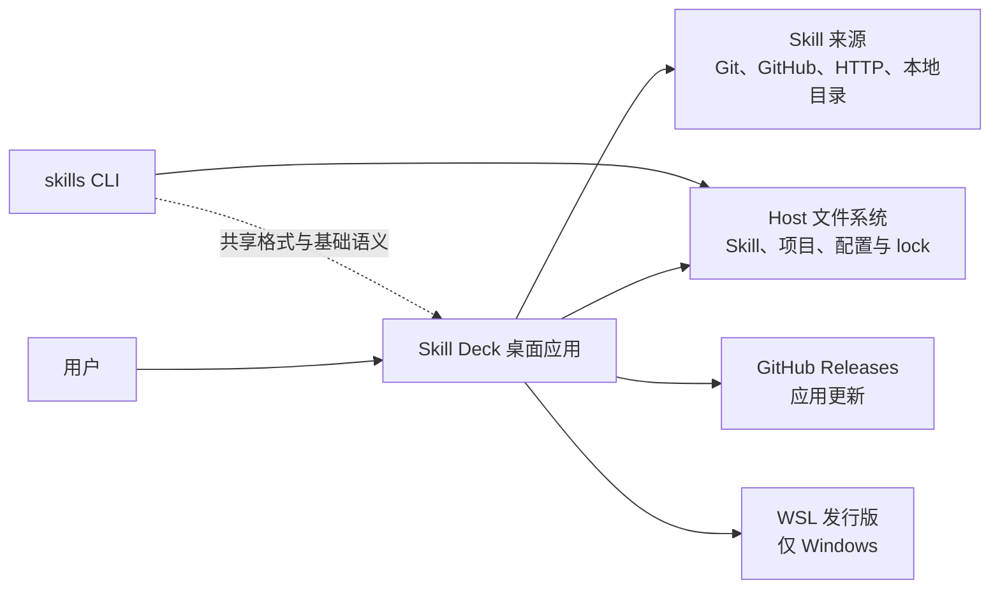
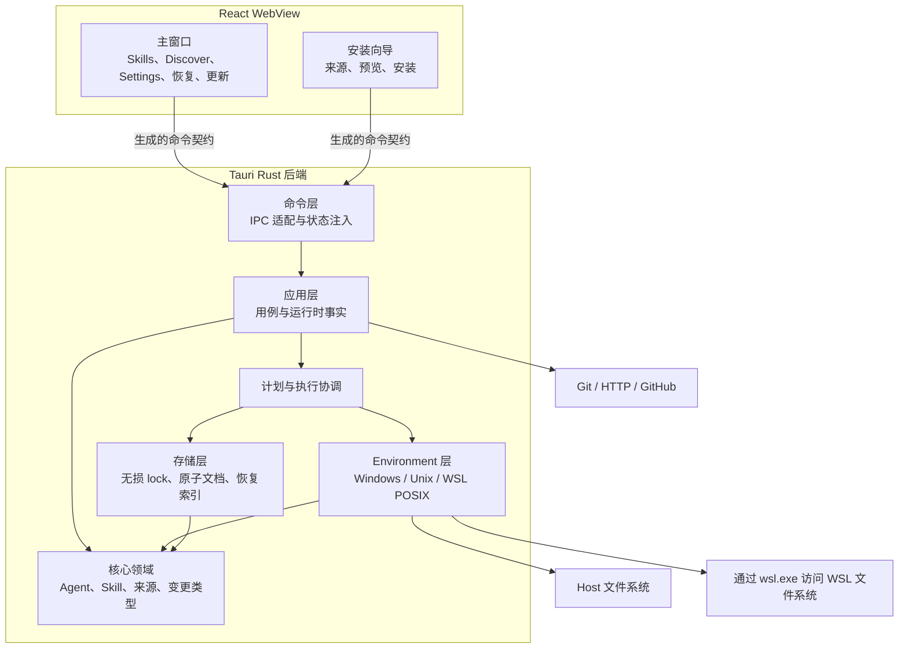

# 系统架构

## 架构目标

Skill Deck 是无服务器的跨平台桌面应用。架构需要同时满足以下目标：

- 用户数据保留在 Host 或选定的 WSL Environment 中；
- Windows、macOS 和 Linux 共享业务流程，文件系统能力和平台集成由对应后端实现；
- WSL 复用 Linux/POSIX 行为，同时保留 `wsl.exe` 的传输边界；
- 内置与自定义 Agent 使用同一运行时注册表和 Skill 工作流；
- 安装、更新、移除、复制和管理 Agent 共用预览、执行与恢复机制；
- React 与 Rust 通过同一份生成的类型契约通信；
- 主窗口和安装向导分别获得完成自身工作所需的命令权限；
- GitHub Release 制品能够完成签名校验和应用内更新。

## 系统边界



Skill Deck 与 `skills` CLI 通过共享的 Skill 目录和 lock 文件互操作，双方运行时相互独立。桌面应用自行实现所需能力，运行时不调用 CLI，也不依赖 Node.js。共享格式和稳定差异见[skills CLI 兼容](./skills-cli-compatibility.md)。

Windows 上的 WSL 发行版是外部执行环境。Skill Deck 负责发现、按需连接和执行 Skill 操作，Windows 及其系统工具负责发行版安装和生命周期管理。连接已经安装但处于停止状态的发行版时，`wsl.exe` 可能按需启动它。

## 进程与技术分层



主窗口和安装向导是同一桌面应用中的两个交互窗口，共享 Rust 进程、运行时状态和 `SingleMutationController`。后端业务授权使用同一套规则。

## 前端职责

| 区域 | 职责 |
|---|---|
| `pages/`、`components/`、`layouts/` | 页面结构、可访问性交互和可视状态 |
| `stores/` | 按 Environment/Context 隔离的客户端快照、请求版本和界面状态 |
| `workflows/` | 跨组件的预览、执行和结果归并 |
| `lifecycle/` | 未保存内容、关闭、退出、重启和写操作中断协调 |
| `hooks/useTauriApi.ts` | 生成命令的薄封装和 `Result` 解包 |
| `bindings.ts` | 由 Rust 命令和类型生成的 IPC 契约，不手工编辑 |

组件负责展示和收集用户选择。前端传递 `ContextRef`、业务标识和用户输入，后端负责文件系统、Agent 解析、lock、授权和写入规则。对话框和安装向导在打开时固定操作 Context，后续页面切换保持原操作目标。

### Skill 运行时快照

Skill 工作台的一次读取由后端在同一份 Agent 运行时快照上完成，并同时返回：

- 当前 Context 的 Skill；
- 当前范围可供筛选的 Agent；
- Project 路径是否可用等路径状态。

前端按 Context 保存整份结果。每个请求只写回启动时对应的 Context，请求版本负责丢弃过期响应。筛选候选与 Skill 的关联 Agent 都根据同一次读取中的目录状态计算，因此共享一致的 Agent 版本。

这一约束适用于 Skill 工作台的读取一致性。Agent 设置、安装向导等独立用例可以按自己的 Context 获取 Agent 信息；Skill 工作台中的每份快照都使用同一次请求返回的数据。

前端可以合并同一窗口中的重复请求并展示冷却状态。后端根据当前运行时状态决定请求是否执行以及退避时间；用户点击重试时，前端重新发出请求并展示后端结果。

## 后端职责

| 层 | 核心职责 | 交由其他层 |
|---|---|---|
| `commands` | Tauri DTO、状态注入、调用来源和入口适配 | 业务编排进入 `application`，平台操作进入 `environment` |
| `application` | 用例、运行时状态、预览与执行、来源会话、资源与恢复服务 | 平台操作进入 `environment`，持久化进入 `storage` |
| `application/mutation` | `MutationPlan`、`ExecutionUnit`、阶段顺序和结果 | Agent 与 Skill 策略来自应用用例和 `core` |
| `environment` | Context 解析、Environment 运行时、物理身份和 Native/WSL 操作 | 页面状态和文案由前端呈现 |
| `storage` | 原子文档、乐观并发提交和恢复记录 | 用例编排由 `application` 完成 |
| `core` | Agent、Skill、来源、lock 投影和纯领域规则 | Tauri 状态、窗口和传输由外层适配 |

Tauri 启动入口是组合根。它集中构造跨请求共享的注册表、WSL 会话、运行维护、写入控制、恢复索引和应用服务；命令从运行时服务图取得依赖。

应用使用标准本地日志保存开发诊断信息，业务反馈使用稳定错误代码、参数和受控标识。前端契约只包含用户工作流需要的结构化信息，日志保留在本机。

长期运行时状态使用内部 `EnvironmentKey` 作为键。Host 保持独立；WSL 发行版名称以不区分大小写的规范化值参与匹配，但不改写 `EnvironmentRef` 或用户看到的显示名称。

### 子进程启动意图

Skill Deck 根据用户是否明确要求显示外部界面区分两类子进程：

- 后台进程用于枚举、计算和有界业务操作，由应用监督并捕获输出，Windows 平台使用隐藏窗口参数；
- 前台启动用于用户明确要求打开资源或外部应用，允许目标程序显示界面。

统一的后台进程边界负责进程构造和 Windows 隐藏窗口参数，Git、WSL 和其他内部调用复用该入口。具体调用方继续负责各自协议的超时、取消、输入输出、重试和错误转换。Rust 静态检查要求业务代码通过统一入口启动系统进程，局部例外需要说明理由。

## IPC 与类型

Rust 命令是 IPC 的权威来源。`tauri-specta` 从 Rust 命令和类型生成 `src/bindings.ts`，前端封装只负责将生成的 `Result` 转换为成功值或结构化错误。

新增或修改命令时，需要同步完成：

1. Rust 命令与 DTO；
2. 正式命令注册；
3. 生成的 bindings；
4. `useTauriApi` 封装；
5. 允许调用它的窗口权限配置（`permission`/`capability`）；
6. 命令、ACL 和前端测试。

具体命令以代码为准，开发步骤见[贡献指南](../CONTRIBUTING.md)。

### 跨窗口 Agent 配置

安装向导遇到未知 Agent 时，通过进程内 Tauri 事件请求主窗口打开 `Settings > Agents`。请求只携带 Agent ID。主窗口先处理未保存的修改，再进入 Agent 设置；用户保存或取消后，主窗口把同一 Agent ID 和处理结果定向发送回安装向导。

安装向导收到成功结果后重新读取 Agent 注册表，确认定义存在后恢复选择。跨窗口请求只在当前进程和窗口生命周期内有效；窗口刷新或应用重启后，用户可以重新发起。两个窗口在首次渲染前都从共享偏好恢复语言和主题。

## 运行时主链

### Skill 写操作

```text
React 工作流
  -> 生成的 IPC 契约
  -> 应用用例
  -> 计划器
  -> 写入协调器
  -> 平台后端
  -> lock 与恢复存储
```

预览读取用户决策需要的目录、Agent、来源和风险信息，并生成预览凭据。执行时重新读取当前权限和运行时状态、重建计划并校验凭据，再交给协调器。安装、来源修复和跨 Environment 复制可以在预览前固定内容快照；更新在用户确认后获取新内容。详细协议见[执行与恢复](./execution-and-recovery.md)。

### 来源获取

来源解析器先产生稳定来源描述，再由来源类型和当前 Environment 选择获取后端。Host 来源由 Native 后端获取；WSL 本地来源直接从发行版原生路径读取，WSL Git 来源在该发行版的受控临时空间中获取。不同后端复用同一套发现语义，兼容规则见[skills CLI 兼容](./skills-cli-compatibility.md#来源发现与-well-known)。

安装、更新和来源修复都在当前 Environment 中获取内容并写入。跨 Environment 复制将来源获取与目标写入分开，后端之间传递经过校验的清单和内容数据；长期标识继续使用来源、Skill 和 Context 等业务信息。

远端更新比较与安装内容使用不同的数据。相同远端来源的版本证据可以在进程内合并，并在 Host 与 WSL 之间复用；用于安装的内容快照仍由实际获取它的 Environment 管理。跨后端传递的是经过校验的清单和内容数据，而不是对方 Environment 中的临时快照。来源解析、获取、发现、版本比较和落盘由独立能力组成，再由应用层按来源类型组合。

### Environment 运行维护

应用启动后异步完成 Host 的临时内容清理和恢复资源重建，主窗口可以同时加载。WSL 在连接成功后按新的会话修订号执行同一类维护；每个修订号对应一次维护尝试。维护失败只影响当前 Environment，界面在对应 Context 显示本次错误，其他 Environment 继续工作。

运行维护随 Environment 重新进入或应用重启再次执行，并使用新的运行时状态。维护错误只作为本次操作反馈展示，不进入恢复资源或产品级错误历史。用户可见行为见[产品设计](./product.md#context-侧栏)。

### 窗口生命周期与应用更新

关闭窗口、退出应用和重启先经过未保存内容保护，再检查当前写操作或更新活动。实际活动属于另一个窗口时，后端将动作交给对应窗口处理，两个窗口共享同一活动状态。

应用更新与 Skill 写操作共享生命周期准入。安装新版本前重新确认目标版本，并依赖 Tauri updater 的签名校验；下载和安装完成后再通过受保护流程重启应用。

## 安全边界

### 窗口命令权限

主窗口与安装向导属于同一桌面应用。窗口 ACL 负责默认拒绝、缩小误调用面和限制 WebView 能力，后端负责业务授权。

Tauri 保持默认拒绝；CSP、输入清理和实际使用的插件资源范围继续限制可调用能力，新增命令必须显式进入允许集合。只有确实依赖窗口身份的生命周期或跨窗口请求，才额外校验调用窗口，例如关闭、重启或完成通知的活动归属。

所有命令都会在后端重新校验类型化业务标识、Environment/Context 修订号、路径和资源归属。窗口身份只参与关闭、重启和跨窗口通知等确实依赖活动归属的操作。

### 类型化资源授权

读取或打开资源时，前端提交 `ContextRef`、Skill 标识、配置标识或不透明的恢复资源 ID，后端重新解析实际目标并校验目录身份。绝对路径用于界面展示。

恢复入口使用不透明资源 ID，Skill 内容读取和资源打开使用类型化业务标识。后端根据受管理根目录解析实际文件系统路径。

### WSL 执行

WSL 连接通过 `wsl.exe` 启动随应用发布的 POSIX `sh` 脚本，并检查 Git、POSIX shell 和当前操作依赖的 GNU 工具行为。全部条件满足后建立会话；缺少条件时返回具体连接错误。

业务参数通过位置参数或结构化标准输入传入。每项类型化操作负责自己的请求、响应和错误映射，共享执行器负责 `wsl.exe` 进程、超时、取消和有界输出。传输失败与权限、冲突和不安全路径等业务错误分别返回。

读取、来源获取和单次原子操作在业务写入开始前遇到会话失效时，可以安全重连并重试一次。多步骤受保护写入开始后不自动重放整个操作，后续失败进入当前执行结果和恢复协议。Windows 路径进入 WSL 时调用目标发行版的实际映射能力。

## 平台实现

| 执行 Environment | 后端 | 主要语义 |
|---|---|---|
| Windows Host | `NativeWindows` | Windows 路径、junction/reparse、大小写折叠和文件占用行为 |
| macOS Host | `NativeUnix` | POSIX 符号链接、权限、可执行位和文件系统身份 |
| Linux Host | `NativeUnix` | POSIX 符号链接、权限、可执行位和文件系统身份 |
| WSL 发行版 | `WslPosix` | 发行版内的 Linux/POSIX 语义，通过 `wsl.exe` 执行 |

执行 Environment 决定平台后端。存储归属环境决定受保护写入位置、物理目标身份、风险提示和恢复资源位置。WSL 原生存储保持 POSIX 大小写语义，Windows 管理的存储按 Windows 规则处理。写入计划只在归属已经确认且与当前 Environment 一致时生成，其他情况返回切换提示。

跨存储路径支持只读观察。跨 Environment 复制将已经固定的内容交给目标存储归属环境，由目标后端执行写入。Windows 可以发现和连接 WSL；macOS 与 Linux 仅提供 Host Environment。

## 数据与状态归属

| 状态 | 归属 |
|---|---|
| 应用设置和项目注册信息 | 对应 Environment 的配置存储 |
| Global/Project Skill lock | 对应 Context 的 lock 存储 |
| 自定义 Agent 定义 | 本机共享定义存储，按当前 Environment 解析 |
| 内容快照会话 | 实际获取内容的后端所拥有的有界临时存储 |
| 恢复标记与索引 | 执行写入的后端和应用运行时 |
| 前端快照 | 按 Environment/Context 隔离的 Zustand 状态存储 |

`skills` CLI lock 保存双方共享的 Skill 与来源字段。Project、Environment、Agent 归属和落盘实现由 Skill Deck 的运行时状态、Agent 定义和文件系统目录表达。

## 架构原则

- 计划器共享领域计划，平台后端提供较粗粒度的准备和写入操作。
- WSL 复用现有业务域，并通过随应用发布的脚本完成有界操作。
- Tauri 命令保持传输薄层，Host/WSL 写入分支位于 Environment 适配层。
- 前端请求版本服务界面协调，后端根据业务标识和运行时状态完成授权。
- 运行时路径用于展示，类型化业务标识用于资源授权。
- 生成的 bindings、`permission`、`capability` 和命令注册保持同源一致。
- 单个 Environment 或远端来源的失败只影响对应 Context，其他 Context 继续工作。
- 生产代码启动子进程前明确后台进程或前台启动意图。
