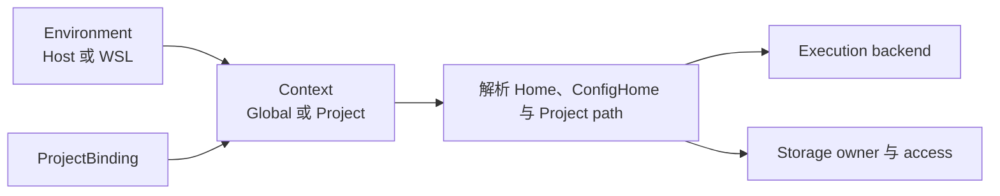

# Environment 与 Context

Environment 表示 Skill Deck 在哪个操作系统语义和用户空间中执行，Context 表示当前管理哪个 Global 或 Project 范围。Environment 决定路径解析和 execution backend；Context 提供业务范围；实际路径所在的 storage owner 决定 filesystem capability 和风险。三者相互关联，但不能互换。



## Environment

`EnvironmentRef` 当前有两种形态：

- `Host` 表示桌面应用所在操作系统和当前用户；
- `Wsl { distroName }` 表示 Windows 上一个具名 WSL 发行版及其 Linux 用户空间。

macOS 和 Linux 只提供 Host。Windows 始终保留 Host，并在发现 WSL 发行版后允许用户按需连接。Skill Deck 不提供 WSL 安装、创建、导入、终止、注销或重启，也不在发行版中部署 daemon 或常驻 helper。连接已经存在但处于停止状态的发行版时，`wsl.exe` 可能按需启动它；这属于连接行为，不表示应用拥有 WSL 生命周期。

应用每次启动都从 Host 的 Global Context 开始，不恢复上次选择的 WSL Environment。启动阶段可以发现 WSL 发行版，但不会因此建立连接或启动发行版；只有用户在当前会话中明确切换到某个 WSL Environment，才进入连接流程。用户主动切换或继续使用已经选择的 WSL Environment，表示允许连接流程或一次受控重连按需唤起已经停止的发行版；这不赋予 Skill Deck 单独启动、停止、重启或管理发行版的能力。

WSL 发现（Discovery）是重新获取当前 WSL 发行版列表的过程，它不建立连接，也不判断发行版当前是否可用。一次成功的发现会取代本次应用运行期间保存的上一份列表，列表中已经不存在的发行版会被移除；发现失败只报告发现错误，不推翻本次运行期间最近一次成功结果。应用重启后不会继续使用上一次运行保存的列表。某个已发现的发行版当前是否可用，由后续连接（Connection）或实际操作确认。连接失败只更新该 Environment 的运行状态和错误提示，不会顺带触发发现，也不会修改发行版列表。

每个 Environment 具有 status、generation/revision、Home、ConfigHome 和 path mapping。WSL 连接时另外得到是否满足正式支持基线的二元 preflight 结果；不维护供 Frontend 长期组合 fallback 的 capability snapshot。WSL session 丢失或重新连接后 generation 会变化，依赖旧 revision 的 preview、payload 或 runtime fact 不能继续授权执行。

Environment runtime identity 对 Host 使用固定值，对 WSL distro name 使用规范化且不区分大小写的值。用于匹配的规范化 identity 不改写 `EnvironmentRef`、用户配置或界面中的 display name。

发现或连接一个 WSL Environment 失败不会让 Host 或其他已连接 Environment 失效。Frontend 在切换成功前保留原 Context，旧请求也不能覆盖已经切换到的新 Environment。

## Context

`ContextRef` 由 Environment 和 scope 组成：

```text
ContextRef
  environment: Host | Wsl(distroName)
  scope: Global | Project(projectId)
```

Global 表示当前 Environment 的用户级 Skill 范围。Project 通过稳定 `projectId` 查找 `ProjectBinding`，再解析该 Environment 中的 native project path。显示路径不是 Context identity，Frontend 不能用 path string 代替 `ContextRef`。

同一个现实项目可以分别登记在 Windows Host 与某个 WSL Environment 中。这些 bindings 表达各自的执行入口、原生路径和 storage facts，不表示需要复制 Agent definition 或建立第二套 Agent catalog。

Project registry 按 Environment 隔离。连接成功后立即提交目标 Environment 的 Global Context，Project 列表随后按目标 Environment 独立加载；Project 加载失败不回滚已经提交的 Environment。连接失败时保持原 Context，不展示来自未提交切换的混合状态。

## ProjectBinding

`ProjectBinding` 将稳定的 `projectId` 映射到某个 Environment 中的 native path，并保存解析 Context 所需的 revision 和 storage facts。它不把显示路径提升为授权，也不允许仅凭其他 Environment 中的路径推断当前 binding。

需要展示 Project resolved path 的读取流程必须持有明确的 Project Context。只有 Environment 而没有 ProjectBinding 时，可以展示 Project-relative 规则，但不能借用任意登记项目生成看似确定的绝对路径。

移除 ProjectBinding 只取消 Skill Deck 对该 Context 的登记，不删除 Project 目录或其中的 Skill。Project 写入的业务行为见[Skill 生命周期](./skill-lifecycle.md)。

## 路径解析条件

Path declaration 与 runtime resolution 分离：

- Home-relative path 使用目标 Environment 的 Home；
- ConfigHome-relative path 使用目标 Environment 的 ConfigHome；
- Project-relative path 必须结合当前 `ProjectBinding`；
- absolute path 只在声明允许的 scope 中使用，并属于当前操作系统用户空间；
- resolved path 是 runtime fact，不持久化回 Agent definition 或 Context identity。

同一 Agent definition 可以在 Host 和不同 WSL Environment 中解析出不同绝对路径。声明不适用于当前 Environment、Project 尚未选择或 Environment 暂时不可用时，解析返回明确 unavailable/indeterminate 结果，不改写原始声明。

Agent path declaration 的领域规则见[Agent](./agents.md)，runtime path 的读写安全见[执行与恢复](./execution-and-recovery.md)。

## Execution Backend 与 Storage Access

Execution Environment 决定使用哪个 platform backend。Storage owner 表示目标路径实际由哪个 filesystem/storage 管理；它不改变用户已经选择的 execution Environment，但会影响 capability、physical identity、风险提示和恢复建议。

Project storage access 使用以下结果：

| Access | 含义 |
|---|---|
| `Native` | 路径由当前 Environment 原生拥有 |
| `CrossStorage` | 当前 Environment 可以只读访问，但路径由其他 Environment/storage 拥有；受保护写入需要切换 owner |
| `Unsupported` | 已确认当前方式不支持安全操作 |
| `Unknown` | 暂时无法确认 capability |

Windows Host 访问 WSL UNC、WSL 访问 mounted Windows path 都可能形成 `CrossStorage`。系统可以读取事实并提示风险，但受保护写入必须切换到实际 owner Environment，不通过 capability fallback 在当前 Environment 中继续写入。

Platform backend 与 storage owner 的技术边界见[系统架构](./architecture.md#platform-backend)，physical identity 与写入安全见[执行与恢复](./execution-and-recovery.md#path-safety-与-physical-identity)。

## WSL Environment 边界

WSL Environment 复用 Linux/POSIX 的路径、权限和 filesystem 语义，同时保留 distro identity、session revision、Windows 到 WSL 的 transport 和 path mapping。连接时只确认 Git、POSIX shell 和必要 GNU coreutils 是否满足正式支持基线，不维护通用 capability matrix。WSL 是独立 execution Environment，但不是第二套 Skill、Agent 或 mutation 业务域。

连接、切换和不可用状态由 Environment 模型表达；`wsl.exe` process supervision、typed operation、script asset 和安全协议由[系统架构](./architecture.md#wsl-execution)负责。本文不定义 WSL transport 实现。

## 跨 Environment 边界

业务操作显式声明来源 Context 与目标 Context。普通 Skill mutation 只在一个 target Environment 中执行；跨 Environment 复制先固定来源 Skill，再将受控 payload 交给一个目标 Environment。这里的“来源 Environment”是跨环境复制的业务角色，不是 Git、Local 或 Well-known Source 的通用属性；安装、更新和修复都在当前 Environment 中获取内容并执行写入。复制的业务约束见[Skill 生命周期](./skill-lifecycle.md#复制到项目)，单 Environment plan 和 payload 安全见[执行与恢复](./execution-and-recovery.md)。

原始 Source path、显示路径或其他 Environment 的 ProjectBinding 都不能作为跨 Environment 写入授权。

## 领域不变量

1. Environment 决定执行位置和 backend，Context 决定 Global 或具体 Project 范围。
2. `ContextRef` 使用稳定 identity，不使用显示路径代替 Environment 或 Project ID。
3. ProjectBinding 按 Environment 隔离，同一现实项目的多个 binding 不共享执行 authority。
4. Resolved path 和 runtime capability 不写回 Agent definition 或 Context identity。
5. Storage owner 决定受保护写入边界；当前 Environment 与 owner 不一致时只读观察并引导切换，不反向改写 execution Environment。
6. 一个 Environment 暂时不可用时，其他 Environment 与已保存 identity 继续有效。
7. WSL 复用 POSIX 业务语义，同时保留独立 distro、session 和 transport 边界。
