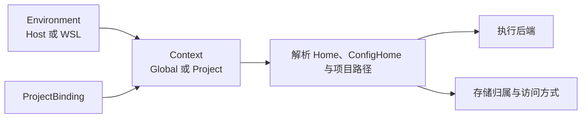

# Environment 与 Context

`Environment` 决定 Skill Deck 在哪个操作系统和用户空间中执行，并据此选择路径规则与执行后端。`Context` 决定当前管理 Global 还是某个 Project。存储归属环境表示目标路径由哪个文件系统管理，并决定受保护写入的位置。



## Environment

`EnvironmentRef` 当前有两种形态：

- `Host`：桌面应用所在的操作系统和当前用户；
- `Wsl { distroName }`：Windows 上某个具名 WSL 发行版及其 Linux 用户空间。

macOS 和 Linux 只有 Host。Windows 始终保留 Host，并在发现可用 WSL 发行版后增加相应选项。Windows 及其系统工具负责 WSL 的安装、导入和生命周期管理，Skill Deck 负责发现、连接和执行 Skill 操作。连接已经安装但处于停止状态的发行版时，`wsl.exe` 可能按需启动它。

应用每次从 Host 的 Global Context 启动。启动阶段可以发现 WSL 发行版；用户选择具体 WSL Environment 后，应用才建立连接。

发现失败时，Host 和其他已可用 Environment 继续工作，界面保留最近一次成功列表并显示本次错误。当前 Environment 提供重新连接入口，其他 Environment 在用户再次选择时重新连接。

发行版发现负责刷新当前可选列表，Environment 连接负责检查运行条件并建立可用会话。发现成功后替换本次运行期间保存的列表；发现失败时只更新错误提示。连接失败时更新对应 Environment 的状态，发行版列表保持不变。

每个 Environment 的运行时记录包含状态、修订号、Home、ConfigHome 和路径映射。WSL 连接还会检查正式支持所需的最低用户态条件。会话丢失或重新连接后，Environment 使用新的修订号；基于旧修订号生成的预览会过期。

Environment 比较键对 Host 使用固定值，对 WSL 使用不区分大小写的规范化发行版名称。`EnvironmentRef`、用户配置和界面继续保留原始名称。

## Context

`ContextRef` 由 Environment 和范围组成：

```text
ContextRef
  environment: Host | Wsl(distroName)
  scope: Global | Project(projectId)
```

Global 表示当前 Environment 的用户级 Skill 范围。Project 通过稳定的 `projectId` 找到 `ProjectBinding`，再解析出该 Environment 中的原生项目路径。`ContextRef` 是上下文身份，显示路径用于界面说明。

项目注册信息按 Environment 隔离。同一个现实项目可以分别登记在 Windows Host 和某个 WSL Environment 中；每份登记拥有自己的路径、存储状态和执行入口。Agent 定义继续由所有 Environment 共享。

切换 Environment 成功后，应用先进入目标 Environment 的 Global Context，再独立加载该 Environment 的项目列表。项目列表加载失败时，Environment 保持已连接状态，项目区域显示错误。

重新连接当前 Environment 后保留现有 Global 或 Project Context，并刷新项目列表。成功加载的列表确认当前项目已经移除时，界面回到 Global；连接失败时继续展示原 Context。

## ProjectBinding

`ProjectBinding` 将稳定的 `projectId` 映射到某个 Environment 中的原生路径，并保存项目展示信息。Environment 与 `projectId` 共同确定绑定身份，显示路径只承担展示和路径解析作用。

移除 ProjectBinding 会解除 Skill Deck 对该项目的登记，项目目录和其中的 Skill 保持原样。项目注册信息的写入使用统一的单写控制，具体执行约束见[执行与恢复](./execution-and-recovery.md)。

读取流程持有明确的 Project Context 后，才能展示该项目的解析路径。只有 Environment 时，界面可以说明项目相对路径规则；选择具体 `ProjectBinding` 后再解析绝对路径。

### 项目路径规范化

同一 Environment 内，添加项目和读取项目列表都会按该 Environment 的路径规则进行规范化，再用规范化后的路径去重：

- 统一路径分隔符，消除多余的 `.`、`..` 和末尾分隔符；
- Windows Host 的盘符和普通 UNC 路径按大小写不敏感比较；
- Windows Host 将 `\\wsl$` 与 `\\wsl.localhost` 视为同一种 WSL UNC 形式；发行版名称比较时不区分大小写，但发行版之后的 Linux 路径保留大小写语义；
- macOS、Linux 和 WSL 使用 POSIX 路径规则，路径部分按大小写敏感比较。

路径规范化处理文本形式和平台比较规则。`realpath`、符号链接、junction 和其他物理身份判断在实际文件系统操作阶段完成。不同 Environment 的项目登记分别保留。

## 路径输入与解析

添加项目时，路径必须先转换为目标 Environment 的原生表达：

- Host 接受 Windows 原生路径、普通 UNC 和指向 WSL 的 UNC 路径；
- WSL 接受自身的 POSIX 路径，以及指向当前发行版的 `\\wsl$` 或 `\\wsl.localhost` 路径；
- Windows 路径进入 WSL 时，调用目标发行版提供的实际映射能力，例如 `wslpath`；
- 指向其他 WSL 发行版的 UNC 路径返回跨发行版错误，无法安全转换的路径返回不支持映射错误。

Agent 的路径声明与运行时解析分开处理：

- 相对于 Home 的路径以目标 Environment 的 Home 为基准；
- 相对于 ConfigHome 的路径以目标 Environment 的 ConfigHome 为基准；
- 相对于 Project 的路径必须结合当前 `ProjectBinding`；
- 绝对路径在声明允许的范围内使用，并按当前操作系统用户空间解释；
- 解析出的绝对路径保留在运行时结果中，Agent 定义和 Context 标识继续保存稳定声明。

同一份 Agent 定义可以在 Host 和不同 WSL Environment 中解析出不同路径。当前 Environment 不支持该声明、尚未选择 Project 或 Environment 暂时不可用时，解析返回不可用或待确认结果，原始定义继续保留。

Agent 的路径规则见[Agent](./agents.md)，受保护读写的路径安全见[执行与恢复](./execution-and-recovery.md)。

## 执行位置与存储访问

执行 Environment 决定使用哪个平台后端。存储归属环境表示目标路径由哪个文件系统管理，并据此决定受保护写入的位置。用户当前选择的 Environment 仍由界面状态表达。

项目的存储访问结果使用以下稳定值：

| 值 | 含义 |
|---|---|
| `Native` | 路径由当前 Environment 原生管理 |
| `CrossStorage` | 当前 Environment 可以读取或观察，但路径由其他 Environment 管理；受保护写入必须切换到归属环境 |
| `Unsupported` | 已确认当前方式不支持安全操作 |
| `Unknown` | 暂时无法确认访问能力 |

Windows Host 访问 WSL UNC、WSL 访问 Windows 挂载路径，都可能形成 `CrossStorage`。系统展示当前访问状态和风险，并引导用户切换到存储归属环境执行受保护写入。

平台后端和物理路径判断见[系统架构](./architecture.md)，具体写入安全见[执行与恢复](./execution-and-recovery.md)。

## WSL Environment 边界

WSL 复用 Linux/POSIX 的路径、权限和文件系统语义，并保留独立的发行版标识、会话修订号、Windows 到 WSL 的传输边界和路径映射。连接使用 Git、POSIX shell 和当前操作所需的 GNU coreutils 作为最低用户态基线。WSL 作为独立 Environment 复用现有 Skill、Agent 和写入业务。

Environment 模型表达连接、切换和不可用状态。`wsl.exe` 的进程监督、类型化操作、脚本资源和安全协议见[系统架构](./architecture.md)。

## 跨 Environment 操作

普通 Skill 安装、更新和来源修复都在当前 Environment 中获取内容并执行写入。跨 Environment 复制由来源 Environment 固定完整 Skill 内容，再由目标 Environment 在目标存储中完成受保护写入。目标 Environment 同时承担目标路径的存储归属职责。

跨 Environment 写入以目标 Environment、目标 `ProjectBinding` 和存储归属检查为依据。来源路径和显示路径用于定位与展示。复制的业务规则见[Skill 生命周期](./skill-lifecycle.md#复制到项目)，内容快照和写入协议见[执行与恢复](./execution-and-recovery.md)。

## 领域规则

1. Environment 决定执行位置和平台后端，Context 决定 Global 或具体 Project 范围。
2. `ContextRef` 使用 Environment 与 Project ID 等稳定标识，显示路径承担界面说明作用。
3. ProjectBinding 按 Environment 隔离，同一现实项目的多份登记分别拥有写入授权。
4. 运行时解析出的路径和访问结果保留在当前会话，Agent 定义与 Context 标识继续保存稳定声明。
5. 存储归属环境决定受保护写入位置；跨存储访问用于观察状态和引导切换。
6. 一个 Environment 暂时不可用时，其他 Environment 和已保存的标识继续有效。
7. WSL 复用 POSIX 业务语义，同时保留独立的发行版、会话和传输边界。
