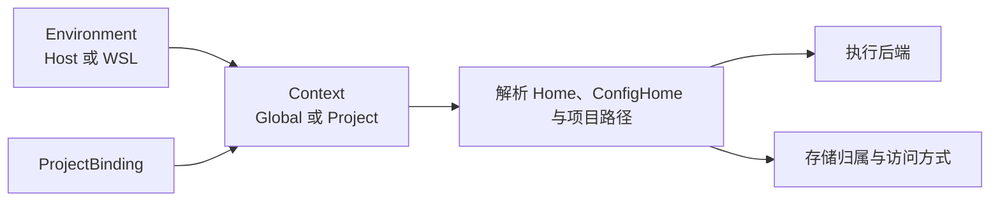

# Environment 与 Context

`Environment` 表示 Skill Deck 在哪个操作系统和用户空间中执行，`Context` 表示当前管理哪个范围。Environment 决定路径如何解析以及使用哪个执行后端；Context 决定管理 Global 还是某个 Project；路径实际由哪个存储归属环境管理，则决定受保护写入的边界。三者相互关联，但不能互相替代。



## Environment

`EnvironmentRef` 当前有两种形态：

- `Host`：桌面应用所在的操作系统和当前用户；
- `Wsl { distroName }`：Windows 上某个具名 WSL 发行版及其 Linux 用户空间。

macOS 和 Linux 只有 Host。Windows 始终保留 Host；只有安装 WSL 且发现可用发行版时，才增加 WSL 选项。Skill Deck 不安装、创建、导入、终止、注销或重启 WSL，也不在发行版中部署常驻 helper。连接已存在但处于停止状态的发行版时，`wsl.exe` 可能按需启动它，这仍属于连接过程，不表示应用拥有 WSL 生命周期管理权。

应用每次启动都从 Host 的 Global Context 开始，不恢复上次选择的 WSL Environment。启动时可以发现 WSL 发行版，但不会因此连接或启动任何发行版；用户明确切换到 WSL 后，才建立连接。发现失败不会影响 Host 或其他已可用 Environment，也不会把失败伪装成空列表。当前已选 Environment 连接失败时，用户可以直接重新连接；其他 Environment 在用户再次选择时自然重试，不为每个 Environment 保存长期重试状态。

发现与连接回答不同问题：发现只重新获取当前 WSL 发行版列表，不判断发行版是否能够完成 Skill 操作；连接才确认某个 Environment 当前可用。成功发现会替换本次运行期间保存的列表，应用重启后不沿用上一次运行的列表；发现失败只更新提示，不修改最近一次成功的列表，也不保存独立的错误历史。连接失败只更新该 Environment 的状态并提示本次失败，不修改发行版列表。

每个 Environment 的运行时记录包含状态、修订号、Home、ConfigHome 和路径映射。WSL 还要在连接时检查是否满足正式支持的最低用户态要求。WSL 会话丢失或重新连接后修订号会变化，依赖旧修订号的预览或执行不能继续使用。

用于比较的 Environment 标识对 Host 使用固定值，对 WSL 使用规范化后的发行版名称，且不区分大小写。这个比较值不改写 `EnvironmentRef`、用户配置或界面显示名称。

## Context

`ContextRef` 由 Environment 和范围组成：

```text
ContextRef
  environment: Host | Wsl(distroName)
  scope: Global | Project(projectId)
```

Global 表示当前 Environment 的用户级 Skill 范围。Project 通过稳定的 `projectId` 找到 `ProjectBinding`，再解析出该 Environment 中的原生项目路径。显示路径只是运行时信息，不能代替 `ContextRef`。

项目注册信息按 Environment 隔离。同一个现实项目可以分别登记在 Windows Host 和某个 WSL Environment 中；这些登记各自拥有路径、存储事实和执行入口，不自动合并，也不因此复制 Agent 定义。

切换 Environment 成功后，应用先进入目标 Environment 的 Global Context，再独立加载该 Environment 的项目列表。项目列表加载失败不会撤销已经完成的 Environment 切换。重新连接当前 Environment 后保留现有 Global 或 Project Context，并刷新项目列表；只有成功加载的列表明确确认当前项目已经不存在时，才回到 Global。连接失败时保留原 Context，不把未提交目标环境的数据混入当前页面。

## ProjectBinding

`ProjectBinding` 将稳定的 `projectId` 映射到某个 Environment 中的原生路径，并保存项目的展示信息。它不把显示路径当作授权，也不允许仅凭其他 Environment 的路径推断当前绑定。

移除 ProjectBinding 只解除 Skill Deck 对该项目的登记，不删除项目目录或其中的 Skill。项目注册信息的写入仍受统一的单写控制，具体执行约束见[执行与恢复](./execution-and-recovery.md)。

需要展示 Project 解析路径的读取流程必须持有明确的 Project Context。只有 Environment 而没有 ProjectBinding 时，可以说明项目相对路径规则，但不能借用任意已登记项目生成看似确定的绝对路径。

### 项目路径规范化

同一 Environment 内，添加项目和读取项目列表都会按该 Environment 的路径规则进行规范化，再用规范化后的路径去重：

- 统一路径分隔符，消除多余的 `.`、`..` 和末尾分隔符；
- Windows Host 的盘符和普通 UNC 路径按大小写不敏感比较；
- Windows Host 将 `\\wsl$` 与 `\\wsl.localhost` 视为同一种 WSL UNC 形式；发行版名称比较时不区分大小写，但发行版之后的 Linux 路径保留大小写语义；
- macOS、Linux 和 WSL 使用 POSIX 路径规则，路径部分按大小写敏感比较。

规范化只处理路径文字，不解析 `realpath`，也不通过 symlink 或 junction 判断物理上是否相同。不同 Environment 的项目登记永远不会自动去重或合并。

## 路径输入与解析

添加项目时，路径必须先转换为目标 Environment 的原生表达：

- Host 接受 Windows 原生路径、普通 UNC 和指向 WSL 的 UNC 路径；
- WSL 接受自身的 POSIX 路径，以及指向当前发行版的 `\\wsl$` 或 `\\wsl.localhost` 路径；
- Windows 路径进入 WSL 时，调用目标发行版提供的实际映射能力（例如 `wslpath`），不假设所有发行版都固定挂载在 `/mnt/<drive>`；
- 指向其他 WSL 发行版的 UNC 路径不得归入当前 WSL Environment；无法安全转换的路径直接返回不支持映射的错误。

Agent 的路径声明与运行时解析分开处理：

- 相对于 Home 的路径以目标 Environment 的 Home 为基准；
- 相对于 ConfigHome 的路径以目标 Environment 的 ConfigHome 为基准；
- 相对于 Project 的路径必须结合当前 `ProjectBinding`；
- 绝对路径只有在声明允许的范围内才能使用，并且属于当前操作系统用户空间；
- 解析出的绝对路径是运行时事实，不写回 Agent 定义或 Context 标识。

同一份 Agent 定义可以在 Host 和不同 WSL Environment 中解析出不同路径。声明不适用于当前 Environment、尚未选择 Project 或 Environment 暂时不可用时，解析返回明确的不可用或待确认结果，不改写原始定义。Agent 的路径规则见[Agent](./agents.md)，受保护读写的路径安全见[执行与恢复](./execution-and-recovery.md)。

## 执行位置与存储访问

执行 Environment 决定使用哪个平台后端。存储归属环境表示目标路径实际由哪个文件系统管理；它不改变用户当前选择的 Environment，但会决定是否允许受保护写入。

项目的存储访问结果使用以下稳定值：

| 值 | 含义 |
|---|---|
| `Native` | 路径由当前 Environment 原生管理 |
| `CrossStorage` | 当前 Environment 可以读取或观察，但路径由其他 Environment 管理；受保护写入必须切换到归属环境 |
| `Unsupported` | 已确认当前方式不支持安全操作 |
| `Unknown` | 暂时无法确认访问能力 |

Windows Host 访问 WSL UNC、WSL 访问 Windows 挂载路径，都可能形成 `CrossStorage`。系统可以展示事实、提示风险并引导用户切换，但不能因为当前后端碰巧能够访问路径，就在非归属环境执行受保护写入。平台后端和物理路径判断见[系统架构](./architecture.md)，具体写入安全见[执行与恢复](./execution-and-recovery.md)。

## WSL Environment 边界

WSL 复用 Linux/POSIX 的路径、权限和文件系统语义，同时保留独立的发行版标识、会话修订号、Windows 到 WSL 的传输边界和路径映射。连接时只检查正式支持所需的 Git、POSIX shell 和当前操作需要的 GNU coreutils，不维护面向用户的通用能力矩阵。WSL 是独立的执行 Environment，不是第二套 Skill、Agent 或写入业务。

连接、切换和不可用状态由 Environment 模型表达；`wsl.exe` 的进程监督、类型化操作、脚本资源和安全协议由[系统架构](./architecture.md)负责，本文不重复实现细节。

## 跨 Environment 操作

普通 Skill 安装、更新和来源修复都在当前 Environment 中获取内容并执行写入。跨 Environment 只有复制操作会区分来源 Environment 与目标 Environment：来源只负责固定完整 Skill 内容，目标 Environment 必须同时是目标路径的存储归属环境，并在那里完成受保护写入。

来源路径、显示路径和其他 Environment 的 ProjectBinding 都不能单独构成跨 Environment 写入授权。复制的业务规则见[Skill 生命周期](./skill-lifecycle.md#复制到项目)，内容快照和写入协议见[执行与恢复](./execution-and-recovery.md)。

## 领域不变量

1. Environment 决定执行位置和平台后端，Context 决定 Global 或具体 Project 范围。
2. `ContextRef` 使用稳定标识，不用显示路径代替 Environment 或 Project ID。
3. ProjectBinding 按 Environment 隔离；同一现实项目的多份登记不共享写入授权。
4. 运行时解析出的路径和访问能力不写回 Agent 定义或 Context 标识。
5. 存储归属环境决定受保护写入边界；当前 Environment 不属于归属环境时，只能观察并引导切换。
6. 一个 Environment 暂时不可用时，其他 Environment 和已保存的标识继续有效。
7. WSL 复用 POSIX 业务语义，同时保留独立的发行版、会话和传输边界。
