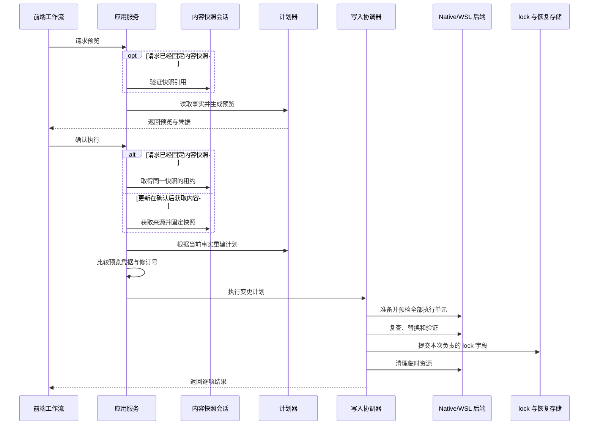
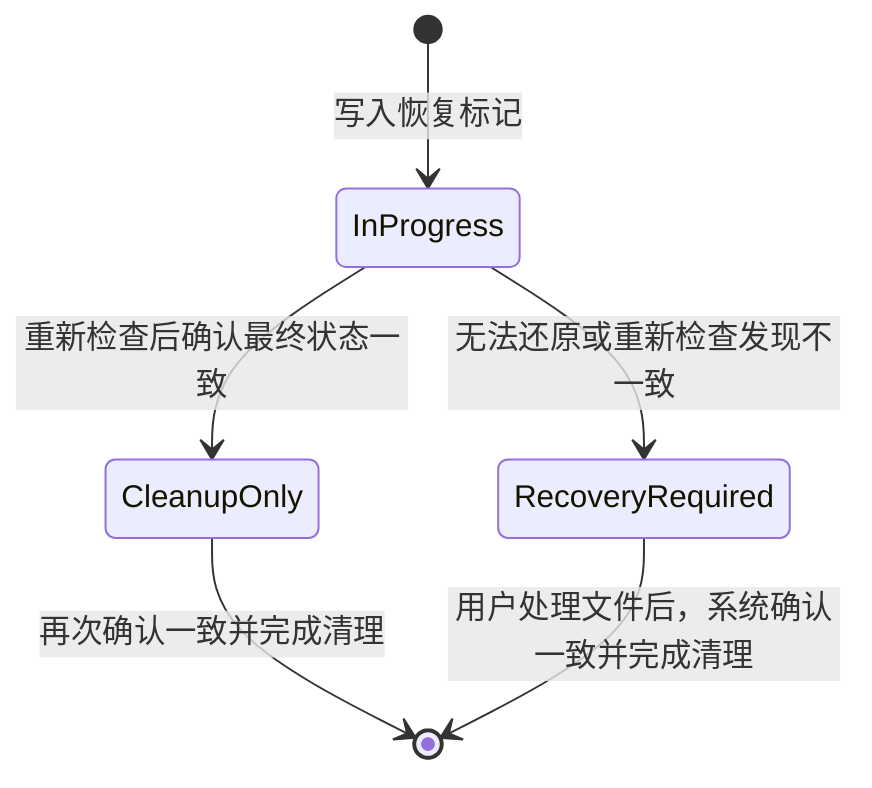

# 执行与恢复

## 统一执行模型

安装、更新、来源修复、移除、复制和管理 Agent 共用同一条写入主链：

```text
接收请求
  -> 读取当前运行时事实
  -> 生成预览
  -> 用户确认
  -> 取得全局写入资格
  -> 获取或固定内容快照
  -> 重建并验证变更计划
  -> 逐执行单元完成预检
  -> 执行写入
  -> 提交本次操作负责的 lock 字段
  -> 清理临时资源，必要时保留恢复资源
```

业务用例决定最终要实现的结果，计划器将意图转换为与具体平台无关的变更计划（`MutationPlan`），写入协调器保证阶段顺序，Native 或 WSL 后端负责真实文件系统操作。

## 核心对象

| 对象 | 职责 |
|---|---|
| Skill 内容快照（`Payload`） | 保存一次来源获取后得到的完整、不可变 Skill 目录 |
| 快照引用 | 在预览和执行之间标识已经固定的内容快照，不暴露临时路径 |
| 快照租约 | 执行期间阻止内容快照被运行维护任务回收 |
| 预览凭据 | 绑定请求、Agent 注册表、Environment、Context、已观察状态和计划规则 |
| 变更计划（`MutationPlan`） | 描述一个目标 Environment 中需要执行的全部单元 |
| 执行单元（`ExecutionUnit`） | 独立提交或恢复一个 Skill 主目录、相关 Agent 目录项和 lock 变更 |
| 准备执行器 | 在 Native 或 WSL 中完成准备、复查、替换、验证、还原和清理 |
| 恢复资源 | 受保护写入未能确认一致时保留的受控证据和稳定标识 |

## Skill 内容快照

内容快照是完整的 Skill 目录，不只是根目录文件。它包括 `SKILL.md`、脚本、参考资料、资源文件、隐藏文件、嵌套目录和可执行权限信息。

采集内容时遵守以下边界：

- 目录项使用相对路径和确定性顺序；
- 快照内部的符号链接在确认安全后解引用，并把实际内容写入清单；
- 指向来源根目录外部、目标不存在或形成循环的符号链接不得进入快照；
- 不跟随目标目录中已有的最终符号链接或 Windows reparse point；
- 来源身份、快照内容、本地 lock 和远端更新分别使用各自的哈希，不能混用字段；
- 临时内容归实际获取它的后端所有，不假设所有来源都能表示为 Host 路径。

安装、来源修复和跨 Environment 复制会在预览前取得并固定内容快照。预览验证快照引用，执行时取得租约并使用同一份内容。安装和来源修复都由当前 Environment 同时完成获取与写入；只有复制可能由来源 Environment 获取内容，再交给目标 Environment 写入。

来源获取或预览失败时尚未进入写入流程，不会产生恢复资源。快照引用已经过期，或者运行维护无法确认其归属时，操作返回结果已过期，用户需要重新获取来源；系统不会继续使用已经失去管理权的临时目录。跨 Environment 复制在内容固定后不再依赖来源 Environment 在线，但目标 Environment 必须保持可用。安装和来源修复始终要求当前 Environment 可用。

更新采用不同的获取时机。更新预览只读取 lock、Agent 目标、目标目录和修订号等本地事实；用户确认并取得全局写入资格后，才在当前 Environment 获取并固定新内容。后续计划重建、验证和执行都使用这次确认后得到的同一份快照。用户取消确认不会留下无效快照。

## 预览与执行



预览是只读操作，不取得全局写入资格，也不缓存一份等待直接执行的旧计划。执行会重新解析当前后端、运行时权限和目标状态，再重建计划并验证预览凭据。已经固定内容的请求不会重新读取原始来源。

跨 Environment 复制的预览需要明确区分两类来源问题：lock 中没有对应记录时返回 `missingMetadata`，记录存在但必要字段无法解释时返回 `invalidMetadata`。这两种结果都要求用户先修复来源。其他 Environment、项目、路径或请求错误仍按普通错误处理，不能一概转成来源修复。修复成功后，前端只恢复用户原来的复制选择并提示重新点击复制，不自动重放预览或写入。

执行必须拒绝预览后发生的以下变化：

- Agent 注册表已经变化；
- Environment 会话或所需能力已经变化；
- Context、项目绑定或根目录身份已经变化；
- 预览前固定的内容快照已经变化或过期；
- 目标目录或 lock 已被外部修改；
- 计划规则已经升级。

预检按实际动作确认必要条件，不建立脱离业务用途的通用能力档案：

| 动作 | 必须确认的事实 |
|---|---|
| 复制内容 | 准备目录与内容清单完整一致 |
| 创建符号链接 | 链接类型和目标与计划一致 |
| 设置可执行权限 | 文件权限与内容清单一致 |
| 原子替换 | 在目标父目录内，应用自有的临时目录能够完成重命名往返 |
| 移除或保留 | 没有内容快照时，通过唯一的受控探针确认目录能力，并立即清理探针 |

任何预检失败都不得改变最终目录、lock 或已有备份。正常结束时必须清理准备目录和探针；清理失败时只能保留本次操作拥有的证据，不能扩大删除范围。

“结果已过期”不是普通执行失败。前端需要重新请求预览，并让用户复核已经变化的目标、覆盖项或风险。对话框不会因为结果过期、失败或部分完成而自动关闭，只有全部完成当前交互才结束。

## 变更计划与执行单元

一份 `MutationPlan` 只属于一个目标 Environment，不能在同一计划中混合 Host 和 WSL 的执行单元。

一个 `ExecutionUnit` 同时负责：

- 当前 Skill 的主目录；
- 本次意图要求的 Agent 目录项；
- 对应的 lock 变更；
- 受保护写入前必须保持不变的目标指纹；
- Agent 注册表、Environment 和 Context 的修订号。

管理单个 Skill 的 Agent 时只生成一个执行单元。主目录、全部相关 Agent 目录项和 lock 必须一起成功，或者一起还原；无法还原时进入恢复流程。多个 Skill 或多个项目组成的批次仍按执行单元独立收敛，因此可能部分完成。单个执行单元不能用“部分完成”掩盖 `RecoveryRequired`。

多个逻辑 Agent 指向同一物理目标时，计划阶段先按物理身份合并，后端只写入一次，再把结果映射回各个 Agent。相同路径字符串不代表同一物理位置；跨存储复制必须根据文件系统身份判断是否复制到自身。WSL 中的目标也不能一律假设区分大小写：Windows 管理的存储按 Windows 规则折叠大小写，发行版原生存储保持 POSIX 语义，无法确认归属时不生成写入计划。

批次在进入写入协调器前，先验证计划结构、快照归属、物理目标冲突和已捕获修订号等确定性事实。整体验证失败时，没有执行单元进入准备或受保护写入；能够定位原因的单元返回具体错误，其余单元返回 `NotRun`。

整体验证通过后，所有执行单元都在首个最终目录替换前完成准备和动作预检。某个单元准备失败只影响该单元，已经生成的临时内容会被清理，其他互不冲突的单元仍可继续。进入受保护写入后的失败也按单元还原，已经成功提交的单元不会因为后续单元失败而回滚。来源获取发生在变更计划形成之前；获取失败按来源和受影响 Skill 返回，不能虚构一个从未进入写入协调器的执行单元。

## 执行阶段

每个通过验证的执行单元遵循固定顺序：

```text
准备临时内容
  -> 复查运行时权限
  -> 复查目标目录
  -> 替换最终目录
  -> 验证结果
  -> 提交 lock
  -> 清理临时资源
```

- 准备阶段创建与目标同父目录的备份、临时目录和恢复标记，但不改变最终目录；
- 准备符号链接时只验证链接自身记录的目标，替换完成后再验证最终解析关系；
- 两次复查用于发现预览、预检和最终替换之间发生的外部变化；
- 最终替换使用对应后端的原子替换或原子移除能力；
- 结果验证重新检查完整目录清单、可执行权限和符号链接目标；
- lock 提交只修改当前执行单元负责的记录或根字段；
- 清理阶段删除备份、临时目录和已经完成的恢复标记。

最终替换、结果验证或 lock 提交失败时，执行器先尝试还原，再清理临时资源。还原成功后，该单元返回普通失败；还原失败时返回 `RecoveryRequired`。清理失败不会推翻已经验证并提交的成功结果，结果仍为 `Succeeded`，同时附带稳定警告。

## 结果与错误

执行单元使用以下稳定状态：

| 状态 | 含义 |
|---|---|
| `Succeeded` | 文件与本次负责的 lock 已提交，可以附带清理警告 |
| `Failed` | 当前单元未完成，后端已经确认没有需要持久保留的未收敛状态 |
| `Skipped` | 当前单元因明确的业务条件未执行 |
| `Cancelled` | 取消请求在当前单元完成前生效 |
| `NotRun` | 整体验证或预检失败，当前单元没有开始 |
| `RecoveryRequired` | 受保护写入未能确认一致，已经保留恢复资源，需要用户检查相关文件 |

错误和警告使用稳定代码与参数。内部技术细节只用于开发和本机日志；前端根据错误代码选择中文提示、重试方式和恢复入口。

每项结果都携带能够定位 Skill、Environment、Context 和操作目标的结构化标识。`RecoveryRequired` 必须原样传到安装、复制、来源修复、管理 Agent、移除和更新工作流，不能压成普通 `Failed`；单个执行单元也不能聚合成“部分完成”。`Skipped` 不计为成功，`NotRun` 不伪装成执行失败。

执行状态通过统一的写操作通道发布当前阶段和可选进度。前端不能从日志或原始路径猜测进度，也不能直接把后端路径当作用户可见目标。

## 取消与全局单写控制

同一进程中一次只允许一个会修改 Skill、Agent 默认目标或项目注册信息的操作。项目的添加、移除、偏好修改和迁移同样进入这套单写控制。`SingleMutationController` 向主窗口和安装向导发布统一状态，并与窗口关闭、应用退出和更新重启共用活动检查。

取消采用协作式信号：

- 在预检和每个受保护写入阶段前检查；
- WSL 执行器终止并回收对应的 `wsl.exe` 子进程；
- 返回 `Cancelled` 后不得继续写入；
- 已完成的执行单元保留真实成功结果，尚未开始的单元不再执行；
- 临时内容必须清理，无法安全清理时进入运行维护或恢复流程能够识别的状态。

更新在来源获取和验证阶段可以响应停止请求；进入不可中断的原子提交区间后，需要等待当前步骤结束。请求停止不等于写操作已经结束，调用方必须等待结构化结果。关闭、退出或重启时，用户可以继续等待，也可以先取消支持取消的操作，再继续原来的应用生命周期动作。

## 路径安全与物理身份

路径声明和运行时授权是两件事。保存 Agent 定义时只验证声明是否合法；实际读写时，由当前 Environment 解析 Home、配置目录、项目目录和允许使用的路径根。

后端在操作前必须：

- 规范化最近存在的父目录；
- 识别存储归属和实际文件系统能力；
- 拒绝文件系统根目录、Home、配置目录和项目根目录等危险目标；
- 拒绝来源与目标相同、祖先关系重叠或复制到自身；
- 检查 Unix 符号链接和 Windows junction/reparse point 穿越；
- 按最终目录项本身执行，不跟随待删除链接指向的内容；
- 限制所有受管理目录项位于已经解析的 Skill 根目录内。

前端路径只用于展示。读取、打开、移除和恢复都提交类型化业务标识，由后端重新解析真实位置并校验归属。

## Native 与 WSL 执行

Native 和 WSL 实现同一组较粗粒度的准备操作，不要求内部文件系统原语完全一致。后端选择、存储归属和 WSL 传输边界见[系统架构](./architecture.md#平台实现)。

### Native

- Windows 后端处理 junction、目录符号链接、reparse point、大小写折叠、文件占用和 UNC 路径；
- macOS 与 Linux 共用 Native Unix 后端，处理 POSIX 符号链接、权限、可执行位和 inode/device 身份；
- 实际文件系统能力通过目标位置的受控检查确认，不能只根据操作系统名称推断。

### WSL

WSL 后端复用 Linux/POSIX 的路径、权限、相对符号链接、重命名、lock 和结果语义，同时处理发行版会话、受控内容传递、路径映射、取消和传输失败。WSL 本地来源直接在发行版中获取，不经过 Windows Host 临时目录。

WSL 能够访问某个路径，不代表允许由当前 WSL Environment 写入。`/mnt/c` 等 Host 管理的存储可以从 WSL 只读观察，但受保护写入必须切换到 Host；物理目标分组也使用 Host 的大小写语义。这个判断在预检和 lock 归属确认前完成，不能推迟到最终落盘阶段。

Native 与 WSL 必须返回同一组执行结果、警告和恢复语义。平台差异不能改变预览与执行、动作预检、原子提交或取消约束。

## lock 提交与外部并发

Global 和 Project lock 可能同时被 `skills` CLI、其他 Skill Deck 实例或用户工具修改。提交采用乐观并发检查：

- 读取阶段只记录当前业务用例负责的 Skill 记录和根字段；
- 提交前重新读取最新文档；
- 本次负责的字段与预期状态不一致时返回结果已过期或冲突；
- 无关记录和未知字段从最新文档保留；
- 一个执行单元成功提交后，后续单元以新的文档状态继续检查。

lock 路径、共享字段和 CLI 兼容规则见[skills CLI 兼容](./skills-cli-compatibility.md)。

Native 与 WSL 的原子文档写入都会先同步同目录临时文件，再替换目标，并同步目标和父目录。普通文档提交不创建持久化 `.bak` 文件；如果目标旁存在精确的 `<target>.bak`，写入器只处理这个已知遗留文件，不扫描或删除其他业务备份。变更执行、恢复和显式迁移拥有的备份仍由各自流程管理。无法确认持久化完成时必须返回错误，不能因为文件暂时可读就报告成功。

## 恢复资源

恢复标记在执行单元进入受保护写入前持久化。它记录恢复资源 ID、Environment、执行后端、操作类型、目标、备份、当前状态和归属证据，但不保存一份可以继续运行的旧计划。



持久化标记只有 `InProgress`、`CleanupOnly` 和 `RecoveryRequired` 三种状态。应用启动时重建 Host 的恢复索引；WSL 在重新连接后按发行版延迟重建。没有活动进程负责的 `InProgress` 标记，会根据文件系统和 lock 证据收敛为 `CleanupOnly` 或 `RecoveryRequired`。Environment 暂时不可用时保留原状态，不删除未知情况。

无法解析的 JSON、未来版本格式、损坏标记或不安全的受管理根目录会形成 `Invalid` 记录。系统只保留已经受控的 Environment、受管理根目录和稳定诊断，不信任损坏内容中的任意路径。用户可以查看诊断并打开受控目录，但不能直接确认或自动清理；修正磁盘记录后，由下一次重新检查更新状态。

恢复入口展示的是每次重新检查得到的当前判断，而不是原始标记状态。后端可能返回 `NeedsAttention`、`ConsistentCanCleanup` 或 `EnvironmentUnavailable`；Environment 恢复后，同一资源可以得到新的判断和状态修订号。

恢复资源只保护已经进入受保护写入后的文件与 lock 一致性证据。来源获取失败、预览失败、普通配置写入失败、预检失败和运行维护失败都不会为了“记录错误”而创建恢复资源，也不会形成产品级错误历史。

备份与目标必须位于同一 Environment 和同一物理父目录。恢复入口通过不透明资源 ID 打开受控位置，前端不能提交任意路径供后端删除。

用户选择“已处理”时，后端重新检查文件、lock 和状态修订号；过期确认会被拒绝。只有当前状态已经一致，系统才会删除恢复标记和本次操作拥有的残留资源。

恢复资源不是自动恢复系统。Skill Deck 不会续跑中断的旧操作，也不会替用户修改无法自动判断的文件。用户可以打开相关位置自行处理，再回到应用刷新状态；后端只负责确认现在是否一致，并在用户确认后清理记录。用户可见行为见[产品设计](./product.md#移除与恢复)。

## 必须保持的不变量

1. 预览不产生最终写入，执行不直接使用缓存的旧计划。
2. 预览前已经固定内容的请求，执行使用同一份快照；更新则在确认后固定快照。两类流程在验证和写入期间都持有对应租约。
3. 一份变更计划只包含一个目标 Environment。
4. 批次整体验证以及全部执行单元的准备和动作预检，都在首个最终目录替换前完成。
5. 每个执行单元的主 Skill 目录、必要 Agent 目录项和 lock 要么一致提交，要么返回 `RecoveryRequired` 并保留恢复资源。
6. 外部无关 lock 变化和未知字段不会丢失。
7. 物理目标按文件系统身份去重，不按路径字符串去重。
8. 原始路径不能授权读取、打开、移除或恢复。
9. 返回取消结果后，对应操作不再继续写入。
10. 无法自动证明一致性的受保护写入状态必须保留恢复证据。
