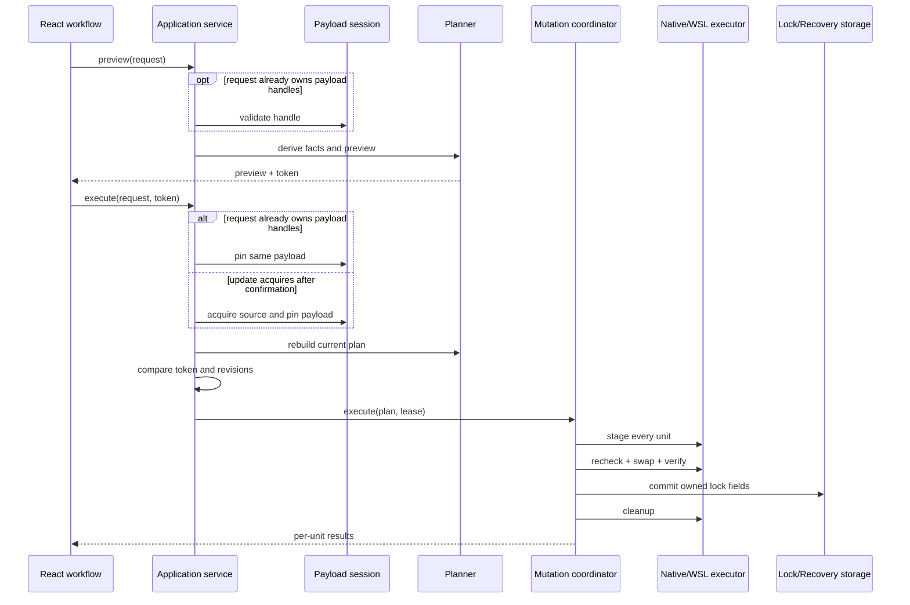
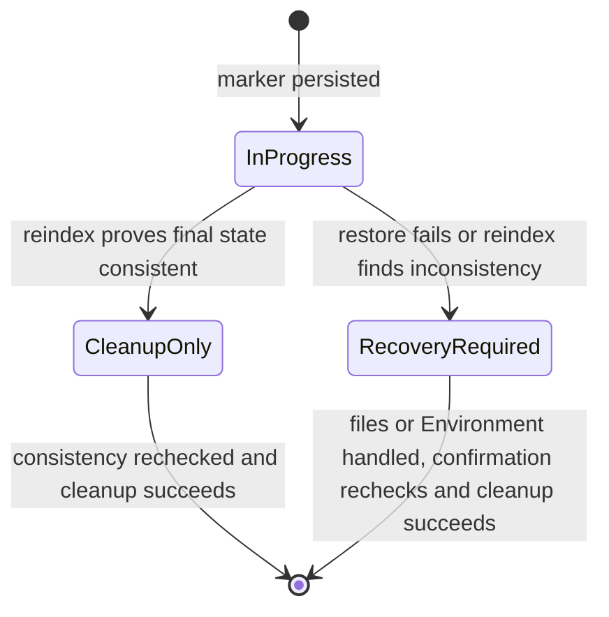

# 执行与恢复

## 统一执行模型

install、update、repair source、remove、copy 和 Manage Agents 共享同一条执行主干：

```text
capture request
  -> derive runtime facts
  -> preview
  -> user confirmation
  -> acquire admission
  -> acquire or pin payload
  -> rebuild and validate plan
  -> action-specific preflight every unit
  -> execute units
  -> commit owned lock fields
  -> cleanup or expose recovery
```

业务 use case 决定“要实现什么结果”，planner 将它转换为 Environment-neutral `MutationPlan`，coordinator 负责阶段顺序，Native/WSL executor 负责实际 filesystem operation。

## 核心对象

| 对象 | 职责 |
|---|---|
| Payload session | 保存一次来源发现产生的 immutable Skill 目录快照 |
| Payload handle | 对已经在 Preview 前完成 acquisition 的流程，在 Preview 和 Execute 之间引用 payload 的 opaque identity |
| Pinned payload lease | Execute 期间阻止 payload 被容量或 TTL maintenance 回收 |
| Preview token | 绑定请求、Registry、Environment、Context、observed state 和 planner contract |
| Mutation plan | 一个 Environment 中的一组 ExecutionUnit 与 pinned payload |
| ExecutionUnit | 一个可独立提交或回滚的主 Skill 目录、Agent 目录项与 lock 变更单元 |
| Prepared entry executor | Native 或 WSL backend 的 stage/recheck/swap/verify/restore/cleanup 实现 |
| Recovery resource | 受保护写入未能安全收敛时保留的、受 ownership 保护的稳定 identity |

## Payload

Payload 是完整 Skill 目录，不只是根目录文件。它包含 `SKILL.md`、scripts、references、assets、dotfiles、嵌套目录和可执行 mode metadata。

采集 payload 时遵守以下边界：

- 目录项使用相对路径和确定性顺序；
- payload 内部 symlink 解引用后纳入 manifest；
- 指向 root 外部、dangling 或循环 symlink 拒绝进入 payload；
- 不跟随目标目录中既有的 final symlink 或 Windows reparse point；
- hash 分别服务 source identity、payload content、local lock 和 remote update，不混用同一字段；
- payload storage 归 acquiring backend 所有，不假设所有来源都能表示为 Host path。

安装、跨 Environment Copy，以及 Repair 中已经在确认前完成准备的流程，都会先取得并固定 payload，再由 Preview 验证 handle 和生成执行计划，Execute 取得 pinned lease。Install 和 Repair 的当前 Environment 同时负责获取和写入；Copy 才可能由一个来源 Environment 获取、再交给另一个目标 Environment 写入。Payload acquisition 或 Preview 失败时不会进入 mutation，Frontend 必须保留失败阶段和结构化错误；Handle 已过期或 maintenance 处于不确定状态时，操作返回 stale/expired 错误并重新开始来源获取，不使用已经失去 ownership 的临时目录。Copy 的来源 Environment 在 payload 固定后断开不影响 Execute，但目标 Environment 仍必须在线；Install 和 Repair 则要求当前 Environment 全程可用。

更新流程不要求用户在确认前固定 payload。更新 Preview 只读取 lock、Agent placement、目标 entry 和 revision 等本地 planning facts；Execute 在用户确认并取得 mutation admission 后才 acquisition，并在当前 Environment 中固定新 payload snapshot、持有对应 lease。后续 plan 重建、validation 和 unit 执行都使用本次 Execute 固定的 snapshot。Frontend 不接收或回传这次 acquisition 的 payload handle。取消更新确认不会创建一次无效的来源快照。

## Preview 与 Execute



Preview 是只读操作，不获取 mutation admission，也不缓存 prepared plan。Execute 获取全局 admission，重新解析 Backend authority 并重建计划；对于已经固定 payload 的请求，不重新读取原始来源。只有跨 Environment Copy 可以在来源 Environment 断开后继续，且目标 Environment 仍须在线；Install、Update 和 Repair 仍要求当前 Environment 可用。Manage Agents 不涉及来源 payload；Repair Source 如果尚未固定 payload，则按普通获取阶段处理。这样可以拒绝以下变化：

Copy Preview 对来源 metadata 使用一个窄的 typed outcome：来源 lock entry 不存在时返回 `missingMetadata`，entry 存在但必需字段无法解释时返回 `invalidMetadata`；两者都要求用户先修复来源。其他请求校验、Environment、payload、Project 和路径失败继续返回 `AppError`，不能被统一降级成来源修复。修复完成后 Frontend 只恢复原复制会话并提示用户重新点击复制，不自动重放 Preview 或 Execute。

- Agent Registry 已变化；
- Environment session 或 capability 已变化；
- 当前 Context、ProjectBinding 或 root identity 已变化；
- 已在 Preview 前固定的 payload handle 已变化或过期；
- 目标 entry 或 lock 已被外部修改；
- planner contract 已升级。

Preflight 按实际 action 验证，不使用一个脱离业务的通用 capability profile：

| Action | 必须验证的事实 |
|---|---|
| Copy | staging tree 与 payload manifest 完整一致 |
| Symlink | staged link 类型和 target 与计划一致 |
| Executable mode | staged file mode 与 manifest 一致 |
| Atomic replace | 在目标父目录对 Skill Deck 自有 stage/probe entry 完成 rename 往返 |
| Remove/Keep | 没有 payload 时创建唯一 ownership probe，验证后立即删除 |

任一 action-specific preflight 失败时，final entry、lock 和既有 backup 均不得改变。正常结束时 stage/probe 必须清理；清理失败则保留 Recovery evidence，不能为了清理而扩大删除范围。

Stale 不是普通执行失败。Frontend 重新请求 preview，并要求用户复核已经变化的目标、覆盖项或风险。业务 Dialog 不因 stale、失败或 partial 自动关闭；只有成功结果才结束当前交互。

## Mutation plan 与 unit

一个 `MutationPlan` 只属于一个 target Environment。全部 entry backend 必须与该 Environment 对应，不能在单个 plan 中混合 Host 和 WSL unit。

一个 `ExecutionUnit` 同时覆盖：

- 当前 Skill 的主 Skill 目录；
- 该次意图要求的 Agent 目录项；
- 对应 lock mutation；
- destructive operation 前需要保持不变的目标 fingerprints；
- Registry、Environment 和 Context revisions。

单个 Skill 的 Manage Agents 计划只生成一个 `ExecutionUnit`。该 Skill 的主目录、所有关联 Agent 物理目录项与 lock mutation 必须一起成功或一起恢复；恢复失败时进入既有 Recovery。多个 Skill 或多个 Project 组成的批次仍按 unit 独立收敛，因此可以产生 partial；单 unit 批次不能用 partial 掩盖 `RecoveryRequired`。

同一物理 target 的多个逻辑 Agent owner 在 planning 阶段合并。Backend 只写一次，并在结果中 fan out owner 信息。相同路径字符串不等于相同物理 identity，跨存储 self-copy 依赖 filesystem identity 比较。WSL target key 不能固定假设大小写敏感：projection 需要同时提供 POSIX anchor 与 storage owner evidence，Windows-owned storage 对 relative component 执行 case folding，当前 distro 的 native storage 保持 POSIX 大小写，unknown owner 不生成 plan。

批次在进入 coordinator 前完成 deterministic validation，包括 plan 结构、payload ownership、physical target 冲突和已捕获 revision 等不依赖 staging 结果的事实。任一 batch validation 失败时，没有 unit 进入 staging 或 destructive phase；能够定位原因的 unit 返回具体错误，其余 unit 返回 `NotRun`。

通过 batch validation 后，coordinator 会在首个 destructive swap 前逐 unit 尝试 staging 和 action-specific preflight。某个 unit 的 staging 或 action-specific preflight 失败只产生该 unit 的失败结果，已经 stage 的内容会被清理；其他互不冲突的 unit 可以继续并形成 partial outcome。进入 destructive phase 后的失败同样按 unit 恢复，已经成功提交的 unit 不因后续 unit 失败而回滚。`RecoveryRequired` 始终保留在对应 unit；单 unit 批次直接返回该状态，多 unit 批次才在聚合层显示 partial。Source acquisition 失败发生在 mutation plan 形成之前，按 source 和受影响 Skill 返回，不伪造一个从未进入 coordinator 的 mutation unit。

## Coordinator phases

每个通过 batch validation 的 unit 使用固定顺序：

```text
stage
  -> recheck runtime authority
  -> recheck target entries
  -> swap
  -> verify
  -> commit lock
  -> cleanup
```

- `stage` 准备同父目录 backup/staging 和 recovery marker，不改变最终 entry。
- staged symlink 在 `stage`/preflight 阶段只验证 link 自身记录的目标，不要求最终 canonical entry 已经存在；最终目标解析关系由 swap 后的 `verify` 确认。
- 两次 `recheck` 防止 preview、preflight 和 destructive swap 之间的外部变化。
- `swap` 使用 backend 的 atomic replace/remove primitive。
- `verify` 确认 final entry 与计划一致。
- `commit lock` 只修改当前 unit 拥有的 entry 或 root field。
- `cleanup` 删除 backup/staging 和已完成 marker。

`swap`、`verify` 或 lock commit 失败时，executor 先 restore，再 cleanup。Verify 必须重新确认 Materialize 的完整 manifest、文件 mode 和 Symlink target；swap 前还要确认由本次 operation 分配的 backup path 仍未被外部占用。Restore 成功后当前 unit 返回失败；restore 失败时返回 `RecoveryRequired`。一个 unit 失败不会回滚已经成功提交的无关 unit。

Cleanup failure 不反转已经验证并提交的成功结果。结果保持 `Succeeded`，同时返回稳定 warning，供用户清理残留资源。

## 结果与错误

Unit 结果使用以下稳定状态：

| 状态 | 含义 |
|---|---|
| `Succeeded` | 文件与 owned lock 已提交，可以附带 cleanup warning |
| `Failed` | 当前 unit 未完成，Backend 已确认没有需要持久保留的未收敛状态 |
| `Skipped` | 该 unit 根据明确业务条件没有执行 |
| `Cancelled` | cancellation 在该 unit 完成前生效 |
| `NotRun` | 系统性/preflight 失败阻止该 unit 开始 |
| `RecoveryRequired` | 受保护写入未能确认一致，已保留 Recovery Resource，相关文件需要检查 |

Error 和 warning 使用稳定 code 与 parameters。Backend technical details 只用于开发和标准本地日志；Frontend 根据 code 选择 i18n 文案、retry 和 recovery 行为。

每个结果携带能够定位 Skill、Environment、Context 和操作目标的结构化 identity。错误按 unit 保留 source、target、Agent target、lock commit 和 recovery 信息。`RecoveryRequired` 必须作为 typed outcome 传到所有相关 workflow（包括 Install、Copy、Repair、Manage Agents、Remove 和 Update），不能压成普通 `Failed`；单 unit 不得聚合成 `Partial`。`Skipped` 不计为成功，`NotRun` 不伪装为执行失败。

执行状态通过统一 mutation channel 发布 phase 和可选 progress。Update 在 acquisition、validation 和 commit 阶段持续更新状态；Repair Source 至少区分验证、准备和安装阶段；进入逐 unit 执行后，progress 使用 Skill name 作为 subject，并携带当前序号与总数。Frontend 不从日志或路径猜测进度，也不把 Backend raw path 作为用户可见的当前目标。

## Cancellation 与全局 admission

进程中只有一个会修改 Skill、Agent defaults 或应用 lifecycle 的 active operation。`SingleMutationController` 向 Main 和 Wizard 发布统一状态。

Cancellation 是 cooperative signal：

- preflight 和每个 destructive phase 前检查；
- WSL runner 终止并 reap 对应 `wsl.exe` child；
- 返回 cancelled 后不得继续写入；
- 已完成 unit 保持真实成功，未开始 unit 不执行；
- staging 必须清理，或者进入能够被 maintenance/recovery 识别的状态。

Update 在来源获取和 validation 阶段接受显式停止请求；进入不可中断的 commit 区间后只允许等待当前原子步骤完成。停止不是关闭界面：调用方必须等待结构化 cancelled 或 partial 结果，不能在请求发出时假定 mutation 已经结束。

窗口关闭、应用退出和更新重启使用同一 activity admission。用户可以继续等待，或者先取消支持取消的 operation 后再继续 lifecycle action。

## Path safety 与 physical identity

Path declaration 和 runtime authorization 分开处理。保存 Agent definition 时只验证声明；实际读写时由当前 Environment 解析 Home、ConfigHome、Project 和允许的 path base。

Backend 在操作前：

- canonicalize 最近存在的父目录；
- 识别 storage owner 和 filesystem capability；
- 拒绝 filesystem root、Home、ConfigHome、Project root 等危险目标；
- 拒绝 source/destination equality、ancestor overlap 和 self-copy；
- 检查 Unix symlink 与 Windows junction/reparse traversal；
- 以 final directory entry identity 操作，不跟随待删除 link target；
- 限制所有 managed entry 位于解析出的 Skill root 下。

Frontend path 只用于展示。读取、打开、移除和恢复使用 typed business identity，Backend 重新解析真实 locator。

## Native 与 WSL executor

Native 和 WSL 实现同一组 coarse-grained prepared operation，不要求内部 filesystem primitive 形状完全相同。Backend 的选择、storage ownership 和 WSL transport 边界见[系统架构](./architecture.md#platform-backend)。

### Native

- Windows backend 处理 junction、directory symlink、reparse classification、case folding、locked file 和 UNC。
- macOS/Linux 共享 Native Unix backend，处理 POSIX symlink、permission、executable mode 和 inode/device identity。
- 实际 filesystem capability 通过目标位置的受控检查确认，不只根据 OS 名称推断。

### WSL

WSL executor 复用 Linux/POSIX 的 path、permission、relative symlink、rename、lock 和 result 语义。它额外处理 distro session、受控 payload bridge、path mapping、cancellation 和 transport failure；WSL Local Source 不经过 Windows Host staging。受保护写入仍要求目标 storage owner 是当前 WSL Environment；payload bridge 只负责把内容交给真正的目标 owner。

WSL 是执行 backend，不代表所有可访问目标都允许由它写入。`/mnt/c` 等 Host-owned CrossStorage 可以由 WSL 读取和观察，但受保护写入必须切换到 Host storage owner；physical target grouping 仍使用 Host-owned storage 的大小写语义，该判断在 preflight 和 lock ownership 之前完成，不能推迟到 materialization。

Native 与 WSL 都必须返回同一组 unit outcome、warning 和 recovery 语义。平台差异不能改变 Preview/Execute、preflight、atomic commit 或 cancellation 的约束。

## Atomic lock 与外部并发

Global 和 Project lock 可能同时由 skills CLI、其他 Skill Deck 实例或用户工具修改。Lock transaction 使用 optimistic compare-and-swap：

- capture 只记录当前 use case 拥有的 Skill entries 和 root fields；
- commit 前重新读取最新 document；
- owned field 与 expected state 不一致时返回 stale/conflict；
- 无关 entry 和未知字段从最新 document 保留；
- 成功 unit 的 lock receipt 会推进同一 document 后续 unit 的 expected state。

Lock 路径、共享字段和 CLI compatibility 见[skills CLI 兼容](./skills-cli-compatibility.md)。

Native 与 WSL 的 atomic document writer 都会在 rename 前同步同目录临时文件，并在完成后同步目标和父目录。普通 document commit 不创建持久化 `.bak` sidecar；如果目标旁存在精确的 `<target>.bak`，writer 会在本次替换前移除它，但不会扫描或删除其他业务 backup。Mutation stage、Recovery 和显式迁移所拥有的 backup 继续遵循各自 lifecycle。Durability 失败会返回错误，不能因为文件暂时可读就报告成功。

## Recovery

Recovery marker 在 destructive stage 前写入。它记录 resource ID、Environment/backend、operation、unit、destination、backup、状态和 ownership evidence，但不保存可续跑的旧 plan。



持久化 marker 只有 `InProgress`、`CleanupOnly` 和 `RecoveryRequired` 三种 kind。应用启动时重建 Host recovery index；WSL reconnect 后按 distro lazy reindex。没有 active process owner 的 `InProgress` marker 根据 filesystem 和 lock evidence 收敛为 `CleanupOnly` 或 `RecoveryRequired`。Environment 暂时不可用时 marker 仍保持原 kind，不删除未知状态。

无法解析的 JSON、future schema、损坏的 marker 或不安全的 managed root 会进入独立的 `Invalid` recovery record。记录只保留受控 Environment、managed root 和稳定 diagnostic，不信任损坏内容中的任意路径。Invalid record 可以在 Recovery Center 中查看诊断和打开受控目录，但不能 confirm 或自动 cleanup；修复磁盘记录后由下一次 reindex 更新状态。

Recovery Center 展示的是动态 assessment，而不是直接显示 marker kind。Backend 每次检查会返回 `NeedsAttention`、`ConsistentCanCleanup` 或 `EnvironmentUnavailable`；同一个 marker 在 Environment 恢复后可以得到新的 assessment 和 status revision。

Runtime maintenance 只在 Backend 内部负责 payload 清理、Recovery reindex 和写入 gate，不向 Frontend 发布独立状态事件。Maintenance 失败本身不会进入 Recovery Center；只有持久 Recovery Resource 或其加载错误会形成用户可见入口。

Backup 与 destination 必须位于同一 Environment 和物理父目录。Recovery Center 通过 opaque resource ID 打开受控位置；Frontend 不接收或提交可用于删除的任意路径。

用户确认“已处理”时，Backend 重新检查当前 consistency 和 status revision。Stale confirmation 被拒绝。只有能够证明 final entry、lock 和残留资源已经一致时才删除 marker。

Recovery Resource 不提供自动续跑或自动恢复。用户可以打开相关文件自行处理，随后重新检查；Backend 只验证当前状态是否一致，并在用户确认后清理处理记录。Skill Deck 不替用户继续执行未完成的操作，也不自动 TTL 清理。一个 Environment 的失败不扩散到其他 Environment。用户可见的状态反馈由[产品设计](./product.md#移除与-recovery-resource)定义。

## 必须保持的不变量

1. Preview 不产生最终写入，Execute 不使用缓存的 prepared plan。
2. 对 Preview 前已经固定 payload 的请求，Execute 使用 Preview 对应的同一 snapshot；update 则在确认后 acquisition，由本次 Execute 固定 snapshot。两类流程都在后续 validation 和执行期间持有对应 lease。
3. 一个 plan 只包含一个 Execution Environment。
4. 全部 batch deterministic validation，以及各 unit 的 staging 与 action-specific preflight，都在首个 destructive swap 前完成。
5. 每个 unit 的主 Skill 目录、必要 Agent 目录项和 lock 要么一致提交，要么明确返回 `RecoveryRequired` 并保留 Recovery Resource。
6. 外部无关 lock 变化和未知字段不会丢失。
7. Physical target 去重以 filesystem identity 为依据，不以 path string 为依据。
8. Raw path 不能授权 read/open/remove/recovery。
9. Cancellation 返回后对应 operation 不再继续写入。
10. 无法自动证明一致性的状态必须保留 recovery evidence。
