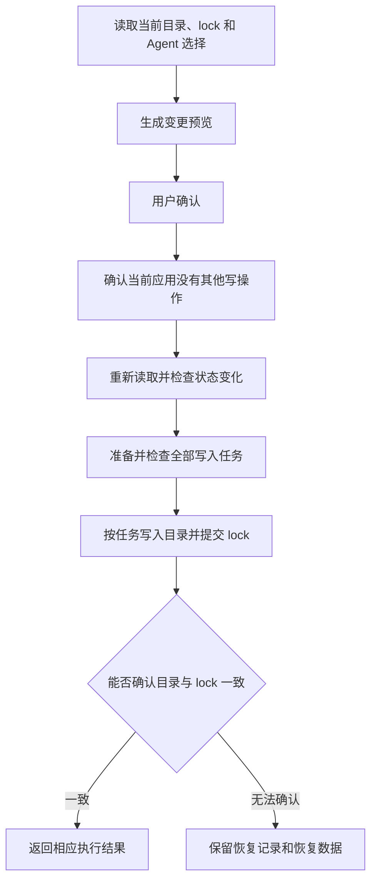

# 执行与恢复

安装、更新、来源修复、复制、移除和调整 Agent 关联都会修改 Skill 目录或相关 lock 文件。Skill Deck 在写入前重新检查目录、lock、Agent 选择和当前运行状态，并把每个 Skill 或目标项目作为可以独立完成的写入任务。写入失败后，如果系统无法确认 Skill 目录与 lock 仍然一致，应用会保留恢复记录，供用户检查和清理。

受保护写入是指会修改最终 Skill 目录、Agent 专用 Skill 目录或相关 lock 记录，并需要在失败后保持或恢复一致性的操作。lock 文件保存 Skill 的来源及相关安装信息，提交时还要保留其他程序写入的无关记录和未知字段。

## Skill 变更如何执行

所有 Skill 变更遵循同一套安全顺序，具体业务结果仍由安装、更新、复制等工作流决定。

系统在内部把一个目标位置中的变更组织成变更计划（`MutationPlan`），再按独立的写入任务（`ExecutionUnit`）提交。一个写入任务同时处理当前 Skill 的主目录、本次需要写入的 Agent 专用 Skill 目录以及对应的 lock 变更。多个 Skill 或多个项目组成的批次可以部分完成，但单个写入任务中的目录与 lock 必须保持一致。

## Skill 内容快照

内容快照是本次操作实际使用的完整 Skill 目录，包括 `SKILL.md`、脚本、参考资料、资源文件、隐藏文件、嵌套目录和可执行权限。预览与执行使用同一份内容，避免远端来源或本地目录在用户确认后发生变化。

进入内容快照的目录项必须满足以下条件：

- 所有目录项都使用相对路径，并按确定顺序记录；
- 快照内的符号链接只有在目标位于来源目录内、目标存在且没有形成循环时才会读取；
- 符号链接写入快照后保存实际内容，不把来源目录之外的路径带入目标位置；
- 目标位置已有的符号链接、Windows 目录联接或重解析点作为目标目录项处理，不跟随它们读取其他位置；
- 临时内容由负责获取内容的系统或 WSL 发行版管理，路径采用该 Environment 可以直接解析的格式。

安装、来源修复以及在 Windows 与 WSL 之间复制时，会在生成预览前固定内容。更新先根据当前本地状态生成预览，用户确认后再取得新版本内容；取得内容后，后续检查和写入始终使用同一份快照。

获取来源或创建快照失败时，写入尚未开始，应用返回相应的来源或预览错误；已经固定的快照过期时返回“结果已过期”。这些情况不会创建恢复记录。在 Windows 与 WSL 之间复制时，来源 Environment 只负责固定内容，目标 Environment 负责实际写入、lock 提交和恢复数据。复制的来源保留规则见[Skill 生命周期](./skill-lifecycle.md#复制到项目)。

## 预览与执行

预览根据当前目录、lock、Agent 选择和目标能力列出将要执行的操作、覆盖内容和风险。用户确认后，应用先取得应用内写入许可，再重新读取当前状态。预览只用于帮助用户确认操作，不能代替执行前的权限和路径检查。

出现以下变化时，原预览失效，应用不会开始写入：

- Agent 信息或本次选择已经变化；
- 当前操作位置、全局或项目位置以及已添加项目的记录已经变化；
- 复制来源的 Skill 内容或来源记录已经变化；
- 固定的内容快照已经过期；
- 目标目录或 lock 被其他程序修改；
- 生成计划所依据的规则已经更新。

应用返回“结果已过期”后，界面重新生成预览，让用户再次确认目标、覆盖项和风险。失败、取消或部分完成时，当前工作流保留未完成项目及可用的后续操作；已经成功的项目不再进入下一次重试。

批量操作按目标项目或 Skill 分别读取状态、生成计划并返回结果。某个目标的路径、lock 或存储状态无法使用时，其他互不冲突的目标仍可继续。Agent 检测结果只影响提示和推荐，实际写入位置由用户确认的 Agent 选择决定，详细规则见[Agent 模型](./agent-model.md)和[Skill 生命周期](./skill-lifecycle.md)。

## 路径安全与实际目标

界面只提交 Skill、项目和操作位置等业务标识，显示路径不直接作为写入授权。后端根据这些标识重新解析实际路径，并确认目标属于当前允许管理的位置。

写入前需要完成以下检查：

- 从路径中最接近目标且已经存在的父目录开始，解析实际文件系统和可用能力；
- 拒绝文件系统根目录、用户目录、应用配置目录和项目根目录等危险目标；
- 拒绝来源与目标相同、互为父子目录或复制到自身；
- 检查 Unix 符号链接、Windows 目录联接和重解析点，防止路径越过允许管理的目录；
- 删除或替换链接时只处理链接本身，不跟随链接删除其目标内容；
- 根据文件系统标识和大小写规则判断多个路径是否指向同一目标；
- 确认临时目录、备份和最终目录位于能够完成原子替换的同一文件系统中。

多个 Agent 读取位置实际指向同一目录时，系统只执行一次写入，再把结果返回给对应的 Agent。Windows 管理的文件系统按照 Windows 的大小写规则判断目标，Linux 和 WSL 原生文件系统按照 POSIX 规则判断。

受保护写入由能够直接管理目标文件系统的 Environment 完成。项目跨越 Windows 与 WSL 文件系统时，某个 Environment 可以读取项目，并不意味着它也能执行写入；具体边界见[Environment、Skill 位置与项目管理](./environments-and-projects.md#访问-windows-和-wsl-中的项目)。

## 原子写入与 lock 提交

批次开始提交前，系统先检查所有写入任务的计划结构、内容快照、目标冲突和状态版本，并为能够继续的任务准备临时内容。某个任务准备失败时，系统清理该任务的临时内容，其他互不冲突的任务仍可继续。

每个通过检查的写入任务依次完成：

1. 在目标父目录中准备临时内容、备份和恢复标记；
2. 再次检查当前权限和目标目录是否变化；
3. 使用目标文件系统提供的原子替换或原子移除能力修改最终目录；
4. 重新检查完整目录、可执行权限和符号链接结果；
5. 提交当前任务负责的 lock 记录；
6. 删除备份、临时目录和已经完成的恢复标记。

最终目录替换、结果检查或 lock 提交失败时，系统先尝试还原目录和 lock。还原成功后返回普通失败；无法还原或无法确认还原结果时返回 `RecoveryRequired`，并保留恢复记录和恢复数据。已经确认目录与 lock 提交成功后，清理失败只产生警告，不会把成功结果改为失败。

全局 lock 和项目 lock 可能同时被 `skills` CLI、其他 Skill Deck 实例或用户工具修改。提交前，系统重新读取最新 lock：

- 当前任务负责的记录已经变化时，返回结果过期或冲突；
- 与当前任务无关的记录和未知字段继续保留；
- 一个任务提交成功后，后续任务根据新的 lock 内容继续检查。

lock 的路径、兼容字段以及与第三方 `skills` CLI 的关系见[skills CLI 参考与兼容](./skills-cli-reference.md)。应用只清理能够确认由本次提交或同一写入机制创建的临时文件和备份，不会扫描或删除其他业务留下的备份。

## 批量结果

每个写入任务返回以下状态之一：

| 状态 | 含义 |
|---|---|
| `Succeeded` | Skill 目录和当前任务负责的 lock 已经提交，可能附带清理警告 |
| `Failed` | 当前任务没有完成，但系统已经确认目录与 lock 一致，可以继续操作 |
| `Skipped` | 当前任务因明确的业务条件不需要执行 |
| `Cancelled` | 取消请求在当前任务完成前生效，写入已经停止 |
| `NotRun` | 当前任务在计划或写入前检查阶段停止，尚未修改最终目录 |
| `RecoveryRequired` | 系统无法确认目录与 lock 一致，需要用户检查相关文件 |

错误和警告通过稳定代码及必要参数返回，界面据此显示具体对象、失败原因、重试方式和恢复入口。内部路径和技术细节只用于后端校验与本机日志。

## 应用内写操作互斥与取消

同一个 Skill Deck 进程一次只执行一项会修改持久数据的操作。存在活动安装会话时，主窗口不能开始其他持久写入；配置、凭据、项目记录和应用更新等操作虽然不使用 Skill 变更计划，也需要在产生副作用前取得应用内写入许可。其他 Skill Deck 实例不受这项进程内限制，它们造成的 lock 变化由提交前的冲突检查处理。

取消请求只在能够安全停止的步骤生效：

- 系统在写入前检查和每个受保护写入步骤开始前检查取消状态；
- WSL 操作收到取消请求后终止并回收对应的 `wsl.exe` 子进程；
- 已经完成的任务保留成功结果，尚未开始的任务返回取消或未运行；
- 进入不可中断的原子替换后，系统先完成当前步骤，再响应取消请求；
- 临时内容进入清理流程，无法安全清理时保留可供后续检查的恢复数据。

发出取消请求不表示写入已经结束。界面需要等待最终结果，再允许关闭、退出、重启或开始下一项写操作。

## 在应用所在系统或 WSL 中写入

Windows、macOS、Linux 和 WSL 使用相同的预览、检查、提交和恢复规则，具体文件操作由能够直接管理目标文件系统的 Environment 完成。

- Windows Environment 处理目录联接、重解析点、大小写规则、文件占用和 UNC 路径；
- macOS 和 Linux Environment 处理 POSIX 符号链接、权限、可执行位以及文件系统身份；
- WSL 发行版处理 POSIX 路径、权限、重命名、lock 和恢复数据；Windows 与 WSL 之间的传输层负责 `wsl.exe` 数据传输、超时与取消；
- `/mnt/c` 等 Windows 管理的存储可以从 WSL 读取，但受保护写入仍由 Windows Environment 完成。

关闭 WSL 支持不会删除发行版中的 Skill、lock 或恢复数据。重新连接发行版后，应用重新读取这些内容。后端选择、存储归属和 WSL 传输方式见[系统架构](./architecture.md#平台实现)。

## 恢复记录与恢复数据

恢复标记在任务进入受保护写入前保存，用于记录本次操作负责的目标、备份和执行阶段。任务正常完成或成功还原后，系统删除标记和备份；系统无法确认目录与 lock 一致时，标记和必要备份会作为恢复数据保留，并在界面中形成恢复记录。

恢复记录只处理已经进入受保护写入的任务。来源获取、生成预览、普通配置写入和写入前检查失败时，最终 Skill 目录尚未改变，原工作流直接显示错误或警告，不创建恢复记录。

应用启动时会读取应用所在系统中的恢复数据；Windows 重新连接 WSL 发行版后，再读取该发行版中的恢复数据。每次重新检查后，系统都会为恢复记录确定以下状态之一：

| 当前判断 | 含义 |
|---|---|
| 需要处理（`NeedsAttention`） | 目录与 lock 不一致或仍无法确认，需要用户检查相关文件 |
| 可以清理（`ConsistentCanCleanup`） | 系统已经确认状态一致，可以删除恢复标记和本次操作留下的备份 |
| 位置不可用（`EnvironmentUnavailable`） | 当前无法访问记录所在的系统或 WSL 发行版，该位置恢复可用后可以重新检查 |
| 记录损坏（`Invalid`） | 恢复数据无法安全解析，只提供诊断和受控目录入口，不自动清理 |

当前版本写入 v2 恢复格式，并继续读取 v1 记录。旧记录缺少具体 Skill 或项目信息时，界面使用通用说明，不根据内部标识猜测对应的 Skill 或项目。来自未来版本、JSON 已损坏或包含不安全路径的记录按“记录损坏”处理；系统忽略其中未经确认的路径，只允许打开 Skill Deck 管理的诊断目录。

有效恢复记录可以打开当前文件和备份所在的共同父目录。用户处理文件并选择“完成处理”后，系统重新检查目录、lock 以及恢复记录是否在此期间发生变化；只有状态一致且记录没有再次变化时，才删除恢复标记和本次操作创建的备份。清理过程不会删除当前 Skill 文件。

恢复入口不会自动继续执行中断的安装、更新或复制，也不会替用户决定应保留哪一份文件。原操作需要从对应工作流重新发起。用户可见的恢复入口和处理方式见[产品行为与交互](./product.md#处理需要检查的写入结果)。
