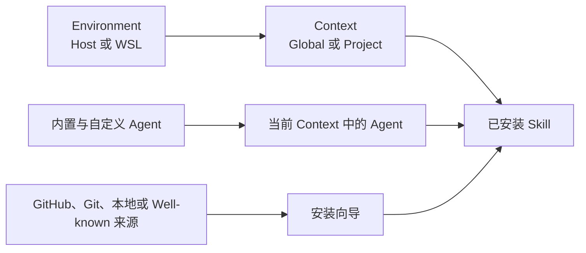
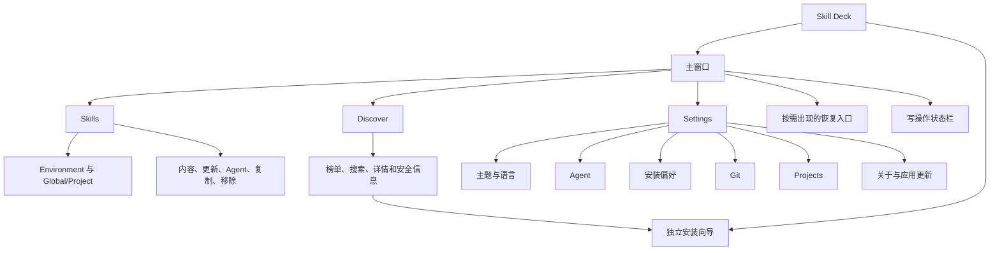
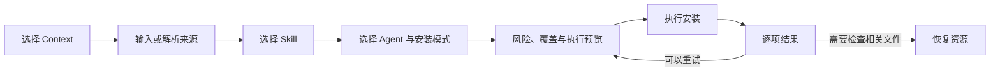

# 产品设计

## 产品定位

Skill Deck 是管理 AI 编程 Agent Skill 的本地桌面应用。用户可以在 Windows、macOS 和 Linux 上浏览、安装、阅读、更新、复制和移除 Skill，也可以管理 Skill 与 Agent 的适配关系。安装了 WSL 且存在可用发行版的 Windows 用户，还可以在 Host 与多个 WSL 发行版之间切换工作环境。

Skill Deck 以 [skills CLI](https://github.com/vercel-labs/skills) 的共享格式和基础语义为兼容基线，并在此基础上提供桌面端工作流、项目级更新检测、批量操作、自定义 Agent、跨 Environment 操作、失败处理和应用内更新。

桌面应用独立运行，用户可以同时使用 Skill Deck 与 CLI。

Agent、项目和 Skill 配置保存在本机及相应 Environment 中，软件更新通过 GitHub Releases 分发。

## 用户心智模型

- **Environment** 表示操作在哪里执行。所有平台都有 Host；Windows 可以额外选择 WSL 发行版。
- **Context** 表示当前管理范围。Global 面向当前 Environment 的用户级目录，Project 面向已登记项目。
- **Skill** 是包含 `SKILL.md` 以及可选脚本、参考资料、资源和其他文件的完整目录。
- **Agent** 是读取或接收 Skill 的 AI 编程助手。内置和自定义 Agent 在 Skill 工作流中使用相同行为。
- **来源**是获取 Skill 的位置。一次来源解析可以发现一个或多个可安装 Skill。

Agent 规则见[Agent](./agents.md)，Environment 与 Context 规则见[Environment 与 Context](./environments-and-contexts.md)，Skill 的状态变化见[Skill 生命周期](./skill-lifecycle.md)。

## 应用结构

主窗口提供 `Skills`、`Discover` 和 `Settings` 三个一级入口。安装向导在独立窗口中完成，主工作区可以继续保留当前内容。写操作进行时显示固定状态栏；存在需要处理的恢复资源时，界面显示全局恢复入口。Environment 和运行维护异常在对应业务区域展示。

## Skills 工作台

Skills 工作台由 Context 侧栏、Skill 列表和详情区组成。

### Context 侧栏

- 侧栏显示当前 Environment 的 Global Context 和已登记项目。
- 应用每次从 Host 的 Global Context 启动。WSL 连接由用户选择触发。
- Windows 发现可用 WSL 发行版后显示 Environment 切换入口；只有 Host 时直接展示当前 Context。
- 应用重新获得焦点且发行版列表缓存已过期时，会在后台刷新列表。刷新期间继续显示最近一次成功结果；失败时保留该结果并说明本次错误。
- 切换到其他 Environment 成功后，应用立即进入目标 Environment 的 Global Context，再独立加载项目注册信息。项目加载失败时，项目区域显示对应错误。
- 当前 Environment 重新连接成功后保留现有 Context，并刷新项目列表。连接失败时保留原 Context；当前 Environment 提供直接重试，其他 Environment 在用户再次选择时重新连接。
- 用户可以添加项目、移除项目或打开项目配置资源。Project 记录按 Environment 隔离。

### Skill 列表与详情

- 列表以已安装 Skill 为主体，并提供关键词搜索、Agent 筛选、刷新、更新检查和新增入口。筛选器默认显示“全部 Agents”；选择具体 Agent 后，列表展示当前 Context 中可供该 Agent 使用的 Skill。关键词与 Agent 条件同时生效，工具栏提供统一的清除筛选入口。
- 筛选器列出当前范围已经检测到的 Agent。Agent 当前没有关联 Skill 时仍可选择，列表显示对应空状态。
- Global 与当前 Project 使用独立区域，并分别保留新增入口。某个区域没有筛选结果时，该区域在 Skill 列表位置显示紧凑空状态，另一个区域继续展示自己的结果。
- 切换 Context 时，目标 Context 仍支持的 Agent 筛选继续保留。目标 Context 确认不支持该 Agent 后清除筛选；加载期间保留用户当前选择。
- Project Context 读取失败时，该区域显示中性不可用状态，并提供检查项目位置或切换 Environment 的下一步。
- 选中 Skill 后，界面切换为列表与详情分栏。详情展示 Skill 元数据、`SKILL.md` 内容、安装位置、关联 Agent 和更新状态。
- Skill 卡片和详情展示当前已经检测到且能够读取该 Skill 的关联 Agent。读取通用 Skill 目录的 Agent 通过主目录建立关系，其他 Agent 通过自身 Skill 目录中的有效链接或文件建立关系。
- 可用操作包括检查更新、执行更新、管理 Agent、复制到项目、修复来源和移除。
- Skill 内容读取失败时，列表和其他详情状态继续保留，内容区域提供重试入口。
- 写操作进行时，相互冲突的入口统一进入禁用状态，一次只执行一个写操作。

## Discover

Discover 用于浏览远端可安装 Skill。

- 用户可以查看热门、趋势和精选列表，也可以按关键词搜索。
- 详情区展示简介、README 或 `SKILL.md` 内容、来源信息、安装位置和可用的安全审计信息。
- 已在 Global 或某个 Project 安装的 Skill 会显示对应位置。
- 点击安装会打开独立向导，并预填来源和 Skill 名称。
- 安全审计属于辅助信号。审计服务暂时不可用时，用户仍可查看来源并决定是否安装。

## 安装工作流

1. 用户选择 Global 或 Project Context。来自 Discover 或 Skill 维护入口的向导会携带相应 Context。
2. 用户输入 GitHub、Git、本地路径、Well-known 地址，或者粘贴受支持的 `skills add` 命令。
3. 应用获取来源并列出其中可安装的 Skill，用户可以选择一个或多个 Skill。
4. 用户选择 Agent 目标以及符号链接（`symlink`）或复制（`copy`）方式。读取通用 Skill 目录的 Agent 可以直接使用主目录。Project 被识别为 Eve 项目时，用户还可以选择 Eve 根 Agent 或已经发现的子 Agent。
5. 确认页展示来源风险、目标、覆盖项和实际执行范围。受保护来源需要用户明确确认风险。
6. 确认页完成安装准备，并核对来源、目标和风险。准备成功后开放安装按钮；准备失败时停留在当前页面并说明失败阶段。准备结果过期后需要重新准备和确认。
7. 完成页按 Skill 和目标项目展示成功、失败、取消、跳过、未运行或“操作未完成，需要检查相关文件”。每项同时显示目标 Environment 与 Global/Project 范围；失败项可以展开错误详情，可重试项保留之前的选择并重新执行。

安装的技术语义见[Skill 生命周期](./skill-lifecycle.md)，预览、一致性和恢复规则见[执行与恢复](./execution-and-recovery.md)。

## 更新与来源维护

- 更新检查按 Context 执行，可以检查单个 Skill，也可以检查当前范围内支持检查的 Skill。
- 更新能力与检查结果分别表达。检查失败时保留上次结果，并将本次状态显示为“检查未完成”。
- 自动检查会复用近期结果，避免用户切换页面时反复访问同一来源；用户主动检查时可以获取最新状态。
- 检查失败按受影响的 Skill 汇总展示，用户可以查看原因；来源服务的内部诊断信息保留在本机日志中。
- 点击更新后打开确认界面。用户确认后获取新的安装内容；批量更新按来源整理本次处理范围。
- 确认界面展示主 Skill、已有适配目标、可同步副本和冲突副本。冲突副本默认保留，只有用户明确选择后才覆盖。
- 计划和结果阶段支持取消或关闭。进入原子写入阶段后，停止请求会在当前安全步骤结束后生效。
- 执行中展示当前阶段和进度。停止完成后仍进入结果页，保留已经完成和未执行项的真实状态。
- 完成页先展示整体摘要，再列出失败、部分完成、警告和未完成操作。失败项继续保留可用的后续入口。
- 来源记录不完整、上游路径已经删除或普通检查无法继续时，界面提供删除、保留或修复来源。来源修复在独立弹窗中重新选择来源并生成预览。

## Agent 管理

内置和自定义 Agent 共用同一套 Skill 工作流。

- Agent 选择区分“可直接使用”和“需要单独接入”，并允许用户保留已经存在的额外 Agent 目录项。安装向导、管理 Agent 和安装偏好使用一致的选择规则。
- 多个 Agent 使用同一实际目录时作为一组选择，避免重复操作或误删仍被其他 Agent 使用的内容。具体分组规则见[Agent](./agents.md#目标选择与目录分组)。
- 保存成功后关闭弹窗；保存失败时保留当前选择。准备结果过期后，界面要求用户重新确认。
- 安装向导遇到尚未定义的 Agent 时，可以打开 Agent 设置页创建定义。保存后返回原安装步骤；取消或失败时保留之前的来源和 Skill 选择。
- Agent 定义的创建、编辑、复制和删除只出现在 Settings。删除自定义 Agent 前会展示受影响路径、默认项引用和管理能力风险，并要求输入 Agent ID 二次确认。
- 删除自定义 Agent 只移除定义，现有 Skill 文件继续保留。后续默认项清理失败时，界面显示警告，定义删除结果保持有效。

## 复制到项目

- 复制入口用于 Project Context 中已经安装的 Skill。用户先选择一个目标 Environment，再选择其中的一个或多个项目。
- 目标 Environment 必须拥有目标项目路径；来源 Environment 可以不同，应用通过受控的内容传递完成跨 Environment 复制。
- 目标项目读取失败时显示对应错误状态。
- 用户点击复制后，系统统一检查来源记录、项目关系、路径重叠、存储能力和覆盖风险，复制资格以本次预览为准。
- 来源记录缺失或无效时，复制弹窗保留当前 Environment 和项目选择，并提供来源修复入口。修复成功后，用户重新点击复制并确认新的预览。
- 多项目结果相互独立，可以出现部分完成。已成功项目从下一次重试范围中排除；普通失败项目保留重试信息，需要检查相关文件的项目保留恢复入口。全部成功后复制弹窗自动关闭。
- 项目位于其他存储归属环境时，界面显示当前只读状态并引导用户切换。切换到归属环境后，目标项目可以执行复制、安装、更新、移除和管理 Agent。
- 复制成功后，远端（`Remote`）、Git 和 Well-known 来源的目标 Project 保留来源、版本、Skill 路径和更新基线，后续更新直接在目标 Environment 获取来源。本地（`Local`）来源保留路径和内容基线，并标记为不可更新。
- 源 Skill 的更新能力在复制前后保持不变。

## 移除与恢复

- 从 Skill 卡片发起移除时，弹窗展示通用 Skill 目录和当前检测到的全部 Agent 接入。用户确认一次后，应用删除这些位置，并同步清理由 Skill Deck 管理的本地记录。
- Agent 接入在界面中使用“符号链接”和“副本”两种用户可理解的类型。多个 Agent 使用同一实际目录时，应用合并展示并处理一次。
- 移除操作处理整个 Skill。用户需要保留 Skill 并调整部分 Agent 时，通过管理 Agent 完成。
- 受保护写入未能安全完成、相关文件和锁状态需要检查时，应用会保留恢复资源，并显示按需出现的全局入口。
- 恢复详情在应用启动和 Environment 状态变化后刷新，也允许用户在状态弹窗中主动刷新。
- 用户可以打开恢复资源并处理相关文件。刷新后，系统重新检查文件与 lock；确认一致时开放清理操作，尚未一致时继续保留恢复记录。
- 中断的业务操作需要重新发起。恢复入口通过受控资源标识打开和清理本次操作留下的文件。

## Settings

### 常规

用户可以切换浅色/深色主题以及简体中文/English。主题和语言应用于主窗口与安装向导。

### Agents

- 页面用于查看 Agent 定义在 Global/Project 中的读取能力和检测结果，并管理自定义 Agent。Skill 安装由 Skills 工作台和安装向导完成。
- 内置定义只读，自定义定义可以创建、编辑、复制和删除。两种来源使用相同的 Agent 领域模型。
- 当前 Environment 决定页面展示的路径解析和检测结果。切换后，同一注册表会在新 Environment 中重新解析。
- 页面说明通用 Skill 目录，并展示每个 Agent 读取通用目录、自身 Skill 目录或两者。Project 使用相对规则，选择具体项目后再解析绝对路径。
- 运行时解析失败时保留 Agent 定义，显示失败原因和重试入口；自定义定义存储异常显示为独立错误状态。
- 删除自定义定义时，现有 Skill 文件继续保留。确认页说明默认项引用和后续管理影响。完整领域规则见[Agent](./agents.md)。

### 安装偏好

用户可以分别设置当前 Environment 中 Global 和 Project 安装的默认 Agent。界面使用与安装向导一致的目标分组，并保存对应 Agent ID。检测暂时不可用时，已经保存的自定义 Agent 默认项继续保留。

### Git

用户可以设置 Git 获取超时时间，也可以恢复默认值。保存失败时界面保留原配置并显示错误。

### Projects

用户可以切换 Environment，并管理该 Environment 的 Project 列表。Environment 不可用或正在切换时，新增和移除操作保持禁用。

### 关于与应用更新

- 关于页展示应用版本、项目链接和 `skills` CLI 兼容信息。
- 应用使用标准本地日志保存开发诊断信息。业务弹窗根据稳定错误代码和参数提供可执行反馈，日志保留在本机。
- 应用可以检查 GitHub Release 更新，显示发布说明、下载进度和失败重试。
- 下载并安装完成后，用户可以在受保护的生命周期流程中重启应用。
- 应用启动时根据上次检查结果决定是否发起一次自动检查。成功检查使用正常间隔，失败检查使用较短的重试间隔；下一次检查由后续启动或用户操作触发。

## 通用状态与反馈

业务弹窗通过明确的按钮或键盘操作关闭。执行开始前，用户可以使用底部取消、`Escape` 或关闭按钮；写操作开始后，底部按钮按当前流程提供停止或取消。失败、部分完成和预览过期继续留在当前弹窗，成功后自动关闭。

| 状态 | 产品行为 |
|---|---|
| 加载中 | 保留稳定布局和已提交状态，同时显示当前加载目标 |
| 空状态 | 说明当前 Context 没有内容，并提供与该页面相关的下一步操作 |
| 错误 | 显示失败对象和当前结果；可重新执行的流程提供重试入口 |
| 部分完成 | 明确区分成功、失败、跳过和未运行项，保留失败项的后续操作 |
| 预览过期 | 重新获取预览，要求用户复核已经变化的风险或目标 |
| 已取消 | 停止后续写入，保留已经完成项目的实际结果 |
| 操作未完成，需要检查相关文件 | 持续展示恢复资源，并引导用户打开相关位置、处理文件和刷新状态 |

## 平台范围

| 桌面平台 | Environment | 主要行为 |
|---|---|---|
| Windows | Host；安装 WSL 且发现发行版后可增加一个或多个 WSL 发行版 | Host 使用 Windows 文件系统语义；WSL 使用 Linux/POSIX 语义并通过 `wsl.exe` 执行 |
| macOS | Host | 使用原生 POSIX 语义 |
| Linux | Host | 使用原生 POSIX 语义 |

Windows 及其系统工具负责 WSL 的安装和生命周期管理。用户选择 WSL Environment 后，Skill Deck 按需连接并读取该发行版的 Home、Project 和 Agent 状态；连接已经安装但处于停止状态的发行版时，`wsl.exe` 可能按需启动它。WSL 暂时不可用时，Host 功能继续工作。

Host 访问 WSL UNC、WSL 访问 Windows 挂载路径都属于跨存储场景。应用可以读取路径状态、显示风险并引导切换；受保护写入和跨 Environment 复制由目标存储归属环境执行。

## 当前能力范围

- Skill 的可用范围由安装位置和 Agent 适配关系共同决定。
- 自定义 Agent 定义保存在本机，支持读取路径、检测条件和 Global/Project 范围配置。
- Settings 展示当前 Environment 的 Agent 状态，用户可以切换 Environment 查看其他结果。
- 一次复制选择一个目标 Environment，并可在其中选择多个项目。
- 恢复入口处理已经识别的恢复资源，中断的业务操作通过原工作流重新发起。
- 当前 Environment 类型包括所有平台的 Host，以及 Windows 上可选的 WSL 发行版。
