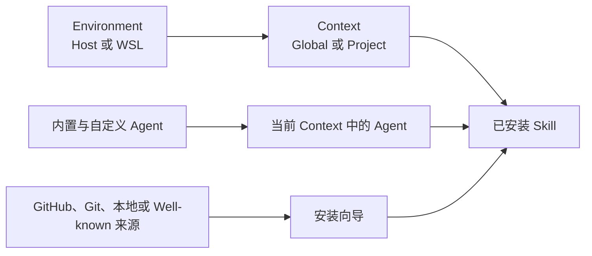
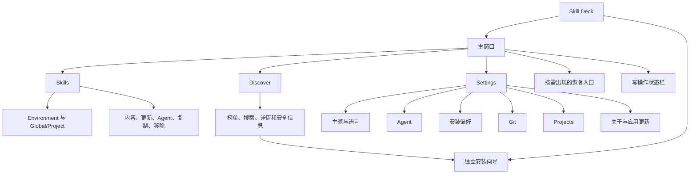
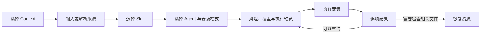

# 产品设计

## 产品定位

Skill Deck 是管理 AI 编程 Agent Skill 的本地桌面应用。用户可以在 Windows、macOS 和 Linux 上浏览、安装、阅读、更新、复制和移除 Skill，也可以管理 Skill 与 Agent 的适配关系。安装了 WSL 且存在可用发行版的 Windows 用户，还可以在 Host 与多个 WSL 发行版之间切换工作环境。

Skill Deck 以 [skills CLI](https://github.com/vercel-labs/skills) 的共享格式和基础语义为兼容基线，同时提供桌面端工作流、项目级更新检测、批量操作、自定义 Agent、跨 Environment 操作、失败处理和应用内更新。它不依赖正在运行的 `skills` CLI，也不把 CLI 的能力范围作为产品上限。

应用不使用服务器保存用户的 Agent、项目或 Skill 配置。业务数据保留在本机和相应 Environment 中，软件更新通过 GitHub Releases 分发。

## 用户心智模型

- **Environment** 表示操作在哪里执行。所有平台都有 Host；Windows 可以额外选择 WSL 发行版。
- **Context** 表示当前管理范围。Global 面向当前 Environment 的用户级目录，Project 面向已登记项目。
- **Skill** 是包含 `SKILL.md` 以及可选脚本、参考资料、资源和其他文件的完整目录。
- **Agent** 是读取或接收 Skill 的 AI 编程助手。内置和自定义 Agent 在 Skill 工作流中使用相同行为。
- **Source** 是获取 Skill 的位置。一次来源解析可以发现一个或多个可安装 Skill。

Agent 规则见[Agent](./agents.md)，Environment 与 Context 规则见[Environment 与 Context](./environments-and-contexts.md)，Skill 的状态变化见[Skill 生命周期](./skill-lifecycle.md)。

## 应用结构

主窗口提供 `Skills`、`Discover` 和 `Settings` 三个一级入口。安装向导使用独立窗口，避免安装过程挤占主工作区。写操作进行时显示固定状态栏；只有存在需要处理的恢复资源时，界面才显示全局恢复入口。Environment 或运行维护异常留在各自的业务区域，不遮盖整个工作区。

## Skills 工作台

Skills 工作台由 Context 侧栏、Skill 列表和详情区组成。

### Context 侧栏

- 侧栏显示当前 Environment 的 Global Context 和已登记项目。
- 应用每次启动都进入 Host 的 Global Context，不恢复上次选择的 WSL Environment，也不会仅因启动应用而连接或启动 WSL 发行版。
- Windows 存在可用 WSL 发行版时，用户可以切换 Environment；只有 Host 时不增加无意义的选择控件。
- 应用重新获得焦点时，只有最近一次成功获取的 WSL 发行版列表已经过期，才会重新获取。列表在有效期内可能短暂滞后；发现失败时保留最近一次成功结果，并说明本次失败。发现流程不提供独立的重试按钮。
- 已有发行版列表时，后续获取在后台进行，界面继续显示当前列表，不切换为整块加载状态。获取成功后一次性更新列表，失败不打断当前 Context。
- 切换到其他 Environment 成功后立即进入目标 Environment 的 Global Context；项目注册信息随后独立加载，加载失败不会回滚 Environment。当前 Environment 重新连接成功后保留现有 Context，并重新加载项目列表。连接失败时保留原 Context，只提示本次失败；当前 Environment 可以直接重试，其他 Environment 通过再次选择自然重试。
- 用户可以添加项目、移除项目或打开项目配置资源。Project 记录按 Environment 隔离。

### Skill 列表与详情

- 列表以已安装 Skill 为主体，并提供关键词搜索、按 Agent 筛选、刷新、更新检查和新增入口。未选择 Agent 时筛选器显示“全部 Agents”，列表展示全部 Skill；选择 Agent 后，只展示当前 Context 中可供该 Agent 使用的 Skill。关键词与 Agent 条件同时生效，工具栏只保留一个统一的清除筛选入口。
- 可供筛选的 Agent 来自当前范围中能够观察到的 Agent，即使它当前没有任何 Skill，也允许用户选择并显示对应的空状态。
- 同时展示 Global 与当前 Project 时，两种范围保持独立区域，并分别保留对应的新增入口。某个区域没有筛选结果时，只在该区域的 Skill 列表位置显示紧凑提示，不隐藏区域标题和新增入口，也不影响另一个区域继续展示结果。
- 切换 Context 时，仍受目标 Context 支持的 Agent 筛选会保留；目标 Context 不支持该 Agent 时才清除筛选。新 Context 仍在加载时，不提前丢失用户的选择。
- 当前 Environment 无法读取 Project Context 时，列表使用独立的中性不可用状态，不同时展示更新结论或管理命令。用户可以检查项目位置，或切换到已经添加该项目的 Environment。
- 选中 Skill 后，界面切换为列表与详情分栏。详情展示 Skill 元数据、`SKILL.md` 内容、安装位置、关联 Agent 和更新状态。
- Skill 卡片和详情只展示已检测到并且能够实际读取当前 Skill 的关联 Agent。读取通用 Skill 目录的 Agent 要求该目录中存在当前 Skill；其他 Agent 要求其自身的 Skill 目录中已经存在有效链接或文件。
- 可用操作包括检查更新、执行更新、管理 Agent、复制到项目、修复来源和移除。
- Skill 内容读取失败不会清空其他列表状态，界面保留重试入口。
- 写操作进行时，相互冲突的入口统一禁用，避免用户同时发起第二个操作。

## Discover

Discover 用于浏览远端可安装 Skill。

- 用户可以查看热门、趋势和精选列表，也可以按关键词搜索。
- 详情区展示简介、README 或 `SKILL.md` 内容、来源信息、安装位置和可用的安全审计信息。
- 已在 Global 或某个 Project 安装的 Skill 会显示对应位置。
- 点击安装会打开独立向导，并预填来源和 Skill 名称。
- 安全审计属于辅助信号。审计服务暂时不可用时，用户仍可查看来源并决定是否安装。

## 安装工作流

1. 用户选择 Global 或 Project Context。来自 Discover 或 Skill 维护入口的向导会携带相应 Context。
2. 用户输入 GitHub、Git、本地路径、Well-known 地址，或者粘贴受支持的 `skills add` 命令。
3. 应用获取来源并列出其中可安装的 Skill，用户可以选择一个或多个 Skill。
4. 用户选择 Agent 目标以及 `symlink` 或 `copy`。读取通用 Skill 目录的 Agent 不要求重复选择。Project 被识别为 Eve 项目时，用户还可以选择 Eve root Agent 或已发现的 subagent 作为具体目标。
5. 确认页展示来源风险、目标、覆盖项和实际执行范围。受保护来源需要用户明确确认风险。
6. 确认页先完成安装准备，确认来源、目标和风险。准备失败时停留在确认页，显示失败阶段和易于理解的原因；安装按钮不会被错误放行。准备结果过期时，界面要求重新准备并确认。
7. 完成页按 Skill 和目标项目展示成功、失败、取消、跳过、未运行或“操作未完成，需要检查相关文件”。每项同时显示目标 Environment 与 Global/Project 范围；失败项可以展开错误详情，可重试项保留原意图重新执行。

安装的技术语义见[Skill 生命周期](./skill-lifecycle.md)，预览、一致性和恢复规则见[执行与恢复](./execution-and-recovery.md)。

## 更新与来源维护

- 更新检查按 Context 执行，可以检查单个 Skill，也可以检查当前范围内支持检查的 Skill。
- 更新能力与检查结果分开表达。来源暂时不可达不会显示成“已是最新版本”；检查失败会保留上次结果，并明确说明本次检查未完成。
- 自动检查会复用近期结果，避免用户切换页面时反复访问同一来源；用户主动检查时可以获取最新状态。
- 检查失败按受影响的 Skill 汇总展示，用户可以查看易于理解的原因；列表不重复堆叠来源服务的内部诊断信息。
- 点击更新后打开确认界面，用户确认前不会获取新的安装内容。批量更新按来源整理，便于理解本次处理范围。
- 确认界面展示主 Skill、已有适配目标、可同步副本和冲突副本。冲突副本默认保留，只有用户明确选择后才覆盖。
- 计划和结果阶段可以取消或关闭；进入不可中断的写入阶段后，界面只提供明确的停止语义。
- 执行中展示当前阶段和进度。停止完成后仍进入结果页，保留已经完成和未执行项的真实状态。
- 完成页先展示整体摘要，再展示失败、部分完成、警告和未完成操作。部分完成不会抹掉失败项的后续入口。
- 来源记录不完整、上游路径已经删除或普通检查无法继续时，界面提供删除、保留或修复来源等维护动作。来源修复在独立弹窗中完成，不会根据名称猜测新的远端目录。

## Agent 管理

Skill 工作流不会把内置和自定义 Agent 分成两套操作。

- Agent 选择区分“可直接使用”和“需要单独接入”，并允许用户保留已经存在的额外 Agent 目录项。安装向导、`Manage Agents` 和安装偏好使用一致的选择语义。
- 多个 Agent 使用同一实际目录时作为一组选择，避免重复操作或误删仍被其他 Agent 使用的内容。具体分组规则见[Agent](./agents.md#目标选择与目录分组)。
- 保存失败时保留当前选择，只有保存成功才关闭弹窗；如果准备结果已经过期，界面要求用户重新确认。
- 安装向导遇到尚未定义的 Agent 时，可以打开 `Settings > Agents` 创建定义；保存后返回原安装步骤。取消或失败不会丢失当前安装意图。
- Agent 定义的创建、编辑、复制和删除只出现在 Settings。删除自定义 Agent 前会展示受影响路径、默认项引用和管理能力风险，并要求输入 Agent ID 二次确认。
- 删除自定义 Agent 不会删除现有 Skill 文件。后续默认项清理失败时，界面会显示警告，但已经确认的删除仍然有效。

## 复制到项目

- 复制操作以一个 Project Context 中已安装的 Skill 为来源，并选择一个目标 Environment。Global Skill 不提供此入口。
- 一个批次可以选择目标 Environment 中的多个项目，但不能同时混选不同 Environment。
- 目标 Environment 必须拥有目标项目路径；来源 Environment 可以不同，应用通过受控的内容传递完成跨 Environment 复制。
- 目标项目的读取失败会显示为错误，不会被当成“尚未安装”。
- 用户点击复制后，系统统一检查来源记录、项目关系、路径重叠、存储能力和覆盖风险；界面不根据列表中的更新状态提前判断能否复制。
- 来源记录缺失或无效时，复制弹窗保留当前 Environment 和项目选择，并提供来源修复入口。修复成功后提示用户重新点击复制，不会自动继续预览或写入。
- 多项目结果相互独立，可以出现部分完成。已成功的项目从下一次重试范围中排除，普通失败项目保留清晰的重试信息；需要检查相关文件的项目保留独立的恢复入口。只有全部成功时才自动关闭复制弹窗。
- 项目位于其他存储归属环境时，当前 Environment 只能读取、提示并引导切换，不能直接执行受保护写入；切换到归属环境后，目标项目才可进入复制、安装、更新、移除或管理 Agent。
- 复制成功后，远端（`Remote`）、Git 和 Well-known 来源的目标 Project 保留可解释的来源、版本、Skill 路径和更新基线，但不依赖来源 Environment 或来源 Project 继续可用。本地（`Local`）来源只保留路径和内容基线作为来源凭据，明确显示没有自动更新能力。
- 复制不改变源 Skill 原有的更新能力；Local 来源复制后不可更新是预期行为，不增加复制专用提示或确认步骤。

## 移除与恢复

- 从 Skill 卡片发起移除时，弹窗展示通用 Skill 目录和当前检测到的全部 Agent 接入。用户确认一次后，应用删除这些位置，并同步清理由 Skill Deck 管理的本地记录。
- Agent 接入在界面中只区分软连接和副本，不展示平台相关的底层链接类型。多个 Agent 使用同一实际目录时，应用合并展示并只处理一次。
- Skill 删除不提供部分 Agent 选择。用户需要保留 Skill、只调整部分 Agent 时，通过 Manage Agents 完成。
- 受保护写入未能安全完成、相关文件和锁状态需要检查时，应用会保留恢复资源，并显示按需出现的全局入口。
- 恢复详情在应用启动和 Environment 状态变化后刷新，也允许用户在状态弹窗中主动刷新。
- 用户可以打开已经确认的恢复资源并刷新状态；只有系统确认文件和锁已经一致后，用户才能确认清理。产品不承诺自动或手动恢复一定成功。
- 恢复不会续跑已经中断的旧计划，也不允许前端提交任意备份路径执行删除。

## Settings

### 常规

用户可以切换浅色/深色主题以及简体中文/English。主题和语言应用于主窗口与安装向导。

### Agents

- 页面用于查看 Agent 定义在 Global/Project 中的读取能力和检测结果，并管理自定义 Agent；它不管理 Agent 本体，也不创建 Skill。
- 内置定义只读，自定义定义可以创建、编辑、复制和删除。两种来源使用相同的 Agent 领域模型。
- 当前 Environment 是路径解析和检测结果的查看条件。切换后重新解析同一注册表，不为每个 Environment 维护重复定义。
- 页面说明通用 Skill 目录，并为每个 Agent 表达是否读取通用目录、此 Agent 的 Skill 目录或两者。Project 只展示相对规则，不借用任意项目推断绝对路径。
- 运行时解析失败时保留定义，明确显示失败并提供重试；自定义定义存储异常不会伪装成空列表。
- 删除自定义定义不删除已有 Skill 文件，并在确认前说明默认项引用和后续管理影响。完整领域规则见[Agent](./agents.md)。

### 安装偏好

用户可以分别设置当前 Environment 中 Global 和 Project 安装的默认 Agent。界面使用与安装向导一致的目标分组，保存统一的 Agent ID；检测暂时不可用不会自动删除用户已经保存的自定义 Agent 默认项。

### Git

用户可以设置 Git 获取超时时间，也可以恢复默认值。保存失败时界面保留原配置并显示错误。

### Projects

用户可以切换 Environment，并管理该 Environment 的 Project 列表。Environment 不可用或正在切换时，新增和移除操作保持禁用。

### 关于与应用更新

- 关于页展示应用版本、项目链接和 `skills` CLI 兼容信息。
- 应用保留标准本地日志，但不把诊断目录、最近记录复制或自由文本导出建设成产品能力。业务弹窗只根据稳定错误代码和参数提供可执行反馈，不展示内部技术细节，也不会自动上传日志。
- 应用可以检查 GitHub Release 更新，显示发布说明、下载进度和失败重试。
- 下载并安装完成后，用户可以在受保护的生命周期流程中重启应用。
- 应用启动时根据上次检查结果判断是否发起一次自动检查。成功检查使用正常间隔，失败检查使用较短的重试间隔；应用不会在进程内持续轮询。

## 通用状态与反馈

业务弹窗的遮罩点击不会关闭弹窗。尚未开始执行时，用户可以使用底部取消、`Escape` 或关闭按钮；进入写操作后，`Escape` 和关闭按钮会暂时失效，底部按钮只执行该业务定义的停止或取消语义。失败、部分完成和预览过期默认留在原弹窗内，成功才自动关闭。

| 状态 | 产品行为 |
|---|---|
| 加载中 | 保留稳定布局并显示当前加载目标，不用空白界面替换已提交状态 |
| 空状态 | 说明当前 Context 没有内容，并提供与该页面相关的下一步操作 |
| 错误 | 显示失败对象，不把失败降级成“未安装”或“没有更新”；只有重新执行可能成功的流程才提供独立重试 |
| 部分完成 | 明确区分成功、失败、跳过和未运行项，保留失败项的后续操作 |
| 预览过期 | 重新获取预览，要求用户复核已经变化的风险或目标 |
| 已取消 | 停止后续写入，保留已经完成项目的真实结果 |
| 操作未完成，需要检查相关文件 | 持续展示恢复资源，不把它归类为普通可重试失败，也不把内部恢复阶段作为用户可见原因 |

## 平台范围

| 桌面平台 | Environment | 主要行为 |
|---|---|---|
| Windows | Host；安装 WSL 且发现发行版后可增加一个或多个 WSL 发行版 | Host 使用 Windows 文件系统语义；WSL 使用 Linux/POSIX 语义并通过 `wsl.exe` 执行 |
| macOS | Host | 使用原生 POSIX 语义 |
| Linux | Host | 使用原生 POSIX 语义 |

Skill Deck 不提供 WSL 安装、创建、终止、注销或重启功能，也不向发行版部署常驻 helper。用户选择 WSL Environment 后，应用按需连接并读取该发行版的 Home、Project 和 Agent 状态；连接已经存在但处于停止状态的发行版时，`wsl.exe` 可能在连接过程中按需启动它。WSL 不可用时，Host 功能继续工作。

Host 访问 WSL UNC、WSL 访问 Windows 挂载路径都属于可观察的跨存储场景。应用可以读取事实、显示风险并引导切换，但不会因为后端能够访问路径就允许跨归属环境的受保护写入；跨 Environment 复制仍须由目标存储归属环境执行。

## 当前限制

- Skill 没有独立的“禁用”状态。用户通过安装、移除或调整 Agent 适配控制可用范围。
- 自定义 Agent 定义不提供远程目录、云同步、导入导出或自定义图标。
- Settings 不汇总其他 Environment 的 Agent 状态。用户切换 Environment 后查看对应结果。
- 一次复制只选择一个目标 Environment。
- 恢复只处理已经识别的恢复资源，不恢复旧的变更计划。
- 应用不提供 WSL 生命周期管理界面，也不支持 SSH、容器或远程主机作为 Environment。
