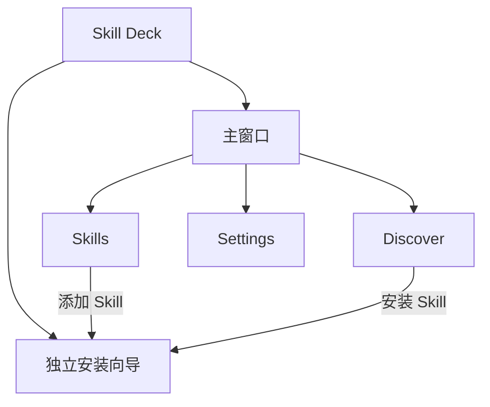
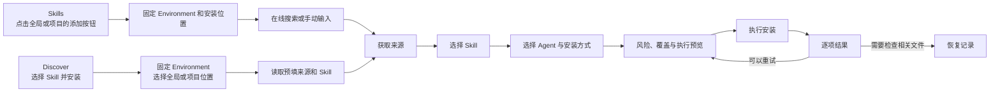

# 产品行为与交互

## 产品定位

Skill Deck 是管理 AI Agent 所用 Skill 的本地桌面应用。用户可以在 Windows、macOS 和 Linux 上浏览、安装、阅读、更新、复制和移除 Skill，也可以管理 Skill 与 Agent 的关联关系。Windows 用户还可以管理已安装 WSL 发行版中的 Skill。

[skills CLI](https://github.com/vercel-labs/skills) 是由 `vercel-labs/skills` 项目独立维护的第三方 Skill 管理工具。Skill Deck 自行实现桌面端功能，运行时不调用该 CLI；两个工具可以分别管理同一份兼容 Skill 数据。用户可以单独使用 Skill Deck，也可以根据需要搭配使用两个工具。具体兼容范围和参考原则见[skills CLI 参考与兼容](./skills-cli-reference.md)。

## 用户看到的核心概念

- **AI Agent** 是独立于 Skill Deck 安装和运行的 AI 智能体，能够根据任务目标和当前上下文决定后续步骤、调用工具并执行操作。
- **Agent Skill（技能）** 是一种可复用的 AI Agent 能力，汇集了处理特定任务所需的知识和工作方法。AI Agent 在处理相关任务时按需加载它，Skill 还可以附带脚本、模板和参考资料。
- Skill Deck 默认管理桌面应用所在操作系统当前用户的 Skill 和项目。macOS 和 Linux 不提供 Environment 切换；Windows 用户启用 WSL 支持后，可以在 Windows 与已经发现的 WSL 发行版之间切换管理位置。
- **全局 Skill** 安装在当前 Environment 的全局位置，不属于具体 Project；**项目 Skill** 安装在具体 Project 中。Agent 能否读取这些 Skill，取决于该 Agent 的 Skill 读取位置和 Skill 的实际安装目录。
- **Skill 来源** 是 Skill 内容的提供位置。一次来源解析可以发现一个或多个可安装 Skill。

Skill Deck 记录 Agent 的 Skill 读取位置和 Agent 检测位置，并按照当前使用的 Windows、macOS、Linux 或 WSL 用户空间解析实际路径、推测 Agent 的检测状态，再判断 Agent 与已安装 Skill 的关联关系。

统一术语见根目录的 [`CONTEXT.md`](../CONTEXT.md)。Agent 规则见[Agent 模型](./agent-model.md)，Environment、Skill 位置与项目规则见[Environment、Skill 位置与项目管理](./environments-and-projects.md)，Skill 的状态变化见[Skill 生命周期](./skill-lifecycle.md)。

## 应用结构

主窗口提供 `Skills`、`Discover` 和 `Settings` 三个一级页面，并集中展示当前安装流程、写操作状态和恢复入口。Windows 启用 WSL 支持并发现发行版后，主窗口还会显示 Environment 切换入口；`Skills`、`Discover` 以及 `Settings` 中的 Agents 和 Projects 使用用户当前选择的 Windows 或 WSL 位置，通用设置、Git 和关于页不依赖该选择。

Windows 用户可以在通用设置中启用 WSL 支持；启用并发现发行版后，主窗口提供持续可见的 Environment 切换入口。WSL Environment 使用 `WSL · 发行版名称` 展示。WSL 支持关闭或没有可用发行版时不显示该入口。macOS 和 Linux 不展示 WSL 支持设置或 Environment 切换入口。

安装向导在独立窗口中完成，可以从 `Skills` 页的全局或项目区域发起，也可以从 `Discover` 页的 Skill 详情发起。打开向导不会改变主窗口当前显示的内容。

## 选择要管理的 Skill

### 在 Windows 和 WSL 之间切换

- Windows 用户启用 WSL 支持并发现可用发行版后，可以通过主窗口的 Environment 切换入口选择 Windows 或某个 WSL 发行版。macOS 和 Linux 不展示这项设置和入口。
- 选择 WSL Environment 时，界面先显示连接状态；连接成功后展示该 Environment 的全局 Skill，再加载已添加项目。连接或项目加载失败时，界面继续显示已经成功加载的内容，并提供与当前阶段对应的重试操作。
- 关闭 WSL 支持时，确认窗口持续展示切回 Windows、等待现有操作结束和停止使用 WSL 的进度。某个阶段失败时，界面显示已经完成的步骤并允许重试；已经保存的 WSL 项目和设置继续保留。

### 浏览全局 Skill 和已添加项目

- `Skills` 显示应用所在系统中的全局 Skill 和已添加项目；Windows 启用 WSL 支持后，则显示主窗口当前选择的 Windows 或 WSL Environment 中的内容。
- 切换到其他 Environment 成功后，应用立即展示目标 Environment 的全局 Skill，再独立加载已添加项目。在首次成功加载完整项目列表前，添加项目入口保持禁用；首次加载失败时，项目区域显示错误和重试操作。
- 项目列表成功加载后，后台刷新期间继续显示现有项目并允许添加项目。后台刷新失败时，界面保留现有列表，同时说明本次错误并允许用户重试。
- 用户可以添加项目、移除项目或打开项目配置资源。已添加项目按 Environment 隔离。

Environment 切换、全局 Skill 和已添加项目的完整规则见[Environment、Skill 位置与项目管理](./environments-and-projects.md)。

## 浏览已安装 Skill

`Skills` 由 Skill 位置导航、Skill 列表和详情区组成。

- 列表以已安装 Skill 为主体，并提供关键词搜索、Agent 筛选、刷新和更新检查。筛选器默认显示“全部 Agents”；选择具体 Agent 后，列表展示当前 Skill 位置中可供该 Agent 使用的 Skill。关键词与 Agent 条件同时生效；用户通过搜索框清空关键词，通过“全部 Agents”恢复 Agent 筛选。
- 筛选器列出当前 Skill 位置中已经检测到的 Agent。Agent 当前没有关联 Skill 时仍可选择，列表显示对应空状态。
- 全局 Skill 与当前项目 Skill 使用独立区域，并各自提供新增入口。某个区域没有筛选结果时，该区域在 Skill 列表位置显示紧凑空状态，另一个区域继续展示自己的结果。
- 切换全局或项目位置时，Skill 列表回到顶部，位置侧栏保持原有滚动位置。如果目标位置仍支持当前 Agent 筛选，筛选条件继续生效；确认目标位置不支持该 Agent 后，界面清除筛选条件。加载期间不改变用户当前选择。
- 项目 Skill 读取失败时，该区域显示中性不可用状态，并提供检查项目位置或切换 Environment 的下一步。
- 全局与项目区域在滚动时持续显示标题、数量、更新摘要和主要操作。空间不足时压缩次要信息，用户仍可查看完整状态。
- Skill 卡片使用稳定的位置标识、内容和操作三列布局。名称、plugin 名称和主要更新状态位于同一标题行；plugin 名称只表达 Skill 的归属，不提供点击操作。简介、来源元数据、注意事项和已检测到的关联 Agent 沿同一内容轴排列。
- 来源名称只在能够打开对应地址时显示为链接，并通过系统默认应用打开。更新时间采用渐进格式：今天显示时间，当年显示月日，跨年显示年份；悬停或聚焦后可以查看完整本地日期时间。
- 卡片用一个注意图标和持续可见的短文案集中展示来源异常、更新检测异常和重复安装关系。来源信息不完整时只显示“来源信息不完整”，不会重复显示由此导致的更新检测异常；来源中的原 Skill 已不存在时显示“来源中已找不到此 Skill”。全局和当前项目都存在同名 Skill 时显示“全局和项目中重复安装”；Agent 可以读取通用目录、但其专用目录仍保留安装项时显示“通用目录和 Agent 专用目录中均已安装”。这两项只说明实际安装关系，不推断内容是否同步。
- Skill 卡片和详情只列出当前已检测到的关联 Agent，并允许标签自然换行。没有检测到的 Agent 不在界面中逐一列出；完整关联规则见[Agent 模型](./agent-model.md#关联-agent)。
- 选中 Skill 后，界面切换为列表与详情分栏。详情先按当前目标、上游来源、本地安装、使用关系、安全与维护分组展示信息，再展示 `SKILL.md` 内容。列表没有单独的详情按钮，用户可以点击 Skill 名称或卡片进入详情。
- 可用操作包括检查更新、执行更新、管理 Agent、复制到项目、修复来源和移除。卡片尾部直接显示当前可用操作，用户可以通过一次点击发起对应操作；需要确认的操作继续使用确认界面。
- Skill 内容读取失败时，列表和详情中的其他信息继续显示，内容区域允许用户重试。
- 写操作进行时，界面禁用与其冲突的操作，一次只执行一个写操作。

## 添加与安装 Skill

用户可以从 `Skills` 页的全局或项目区域直接添加 Skill，也可以先在 `Discover` 页浏览 Skill 再发起安装。两个入口打开同一个独立安装向导，但带入向导的初始信息不同。

### 从 Skills 页面添加

- 全局 Skill 与当前项目 Skill 区域分别提供添加按钮。用户点击哪个区域的按钮，向导就固定使用打开时的 Environment 和对应的全局或项目位置，并从来源步骤开始。
- 来源步骤提供“在线搜索”和“手动输入”两种方式。在线搜索用于按名称查找 Skill；选择搜索结果后，向导立即读取其来源并预选该 Skill。手动输入支持 GitHub、Git、本地路径、Well-known 地址、原始 `SKILL.md` 与 ZIP、tar、tar.gz 归档地址，以及受支持的 `skills add` 命令。
- 普通 HTTP 或 HTTPS 地址先按 Well-known 协议读取；未发现有效 Skill 时，应用继续尝试直接下载该地址。明确的 GitHub 或 GitLab 文件和归档地址直接进入下载流程。
- 一个来源包含多个 Skill 时，向导列出全部可安装项。用户可以保留预选项，也可以改为选择一个或多个其他 Skill。
- `skills.sh/p/...` Pack 链接没有指定具体 Skill 时，向导初始选中其中的全部 Skill。用户仍会经过 Skill 选择页和确认页，可以搜索、取消单项、全选或清空；Pack 不会自动开始安装。链接或 `skills add` 命令已经指定具体 Skill 时，只预选明确指定的项目。

### 从 Discover 安装

Discover 用于浏览远端可安装 Skill。

- 用户可以查看热门、趋势和精选列表，也可以按关键词搜索。
- 详情区展示简介、README 或 `SKILL.md` 内容、来源信息、安装位置，以及 Discover 来源已经提供的安全审计信息。
- 已安装到全局或某个项目的 Skill 会显示对应位置。
- 点击安装会打开独立向导，固定主窗口当前使用的 Environment，并预填来源和 Skill 名称。向导使用 `Windows`、`macOS`、`Linux` 或 `WSL · 发行版名称` 显示这个固定目标。用户先选择该系统中的全局或项目 Skill 位置；进入来源步骤后，向导自动读取预填来源并预选该 Skill。用户仍可以返回来源步骤，改用在线搜索或手动输入。
- 安全审计属于 Discover 提供的辅助信号。Skill Deck 不会把已安装 Skill 或用户手动输入的来源自动发送给其他审计服务；没有审计信息时，用户仍可查看来源并决定是否安装。

### 统一安装流程

1. 从 `Skills` 页发起安装时，用户点击的全局或项目区域直接确定 Skill 位置。从 `Discover` 页发起安装时，用户在向导中选择主窗口当前系统中的全局或项目 Skill 位置。向导打开后会持续显示 `Windows`、`macOS`、`Linux` 或 `WSL · 发行版名称`，并固定本次 Environment 和 Skill 位置；主窗口随后切换 Environment 或改看其他项目，都不会改变已经打开的安装目标。
2. 从 `Skills` 页进入时，用户通过在线搜索选择 Skill，或者手动输入来源。从 `Discover` 页进入时，向导自动使用预填来源和 Skill；用户返回来源步骤后也可以更换来源。
3. 应用获取来源并列出其中可安装的 Skill。在线搜索结果和 Discover 入口会预选对应 Skill；用户可以调整选择，也可以从同一来源安装多个 Skill。直接下载发生跨主机重定向时，确认页显示最终下载主机，用户确认后才能执行安装。
   在应用所在系统中获取 Git 来源时，向导显示连接或读取阶段以及已经等待的时间和当前超时设置。等待时间用于说明操作状态，不表示仓库内容的下载完成比例。
4. 用户查看安装后可以直接使用 Skill 的 Agent，并按需选择要为哪些 Agent 创建链接或副本。Eve 项目还会展示根 Agent 和已经发现的子 Agent。向导根据入口信息和当前 Skill 位置预选建议目标，用户可以在本次安装中调整选择；默认目标的计算规则见[Agent 模型](./agent-model.md#默认目标)。
   安装请求明确指定、但 Skill Deck 尚未记录其 Skill 读取位置和 Agent 检测位置的 Agent 会显示为只读的不可用目标，没有 Checkbox，也不进入安装计划。未知 Agent 不需要手动移除，也不阻止用户继续安装当前 Skill；用户需要让该 Agent 使用 Skill 时，可以关闭向导并前往 `Settings > Agents` 添加 Agent 信息后重新安装。
5. 确认页按 Skill 展示来源风险、安装目标、同名冲突和实际执行范围，并在后台准备安装内容。受保护来源和跨主机下载需要用户明确确认；直接下载来源存在同名目标时禁止执行。准备成功后开放安装按钮；准备失败时停留在当前页面并说明失败阶段。准备结果过期后需要重新准备和确认。
6. 完成页按 Skill 和目标项目展示成功、失败、取消、跳过、未运行或“操作未完成，需要检查相关文件”。每项同时显示目标 Environment 及全局或项目位置；失败项可以展开错误详情，可重试项保留之前的选择并重新执行。

安装执行期间不显示操作栏。安装完成或失败后，结果区域可以独立滚动，完成、重试、返回来源和关闭等操作固定显示在向导底部。

安装得到结果后，主窗口立即刷新目标位置的 Skill 列表。批量安装部分完成时，已经成功的 Skill 会及时出现在列表中，失败项继续显示在结果页；用户继续查看结果或关闭安装向导都不会延迟这次刷新。

直接下载来源只支持无同名冲突的全新安装，不保存用于更新或重新获取的来源信息。安装完成后，用户仍可管理 Agent、复制或移除该 Skill；界面不提供更新、重新安装或来源修复入口。

安装的技术语义见[Skill 生命周期](./skill-lifecycle.md)，预览、一致性和恢复规则见[执行与恢复](./execution-and-recovery.md)。

## 维护已安装 Skill

### 检查更新与修复来源

- 用户可以检查单个 Skill，也可以检查当前 Skill 位置中支持检查的全部 Skill。界面分别显示该 Skill 是否支持检查、本次检查状态，以及上次成功检查的结果。
- 首次版本比较完成前，摘要保持未知。检查失败时，界面保留上次成功结果，并将本次状态显示为“更新检查未完成”；卡片和详情提供失败原因、可重试时间以及重试、配置 GitHub Token、打开来源或修复来源等下一步。
- Git 设置允许验证并保存 GitHub Token。已经保存的 Token 不回显；凭据不可用时，界面说明可使用的其他凭据来源。
- 点击更新后打开确认界面。用户确认后，应用获取新的安装内容；批量更新在同一流程中展示本次需要处理的 Skill。
- 确认界面展示通用 Skill 目录中的 Skill，以及本次将为哪些 Agent 创建链接、创建副本或同步已有副本。已经被用户修改的副本默认保留，只有用户明确选择后才覆盖。
- 计划和结果阶段支持取消或关闭。执行中展示当前阶段和进度；停止完成后仍进入结果页，如实列出已经完成和尚未执行的项目。
- 完成页先展示整体摘要，再列出失败、部分完成、警告和未完成操作。失败项仍显示可以执行的后续操作。
- 来源记录不完整或普通检查无法继续时，界面提供适用的修复来源或移除操作。上游已经删除当前 Skill 时，本地内容默认保留，界面显示“来源中已找不到此 Skill”，并提供修复来源和移除；来源修复在独立弹窗中重新选择来源并生成预览。

远端比较的触发、缓存、重试、限流和凭据规则见[更新检查](./update-checking.md)。执行更新与来源修复的业务规则见[Skill 生命周期](./skill-lifecycle.md#更新与来源修复)，取消和写入结果见[执行与恢复](./execution-and-recovery.md)。

### 让 Agent 使用 Skill

安装、复制和管理 Agent 使用同一套选择界面，帮助用户判断各个 Agent 在操作完成后能否使用当前 Skill，以及 Skill Deck 是否需要创建链接或副本。

- 第一个信息区列出操作完成后可以从通用 Skill 目录直接读取当前 Skill 的 Agent，标题根据流程显示“安装后可直接使用”“无需选择即可使用”或“复制后可直接使用”。
- 第二个信息区固定显示“选择后可使用”。用户选中 Agent 后，Skill Deck 会在相应目录中创建链接或副本。
- 对于本来已经可以使用当前 Skill、但也允许在自己目录中保留链接或副本的 Agent，界面将这项操作显示为可选设置。安装向导和管理 Agent 使用相同的选择规则。
- 管理界面明确标识当前 Skill，并将链接或复制的安装方式作为独立选择。状态过期和保存失败时保留用户选择并说明下一步。
- 只要当前流程中存在可以选择安装方式的 Agent，用户就可以先选择安装方式，再选择 Agent。尚未用于任何已选 Agent 的安装方式不算待保存修改；固定使用复制方式的 Agent 不受该控件影响。
- 界面分别展示已经能够使用当前 Skill 的 Agent、选择后才可使用的 Agent，以及可以选择是否在自己目录中保留链接或副本的 Agent。汇总项可以展开查看完整成员及其可用条件。
- 使用同一个 Skill 目录的 Agent 合并为一个选项，用户可以展开查看成员、写入位置和可用条件。界面分开展示当前状态与待执行操作，并以一致的方式说明检测结果、暂时无法判断和链接冲突等情况。具体分组规则见[Agent 模型](./agent-model.md#agent-选择与安装位置分组)。
- 保存成功后关闭弹窗；保存失败时保留当前选择。准备结果过期后，界面要求用户重新确认。
- 安装向导不能添加新的 Agent 信息。Skill Deck 尚未记录的 Agent 通过只读提示说明本次无法处理，并引导用户关闭向导后前往 `Settings > Agents` 添加 Skill 读取位置和 Agent 检测位置。

### 复制到项目

- 复制弹窗分别提供目标项目和 Agent 选择区域，用户可以按任意顺序配置，并在两个区域中独立滚动。目标 Environment 只有一个可选项时隐藏该字段，存在多个可用 Environment 时才显示。
- 用户在一个目标 Environment 中选择一个或多个项目。每个项目都显示名称和完整路径。目标 Agent、安装方式和展开状态由全部目标项目共用；项目只决定实际写入路径，不会各自保存一套 Agent 选择。
- Agent 选择默认沿用来源 Skill 当前的安装选择。用户可以增删目标 Agent，并提前选择链接或复制；即使尚未选择项目，Agent 选择仍保持可用。固定使用复制的 Agent 不受安装方式控件影响。
- 连接目标 Environment 失败时，界面提示用户重新连接；连接成功但项目目录读取失败时，界面提示用户重新读取项目。两类失败都保留 Agent 选择，并允许用户重试当前步骤。
- 用户点击复制后，应用检查目标、Agent 选择和覆盖风险。复制弹窗不增加独立预览页；需要用户处理的风险和状态变化直接留在当前弹窗中说明。
- Agent 选择状态发生变化时，弹窗载入最新状态，保留仍然有效的用户选择和项目选择，并要求用户确认后继续。
- 预览、计划和执行阶段都按目标项目返回结果。一个目标项目的来源信息、路径或存储状态异常时，其他目标项目继续处理。重试时不再处理已经成功的项目；普通失败项目显示重试信息，需要检查相关文件的项目显示恢复入口。全部成功后，复制弹窗自动关闭。
- 如果当前 Environment 无法直接管理项目所在的 Windows 或 WSL 文件系统，界面会显示只读状态并引导用户切换。切换到能够原生访问项目文件的 Environment 后，用户可以对目标项目执行复制、安装、更新、移除和管理 Agent。

目标项目、跨文件系统访问和 Environment 选择规则见[Environment、Skill 位置与项目管理](./environments-and-projects.md#把-skill-复制到其他项目)。来源记录、Agent 安装关系和复制结果见[Skill 生命周期](./skill-lifecycle.md#复制到项目)，一致性与逐项目执行规则见[执行与恢复](./execution-and-recovery.md#预览与执行)。

### 移除 Skill

- 从 Skill 卡片发起移除时，确认界面汇总通用 Skill 目录和当前检测到的全部 Agent 专用 Skill 目录，并允许用户查看完整路径。Windows 内部路径前缀不进入用户可见路径。
- 确认界面区分通用目录、链接和副本。多个 Agent 使用同一实际目录时，界面将其合并为一个待移除位置。用户确认后执行移除，并在当前界面反馈结果。
- 移除操作处理整个 Skill。用户需要保留 Skill 并调整部分 Agent 时，通过管理 Agent 完成。

## 处理需要检查的写入结果

- 受保护写入未能安全完成、相关文件状态需要检查时，应用会保留恢复记录和恢复数据。存在待处理记录时，主窗口显示全局恢复入口。
- 恢复详情在应用启动和 Environment 状态变化后刷新，也允许用户在状态弹窗中主动刷新。只有同时存在多项待处理操作时，弹窗才提供批量重新检查。
- 新创建的恢复记录显示原操作类型、Skill、全局或项目位置、Environment 和发生时间。旧版记录缺少具体 Skill 或项目信息时继续使用通用标题，不根据内部标识猜测操作含义。
- 恢复项分别标注当前文件、操作前备份和损坏记录的诊断位置。Windows 内部路径前缀不进入用户可见路径，完整路径允许换行阅读。
- 用户可以从有效恢复项打开当前文件与备份所在的处理目录；损坏记录只允许打开 Skill Deck 管理的诊断目录。刷新后，系统重新检查相关文件状态；确认一致时允许完成处理，尚未一致时继续保留恢复记录。
- 完成处理会删除本次操作保留的备份和处理记录，清理动作不会删除目标位置的当前文件。确认界面明确说明这一删除范围。
- 中断的业务操作需要重新发起。用户只能通过恢复入口打开或清理本次操作留下的文件。

## Settings

### 常规

用户可以切换浅色或深色主题，也可以选择简体中文或英语。主题和语言设置同时应用于主窗口与安装向导。

### Agents

- 页面展示 Skill Deck 已记录的 Agent，以及各 Agent 在全局和项目中的 Skill 读取位置与 Agent 检测结果。用户可以为尚未收录的 Agent 添加这些信息；Skill 安装由 `Skills` 和安装向导完成。
- 页面默认在同一列表中展示随应用提供和用户添加的 Agent，并提供来源筛选与搜索。页面概览展示已记录数量和当前已检测到的数量；页面标题区提供添加其他 Agent 的入口。
- 随应用提供的信息只读，用户添加的信息可以编辑和删除。添加和编辑操作进入独立表单页，保存或取消后返回 Agent 列表。用户添加的信息显示带有明确可访问名称的编辑和删除图标按钮；删除仍需经过影响预览与二次确认。两种来源使用相同的检测和关联规则。
- 新建表单首次进入时聚焦 Agent 名称。后台校验可以更新错误展示，但不移动用户当前焦点；用户提交后校验失败时，页面聚焦第一个需要处理的错误控件。检测路径集合需要补充内容时，焦点进入新增检测路径入口。
- 用户添加的信息与随应用提供的信息使用相同 ID 时不会进入运行时注册表。页面说明该信息当前未生效，并允许用户查看删除影响后将其移除；需要记录其他 Agent 时，用户通过添加流程填写新的名称、ID、读取目录和检测路径。
- macOS 和 Linux 按应用所在系统解析 Agent 路径和检测结果；Windows 启用 WSL 支持后，相关页面按照主窗口当前选择的 Windows 或 WSL 位置重新解析同一份 Agent 信息。
- 页面集中说明通用 Skill 目录。Agent 卡片头部展示来源和当前检测状态；卡片内容分别展示全局与项目中的 Skill 读取位置和 Agent 检测位置。Skill Deck 根据 Agent 检测位置判断当前是否检测到该 Agent，界面将检测规则与检测结果分开展示。项目使用相对规则，选择具体项目后再解析绝对路径。
- 运行时解析失败时保留已经记录的 Skill 读取位置和 Agent 检测位置，显示失败原因和重试入口；用户添加的信息无法读取或保存时显示为独立错误状态。
- 删除用户添加的信息时，现有 Skill 文件继续保留。确认页说明默认项引用和后续管理影响。完整领域规则见[Agent 模型](./agent-model.md)。

### Git

用户可以设置 Git 获取超时时间，也可以恢复默认值。默认值为 120 秒，可设置范围为 30 至 3600 秒。该设置同时用于应用所在系统中的 Git 来源获取、远端引用查询，以及 WSL Environment 中的 Git 来源获取；等待其他来源获取任务的排队时间不计入该时限。Well-known 地址使用自身的 HTTP 请求时限。保存失败时界面保留原配置并显示错误。

### 代理设置

用户可以让应用主动发起的 HTTP 请求不使用代理，或者填写一个带端口的 HTTP 或 HTTPS 代理地址。该设置用于浏览在线 Skill、查询 GitHub 来源信息、获取 Well-known 来源以及检查和下载应用更新。代理地址只保存在应用配置中，不接受内嵌用户名或密码；应用不读取或修改操作系统的代理设置。

Skill 内容中的在线图片由 WebView 加载并沿用系统网络设置，不使用这里填写的自定义代理。图片加载失败不影响正文展示。

用户手动输入的 Well-known Skill 来源可以使用 HTTP 或 HTTPS，也可以指向本机或局域网地址。应用将这次来源获取视为用户主动发起的网络访问，使用客户端的正常域名解析和重定向行为；来源内容仍需通过对应格式、摘要和解包校验。

HTTP 请求、本机 Git 和各 WSL 发行版中的 Git 分别设置连接方式。本机 Git 可以保持原有连接方式，也可以使用独立的 HTTP 或 HTTPS 代理地址。选择代理后，用户可以只代理 `github.com` 及其子域中的仓库，也可以代理所有使用 HTTP 或 HTTPS 的仓库。选择“仅 GitHub 仓库”时，应用只为匹配的仓库注入代理参数；访问其他仓库时不注入代理参数，Git 继续使用已有配置和环境设置。使用 SSH 的仓库不受这项设置影响。

每个 WSL 发行版中的 Git 都作为独立 Environment 展示。它可以与 Windows Git 保持一致、保持该发行版原有的连接方式，或者使用一个能从该发行版访问的独立代理地址和使用范围。应用原样传递最终地址，不探测 WSL 网络模式，也不改写回环地址或宿主地址。

Git 代理只通过本次进程的 `http.proxy` 参数生效，不读取、修改或清除持久化 Git 配置。选择“保持原有连接方式”时，应用不指定额外代理，Git 继续使用已有配置和环境设置。

页面中的修改形成设置草稿。只有保存成功后，后续发起的 HTTP 请求和 Git 操作才使用新设置；已经开始的操作继续使用启动时的设置，在线图片不受此次保存影响。

用户可以在保存前测试当前页面中的设置。连接测试始终通过 `https://www.skills.sh/api/search` 的轻量查询检查在线 Skill 搜索，并通过 `https://github.com/hccake/skill-deck.git` 检查应用所在系统和当前页面中所有 WSL 发行版的 Git 连接。每项检查最多等待 10 秒，测试结果不会保存当前设置，也不表示任意 Well-known 地址、更新服务器或在线图片都可以访问。

### Projects

页面管理应用所在系统中已添加的项目；Windows 启用 WSL 支持后，则管理主窗口当前选择的 Windows 或 WSL 位置中的项目。WSL 发行版不可用或正在切换时，新增和移除操作保持禁用。

### 关于与应用更新

- 关于页展示应用版本、项目链接和 `skills` CLI 参考版本。
- 应用使用标准本地日志保存开发诊断信息。各业务弹窗根据稳定错误代码和参数提供可执行的处理建议，日志保留在本机。
- 应用可以检查 GitHub Release 更新，显示发布说明、下载进度和失败重试。
- 应用更新使用当前保存的不使用代理或自定义代理设置。Tauri Updater 插件负责 endpoint 顺序、域名解析、重定向、下载、签名验证和安装；应用不为更新清单或安装资产增加运行时响应大小限制。
- 下载开始后可以隐藏更新弹窗，让后台继续处理，也可以取消当前下载。制品下载完成并进入安装后，界面会明确显示安装状态，此时不能取消。
- 下载并安装完成后，用户可以在没有其他冲突操作时重启应用。
- 应用启动时根据上次检查结果决定是否发起一次自动检查。成功检查使用正常间隔，失败检查使用较短的重试间隔；下一次检查由后续启动或用户操作触发。

## 跨流程状态与反馈

### 安装会话与写操作

安装流程成功打开后形成安装会话，直到流程正常完成、取消或窗口关闭。会话期间，当前安装窗口可以执行本次安装并在失败后重试；主窗口仍可浏览、切换自身的 Environment 或项目，以及修改主题和语言。主窗口中的业务写入、恢复清理和应用更新保持禁用，也不能再打开第二个安装流程。界面持续说明修改受限状态，并提供返回当前安装窗口的入口。

主窗口尚未确认安装会话状态或状态同步失败时，业务写入保持禁用并提供重新检查入口。操作因安装流程冲突而未执行时，主窗口说明结果并提供继续处理入口。安装流程完成或关闭后，主窗口恢复修改能力。

普通写操作进行时显示固定状态栏；存在需要处理的恢复记录时，界面显示全局处理入口。Windows 下 WSL 发行版的发现、连接、重试和运行维护状态由 Environment 切换入口集中反馈。

### 通用状态

涉及业务操作的弹窗通过明确的按钮或键盘操作关闭。执行开始前，用户可以使用底部取消按钮、`Escape` 或关闭按钮；写操作开始后，底部按钮根据当前流程显示停止或取消。失败、部分完成和预览过期时，弹窗保持打开；操作成功后自动关闭。

| 状态 | 产品行为 |
|---|---|
| 加载中 | 保持布局稳定并继续显示已有内容，同时说明当前正在加载的目标 |
| 空状态 | 说明当前全局或项目位置没有内容，并提供与该页面相关的下一步操作 |
| 错误 | 说明哪个对象处理失败，并保留当前结果；可以重新执行时显示重试操作 |
| 部分完成 | 明确区分成功、失败、跳过和未运行项，保留失败项的后续操作 |
| 预览过期 | 重新获取预览，要求用户复核已经变化的风险或目标 |
| 已取消 | 停止后续写入，保留已经完成任务的实际结果 |
| 操作未完成，需要检查相关文件 | 持续展示恢复记录，并引导用户打开相关位置、处理文件和刷新状态 |

## 平台与产品限制

| 桌面平台 | 默认管理位置 | 切换能力 |
|---|---|---|
| Windows | 当前 Windows 用户的目录和文件系统 | 启用 WSL 支持并发现发行版后，可以切换到一个或多个 WSL Environment |
| macOS | 当前 macOS 用户的目录和文件系统 | 不提供 Environment 切换 |
| Linux | 当前 Linux 用户的目录和文件系统 | 不提供 Environment 切换 |

Windows 及其系统工具负责 WSL 的安装和生命周期管理。用户选择 WSL Environment 后，Skill Deck 按需连接并读取该发行版的 Home、项目和 Agent 状态；连接已经安装但处于停止状态的发行版时，`wsl.exe` 可能按需启动它。WSL 暂时不可用时，Windows Environment 中的功能继续工作。

Windows 访问 WSL UNC、WSL 访问 Windows 挂载路径都属于跨文件系统场景。应用可以读取路径状态、显示风险并引导切换；受保护写入和跨 Environment 复制由能够原生访问目标文件的 Environment 执行。

完整的平台、路径和跨文件系统规则见[Environment、Skill 位置与项目管理](./environments-and-projects.md)。
