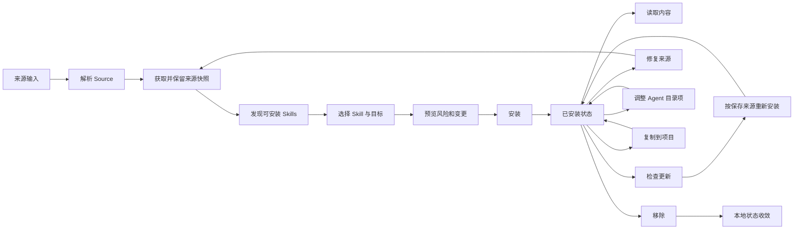

# Skill 生命周期

## 生命周期概览

Skill Deck 把 Skill 视为一个完整目录，而不是单独的 `SKILL.md`。目录可以同时包含 scripts、references、assets、dotfiles、嵌套目录和可执行文件。来源、安装位置、Agent 目录项和 lock metadata 共同描述一个已安装 Skill，但其中任何一项都不能单独代替完整状态。

安装、更新、来源修复、复制、Manage Agents 和移除都会先生成预览，再根据当前状态重新验证并执行。本文描述这些操作希望得到的业务结果；token、payload lease、回滚和 recovery 规则见[执行与恢复](./execution-and-recovery.md)。

## Source

Source 是能够重新定位 Skill 内容的声明。解析器支持以下输入类别：

- GitHub shorthand、GitHub/GitLab URL 和仓库子路径；
- 带 branch、tag 或 Skill filter 的 Git 来源；
- SSH 和其他可 clone 的 Git URL；
- Host 或当前 WSL Environment 中的本地路径；
- well-known endpoint；
- 可提取来源、Skill 和 Agent 选择的受支持 `skills add` 命令。

解析结果保留规范化 source、source type、原始 URL、ref、仓库子路径和 Skill filter。私有 Git 来源需要保留原始 SSH/URL 表达，不能为了显示统一而改写成失去认证语义的 shorthand。

Source parser 只负责理解输入，不执行 clone，也不判断目标 Agent。上游 skills CLI 的可共享解析行为由[skills CLI 兼容](./skills-cli-compatibility.md)维护。

## 获取与发现

发现会话归属于当前执行 Environment。Source 类型和 Environment 共同决定内容由哪个 backend 获取；具体路由与跨 backend 边界见[系统架构](./architecture.md#source-acquisition)。跨 Environment Copy 的来源 Environment 只负责固定来源 Skill，属于复制流程的专门角色。

一次获取会建立 discovery session，并保留以下事实：

- 原始与规范化来源信息；
- acquisition backend 和 Environment identity；
- 本次发现的 Skill 路径及 metadata；
- 后续能够生成 immutable payload 的受控来源快照；
- 可用时的 well-known trust metadata 和安全审计信息。

应用按照与 skills CLI 兼容的 root、priority、plugin manifest 和 recursive fallback 规则发现有效 Skill。Host 与 WSL 使用相同的选择语义，不因 acquisition backend 不同产生两套业务结果。精确兼容约束见[skills CLI 兼容](./skills-cli-compatibility.md#sourcediscovery-与-well-known)。

用户确认选择后，应用从 discovery session 固定完整 Skill payload。安装确认页随后基于同一 snapshot 生成执行预览；payload acquisition 或 preview 失败时不会进入 mutation，也不会伪造“已准备”状态。后续执行使用该 snapshot，不重新读取可能已经变化的原始目录；session 过期后必须重新获取来源。Payload handle、storage 和 lease 由[执行与恢复](./execution-and-recovery.md#payload)定义。

## 安全信息

Discover 和安装确认页可以展示来源风险、well-known trust metadata 和远端安全审计结果。安全审计是 best-effort 辅助信息，超时或服务不可用不会被解释为“安全”，也不会阻止用户查看来源。

被判定为需要保护的来源必须由用户明确确认风险后才能执行安装。该确认只适用于当前预览；来源或目标变化后需要重新确认。

## 安装

安装请求同时声明：

- 一个目标 Context；
- 一个或多个已获取的 Skill payload；
- 目标 Agent；
- Eve 等专用 adapter 需要的具体 target；
- 用户选择的 `symlink` 或 `copy` 模式；
- 必要的覆盖和风险确认。

每个已安装 Skill 在当前 Context 中都有一份主 Skill 目录。Agent 如果读取通用 Skill 目录，不需要在自己的 Skill 目录中重复创建内容；如果 Agent 只从自己的 Skill 目录读取，安装会在该位置建立 Agent 目录项。读取能力、目标分组和 Agent 目录项的含义见[Agent](./agents.md#目标选择与目录分组)。

Eve 项目使用具体 adapter target。用户可以选择 root agent 或已发现的 subagent；安装时从已经固定的 payload 派生 Eve-compatible 内容，Project lock 记录目标，后续读取和更新恢复同一 placement。具体 target 模型见[Agent](./agents.md#eve-adapter-target)。

`symlink` 和 `copy` 属于 Skill materialization 选择，不属于 Agent definition。当前 Backend 不会在 link 创建失败后自动改成 copy；对应 unit 返回失败，用户重新预览后可以改用 copy。各平台的执行差异由[执行与恢复](./execution-and-recovery.md)负责。

成功安装使主 Skill 目录、必要 Agent 目录项和 lock metadata 对当前执行单元保持一致。批量安装按 Skill 返回独立结果，允许一部分成功而另一部分失败；界面不能用批次总状态覆盖每个 Skill 的真实结果。原子提交和逐 unit 结果由[执行与恢复](./execution-and-recovery.md)定义。

## 已安装状态与读取

已安装 Skill 的展示综合当前 Context 中的以下信息：

- 通用 Skill 目录和各 Agent 的 Skill 目录检查结果；
- Global 或 Project lock metadata；
- 当前 Agent Registry 的 scope、读取方式与 detection；
- source、ref、`skillPath` 和 hash metadata；
- 当前 Environment revision 与 storage capability。

目录存在不等于 lock 完整，lock 存在也不证明目录仍可读取。列表会保留这类不完整状态，并提供相应的查看、修复或移除入口，不会静默补造来源信息。

读取 `SKILL.md` 或打开资源时，应用根据 Skill identity 和 Context 重新解析实际目录。展示路径不是读取授权。精确的 typed resource 边界见[系统架构](./architecture.md#typed-resource-authorization)。

## 更新检查与重新安装

更新能力、更新检查结果和更新执行是三个不同概念。

| 概念 | 含义 |
|---|---|
| 可以重新安装 | 保存的 source、ref 和 `skillPath` 足以再次获取当前 Skill |
| 可以检查更新 | 当前 source type 具有可比较的远端版本证据 |
| 检查结果 | 当前检查得出的有更新、无更新、来源不可达、上游已删除或信息不足 |
| 执行更新 | 根据保存的来源获取新 payload，并按当前目标重新安装 |

远端检查先按规范化 source 与 ref 合并，再为同一来源下的各个 `skillPath` 生成可比较证据。GitHub 可以使用仓库 tree evidence；GitLab 和其他可 clone Git 来源使用同一次来源快照计算 CLI-compatible content hash。Local 不进入更新检查或重新安装；当前 lock 中没有可比较远端基线的 well-known 来源在定位信息完整时仍可以重新安装，但不会伪造自动检查结果。跨 Environment copy 后的 Remote、Git 和 Well-known 更新直接在目标 storage owner Environment 获取来源，不回到原来源 Environment。

检查证据与执行 payload 的缓存边界不同。远端证据不依赖 Host 或 WSL Environment，自动检查在十五分钟有效期内复用结果；用户主动检查绕过该有效期，但仍服从同源 in-flight 合并、统一检测并发、provider cooldown 和网络退避。成功检查刷新结果及有效期；失败检查保留上次证据用于解释历史状态，但不能继续把它标记为 fresh。

Project Skill 的 `remoteHash` 只保存 provider 可比较的 upstream revision，不能回退为本地 payload 或 `computedHash`。GitHub tree evidence 与 `remoteHash` 比较；GitLab 和 generic Git 的远端 CLI content hash 与安装时记录的 `computedHash` 比较。缺少相应比较基线时，只要 source、ref 和 `skillPath` 完整，用户仍可以主动重新安装；界面不能声称已经完成远端检查。

Global 与 Project 更新都采用重新安装语义，不做增量 patch。打开确认界面不会获取来源；用户确认后才按 source、ref 和目标 storage owner Environment 获取 payload，并使用 lock 中仓库相对的 `SKILL.md` 文件路径 `skillPath` 精确选择原 Skill。不能因为名称相同就改装仓库中的另一个目录。

同一执行批次中具有相同 source、ref 和执行 Environment 的 Skill 共享一次 acquisition 和 discovery session，再从该快照固定各自的 immutable payload。检测阶段留下的来源快照只有在执行 Environment 相同、ref revision 一致且 session 仍有效时才能被执行阶段复用；远端证据本身可以跨 Environment 复用，Host payload snapshot 不能直接作为 WSL payload 使用。

更新范围来自当前 Context 的 lock placement 与实际目录事实，而不是 Agent Registry 中所有理论上能够读取该 Skill 的 Agent。Managed canonical 目录始终更新；只有当前实际存在的 Adapter 目标进入明确写入范围。Standard Agent 的独立目录只有在磁盘上存在时才会被识别为 copy，Registry 中存在但目标目录缺失的 Agent 不会出现在预览中，也不会因为更新而新建目录项。

指向 canonical 的 symlink 或 junction 会随 canonical 生效，不作为待更新的独立副本；内容仍与更新前 canonical 一致的 copy 自动同步。已经发生本地修改的 conflict copy 默认保留，只有用户在确认界面明确选择后才覆盖；保留 conflict copy 作为成功更新的 warning 和 coverage 结果，不把对应 Skill 伪装成执行失败。

批量更新共享来源获取和远端查询时，仍按 Skill unit 独立返回结果。失败、未完成或需要检查的 unit 不会把该 Skill 的缓存强行标记为 up to date；只有与实际提交一致的结果才能推进本地状态。多个 unit 的聚合结果才可以是 partial。

共享 lock 字段、hash 含义和 CLI 更新差异见[skills CLI 兼容](./skills-cli-compatibility.md)。

## 来源修复

来源修复处理“本地 Skill 仍存在，但普通更新无法可靠定位上游”的情况，例如：

- 旧 lock 缺少 `skillPath`；
- 上游目录已移动或删除；
- 原始 source 已失效；
- 私有来源信息不足，无法自动重新获取。

来源修复使用独立的 Repair Source workflow，但复用正常获取、安装准备、预览和执行链路。界面按验证、准备和安装阶段展示状态；用户可以在执行中发出停止请求，workflow 返回 stopped、missing、riskRequired、failed 或 recoveryRequired 等结构化结果。Repair 在当前 Environment 中完成来源获取和写入；payload 准备完成后，执行阶段不再重新读取原始来源，但当前 Environment 仍必须可用。如果在准备 payload 时就获取失败，仍按普通获取失败处理。`recoveryRequired` 表示受保护写入未能确认一致，必须保留 Recovery Resource 并让用户检查相关文件；它不能降级为普通 failed，也不把单个 Skill 写成 partial。成功才关闭弹窗，其他结果保留在原位并提供与结果相符的继续处理或重试入口。用户重新选择来源后，应用通过正常获取、预览与安装链路刷新目录与 lock。

应用不会只按 Skill 名称猜测新的远端路径，也不会在后台自动删除上游已经不存在的本地 Skill。

## Manage Agents

Manage Agents 调整哪些 Agent 可以读取当前已安装 Skill，不重新获取来源。

- 添加目标时，应用使用当前主 Skill 内容创建缺失的 Agent 目录项；
- 移除目标时，只处理经过当前目录检查确认的 Agent 目录项；
- 清理额外 Agent 目录项不删除通用 Skill 目录中的主 Skill；
- 多个 Agent 使用同一实际目录时只执行一次物理变更，并保留仍然有效的 Agent 关系。
- 每次保存都重新生成 preview 并校验 revision。单个 Skill 的主目录、关联 Agent 目录项和 lock 共同组成一个原子 unit，不产生 partial；全成功才关闭弹窗，普通失败时保留弹窗和当前选择，`recoveryRequired` 时同时保留 Recovery Resource 并引导用户检查，stale 则刷新 preview 后要求重新复核。partial 只属于多个 Skill 或多个 Project 组成的批次。

“可直接使用”“需要单独接入”“额外保留”、Detection、目录分组和关联 Agent 由[Agent](./agents.md)定义。Observed identity、physical target 去重和安全删除由[执行与恢复](./execution-and-recovery.md)定义。

## 复制到项目

复制以一个 Project Context 中已安装的 Skill 为来源，以一个目标 Environment 中的一个或多个 Project Context 为目标。Global Skill 不进入复制流程，一次批次也不混合多个目标 Environment。目标 Environment 必须是目标 Project 路径的 storage owner；来源 Environment 可以不同。

复制使用完整 Skill payload，包括嵌套目录、脚本和 metadata，不只复制根目录文件。来源与目标 Environment 不同时，系统通过受控 payload bridge 传递已经固定的内容，最终受保护写入仍在目标 storage owner Environment 执行；payload 固定后来源 Environment 断开不影响本次 Execute。Transport 和 storage 边界见[系统架构](./architecture.md#source-acquisition)，payload safety 见[执行与恢复](./execution-and-recovery.md#payload)。

复制资格由 Backend preview 统一判断。来源 lock entry 缺失或来源 metadata 无法解释时，preview 返回有限的来源修复结果；Environment、payload、目标 Project 和路径错误仍保留原有错误语义。Frontend 不根据 `updateReason`、来源展示字段或 Local 的更新能力提前阻止复制。来源修复弹窗打开时，复制会话继续保留目标 Environment、项目选择和局部结果；修复成功后只提示用户重新点击复制，由新的 Backend preview 重新确认当前事实，不自动继续执行。

每个目标 Project 是独立 unit。目标读取失败、路径重叠、self-copy、storage capability 不足或覆盖冲突只影响相应目标，并产生明确结果。部分成功时只保留失败且可重试的 Project 作为下一次执行范围；全部成功才关闭复制弹窗。目标 Project lock 会继承能够安全解释的来源 metadata，同时保留 Skill Deck 用于远端更新检测的增强信息；目标目录和 lock 是独立 materialization，不依赖来源 Project 继续存在。Remote、Git 和 Well-known 来源保留可更新 lineage；Local 来源仍可复制当前快照，但只保留 provenance，明确没有自动更新能力，也不把本地 hash 当成远端版本证据。若某个目标 unit 返回 `RecoveryRequired`，单目标 Copy 直接显示该状态，多目标 Copy 才在批次摘要中聚合为 partial，并保留该 unit 的 Recovery 入口。

## 移除

Skill Card 的移除预览展示通用 Skill 目录和当前检测到的全部 Agent 目录项。用户确认后执行完整移除，并同步清理由 Skill Deck 管理的本地记录；删除流程不提供部分 Agent 选择，只调整某些 Agent 的接入时使用 Manage Agents。

完整移除在 Execute 时重新检查当前 Context，根据 Agent Registry、目录事实和当前 lock metadata 选择能够证明归属的 Agent 接入，并在同一 unit 内处理这些目录、通用 Skill 目录和 owned lock 字段。同一实际目录不会按 Agent 重复删除。应用不会猜测或扫描已经不在当前 Registry 与 Context 中的历史 Agent 目录。

删除确认只把 Agent 接入呈现为软连接或副本。平台使用的具体链接类型、physical identity 和 lock mutation 保留在 Backend 与诊断信息中，不要求用户理解。

移除不是“禁用”。Skill Deck 当前没有独立的 disabled 状态，用户通过安装、移除或调整 Agent 适配改变可用范围。

## 状态原则

- Source、Skill path、Context 和 Environment 共同组成业务身份，Skill name 只用于显示和局部匹配。
- Discovery session 和 payload 是临时快照，lock 与已安装目录才是长期本地状态。
- Detection 不决定用户是否可以显式选择 Agent；目录检查结果也不能代替 lock metadata。
- 更新检查失败不等于没有更新，上游删除不等于应删除本地内容。
- Repair 复用正常安装链路，Manage Agents 复用当前主 Skill 内容。
- 所有写操作保留逐 unit 结果；受保护写入未能确认一致时返回 `recoveryRequired`，保留 Recovery Resource，并由 Recovery Center 提供后续检查入口。
