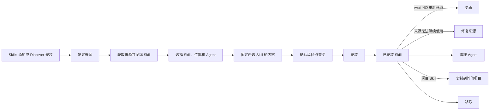

# Skill 生命周期

## 生命周期概览

Skill Deck 将包含 `SKILL.md` 的完整目录作为一个 Skill。目录还可以包含脚本、参考资料、资源文件、隐藏文件、嵌套目录和可执行文件。

安装、更新、来源修复、管理 Agent、复制和移除都需要先确认本次变更。执行前，Skill Deck 会根据最新目录、来源记录和 Agent 选择重新检查操作条件。内容快照、变更计划、写入一致性和恢复规则见[执行与恢复](./execution-and-recovery.md)。

## 从来源发现 Skill

来源（`Source`）记录 Skill 内容的获取位置及必要的版本信息。一个来源可以提供一个或多个 Skill。Skill Deck 支持以下来源输入：

- GitHub 简写、GitHub 或 GitLab URL，以及仓库中的 Skill 路径；
- 带分支、标签或 Skill 筛选条件的 Git 来源；
- SSH 和其他可以通过 Git 获取的地址；
- 应用所在系统中的本地路径；Windows 用户也可以在选择 WSL 发行版后使用其中的本地路径；
- Well-known 地址；
- 能够解析出来源、Skill 和 Agent 选择的受支持 `skills add` 命令。

Skill Deck 先解析并获取来源，再按照兼容的发现规则列出其中有效的 Skill。用户选定一个或多个 Skill 后，应用保存所选 Skill 的完整内容快照，并使用这份快照生成安装预览。获取失败时不会进入安装；来源内容或预览过期后，需要重新获取并确认。

Git 来源获取与远端引用查询共用 Git 获取超时设置，Windows 中面向 WSL Environment 执行的 Git 来源获取也使用同一设置。超时从 Git 子进程开始运行时计算，共享获取队列中的等待时间不计入其中。Git 子进程运行期间持续读取标准输出和标准错误，避免输出管道阻塞进程；应用只保留有界的末尾诊断内容，并在向界面或进度事件传递错误前清除来源 URL 中的凭据、查询参数以及常见认证字段。

来源获取失败时，Skill Deck 区分超时、网络连接、认证、仓库不存在、引用不存在和其他 Git 执行失败。只有能够确定为网络连接问题的错误使用网络失败提示；其他 Git 执行失败保留经过清理的诊断内容，供用户判断仓库或本机 Git 配置问题。

来源解析和发现顺序的兼容规则由[skills CLI 参考与兼容](./skills-cli-reference.md)维护。用户从 `Skills` 或 `Discover` 进入安装流程时已有信息和界面反馈见[产品行为与交互](./product.md#添加与安装-skill)。

## 安装

一次安装需要确定以下内容：

- 安装到全局位置还是某个已添加项目；
- 本次安装的一个或多个 Skill；
- 需要写入 Agent 专用 Skill 目录的安装选项；
- 使用符号链接（`symlink`）还是复制（`copy`）；
- 覆盖已有内容和来源风险所需的用户确认。

读取通用 Skill 目录的 Agent 可以直接发现其中的 Skill。用户选择某个 Agent 安装选项后，Skill Deck 会在对应的 Agent 专用 Skill 目录中创建链接或副本。Agent 的读取方式、安装位置分组和未知 Agent 的处理规则见[Agent 模型](./agent-model.md#agent-选择与安装位置分组)。

Eve 项目还可以选择根 Agent 或已经发现的子 Agent。Skill Deck 根据选定位置生成 Eve 所需的内容，并保存后续读取和更新所需的目标信息。具体规则见[Agent 模型](./agent-model.md#eve-专用安装目标)，兼容格式见[skills CLI 参考与兼容](./skills-cli-reference.md)。

安装流程打开时会记录本次安装位置。在 Windows 与 WSL 之间切换 Environment 或改看其他项目，不会改变已经打开的安装目标。批量安装按 Skill 分别返回结果，一个 Skill 失败不会改写其他 Skill 的结果。

## 已安装状态与读取

已安装 Skill 由所在的 Environment、Skill 位置和 Skill 名称标识。来源不是已安装 Skill 身份的一部分；它可以缺失，也可以在来源修复后发生变化。

Skill 目录提供当前内容，lock 提供来源和安装记录。Skill Deck 会分别读取两类信息：目录存在但来源记录缺失时，用户仍可查看和管理本地内容；来源记录存在但目录缺失或不可读取时，应用会显示相应的异常状态。

读取 `SKILL.md` 或其他资源时，应用根据已安装 Skill 的标识重新解析实际目录，并在读取前完成路径校验。资源读取边界见[系统架构](./architecture.md)，Skill 卡片和详情的展示规则见[产品行为与交互](./product.md#浏览已安装-skill)。

## 更新与来源修复

文档需要区分更新能力、更新检查和执行更新：

| 概念 | 含义 |
|---|---|
| 可以重新获取 | 保存的来源信息足以再次定位当前 Skill |
| 可以检查更新 | 当前来源能够提供比较版本所需的远端信息 |
| 检查结果 | 上次成功完成版本比较后得出的“有更新”或“没有更新”；检查失败和信息不足单独显示 |
| 执行更新 | 按保存的来源取得新内容，并重新安装到原 Skill 位置 |

本地来源不参与远端更新检查。远端来源信息完整时可以重新获取；缺少比较版本所需的信息时，用户可能仍可主动重新安装 Skill，但 Skill Deck 无法判断“有更新”或“没有更新”。远端版本信息的缓存、失败重试、限流和凭据规则见[更新检查](./update-checking.md)。

更新会重新安装完整 Skill 目录。指向通用 Skill 目录中该 Skill 的链接会随其一起更新；已经发生本地修改的副本默认保留，只有用户明确选择后才会覆盖。更新后继续保留已经确认的 Agent 安装位置。

来源修复用于处理本地 Skill 仍然存在，但保存的来源无法可靠定位原 Skill 的情况，例如来源信息不完整、上游目录移动或删除，或者来源已经失效。用户重新选择来源和对应 Skill 后，Skill Deck 更新来源记录并重新安装内容。上游内容已经删除时，本地 Skill 继续保留，由用户选择修复来源、保留现状或移除。

来源修复不会改变已经确认的 Agent 安装关系。只读取 Agent 专用 Skill 目录的 Agent，以及已经在专用目录中安装当前 Skill 的 Agent，修复后仍然使用原有位置。

## 管理 Agent

管理 Agent 使用通用 Skill 目录中当前 Skill 的完整内容，调整 Agent 专用 Skill 目录中的安装项：

- 选中安装选项时，创建缺失的链接或副本；
- 取消安装选项时，只移除已经确认属于当前 Skill 的安装项；
- 移除 Agent 专用 Skill 目录中的安装项后，通用 Skill 目录中的已安装 Skill 继续保留；
- 多个 Agent 使用同一实际目录时，只执行一次文件变更，并保留仍然有效的 Agent 关系。

Agent 检测结果用于提示、排序、默认推荐和界面展示。最终写入目标由用户本次确认的安装选项决定。Agent 的检测、关联关系和安装位置分组见[Agent 模型](./agent-model.md)。

## 复制到项目

复制入口用于项目中已经安装的 Skill；全局 Skill 通过安装流程进入项目。用户选择一个或多个目标项目，并为这些项目使用同一套 Agent 安装选项和安装方式。

复制直接读取当前已安装 Skill 的完整目录，不重新访问其远端来源。开始写入前，Skill Deck 会保存本次复制使用的内容快照；在 Windows 与 WSL 之间复制时，由能够直接管理目标项目文件的 Environment 完成写入。项目位置和跨文件系统访问规则见[Environment、Skill 位置与项目管理](./environments-and-projects.md#把-skill-复制到其他项目)。

来源记录作为可选信息随 Skill 内容复制：

- 来源信息完整时，目标项目保存独立的来源记录，并可以按照该来源判断后续更新能力；
- 本地来源不提供远端更新能力；
- 来源缺失或无法解释时，目标项目只保存 Skill 内容，不创建来源记录；
- 源 Skill 的内容、来源记录和更新能力不受复制结果影响。

目标项目中已有的其他 Agent 安装关系继续保留。本次选择只处理对应的安装位置，新增安装项使用用户本次选择的链接或复制方式。每个目标项目分别返回结果；一个项目失败时，其他项目的任务仍可继续执行。

## 移除

移除 Skill 会删除当前 Skill 位置下通用 Skill 目录中的已安装 Skill，以及已经确认属于该 Skill 的 Agent 专用安装项，并同步清理由 Skill Deck 管理的本地记录。多个 Agent 使用同一实际目录时，应用只处理一次该目录。

移除处理整个 Skill。用户需要保留通用 Skill 目录中的 Skill，只调整部分 Agent 的使用关系时，应使用“管理 Agent”。移除范围、路径展示和确认反馈见[产品行为与交互](./product.md#移除-skill)。

## 核心规则

1. 已安装 Skill 由 Environment、Skill 位置和 Skill 名称标识；来源信息可以缺失，只用于重新获取内容。
2. Skill Deck 先从来源发现 Skill，用户完成选择后再固定需要安装的完整内容。
3. Skill 目录和 lock 分别提供当前内容与来源记录，其中一项缺失不会被解释成另一项也不存在。
4. 更新检查成功后才能得出“有更新”或“没有更新”；检查失败时，保留上次成功检查的结果。
5. 来源修复更新来源和内容，但不改变已安装 Skill 的身份，并保持已经确认的 Agent 安装关系。
6. Agent 检测结果与用户选择分别保存；最终写入目标由用户本次确认的安装选项决定。
7. 复制使用当前已安装的完整 Skill 内容，来源信息可以随内容复制，也可以缺失。
8. 受保护写入无法确认结果一致时，应用保留恢复记录和恢复数据，由用户检查后续状态。
