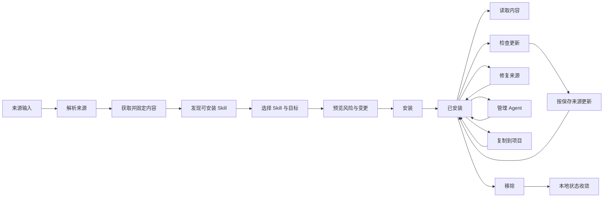

# Skill 生命周期

## 生命周期概览

Skill Deck 把 Skill 视为一个完整目录，而不是单独的 `SKILL.md`。目录可以包含 `scripts`、`references`、`assets`、隐藏文件、嵌套目录和可执行文件。来源、安装位置、Agent 目录项和 lock 元数据共同描述一个已安装 Skill，任何单项信息都不能代替完整状态。

安装、更新、来源修复、复制、管理 Agent 和移除都会先生成预览，再根据最新事实重新验证并执行。本文说明这些操作的业务语义；内容快照、变更计划、锁和恢复资源的执行规则见[执行与恢复](./execution-and-recovery.md)。

## 来源

来源（`Source`）是能够定位 Skill 内容的位置声明。支持的输入包括：

- GitHub 简写、GitHub/GitLab URL 和仓库子路径；
- 带 `branch`、`tag` 或 Skill filter 的 Git 来源；
- SSH 以及其他可通过 Git clone 获取的 URL；
- 当前 Host 或 WSL Environment 中的本地路径；
- well-known 地址；
- 可以解析出来源、Skill 和 Agent 选择的受支持 `skills add` 命令。

解析结果保留规范化后的来源、来源类型、原始 URL、`ref`、仓库子路径和 Skill filter。私有 Git 来源保留原始 SSH/URL 表达，不能为了显示统一而改写成失去认证语义的简写。来源解析器只理解输入，不执行 Git clone，也不决定目标 Agent；与上游 `skills` CLI 共用的解析规则由[skills CLI 兼容](./skills-cli-compatibility.md)负责。

## 获取与发现

来源获取属于当前执行 Environment。来源类型与 Environment 共同决定使用哪个获取后端；跨 Environment 复制时，来源 Environment 只是复制流程中的专门角色。一次获取会建立发现会话，并保存来源信息、发现到的 Skill 路径和后续生成内容快照所需的事实。

应用按与 `skills` CLI 兼容的目录根、优先级、插件清单（plugin manifest）和递归回退规则发现有效 Skill。Host 与 WSL 使用相同的选择语义，不因获取后端不同而产生两套业务结果。具体协议见[skills CLI 兼容](./skills-cli-compatibility.md)。

用户确认后，应用从发现会话固定完整 Skill 内容快照。安装、来源修复和跨 Environment 复制在进入预览前固定快照；快照固定后，执行阶段不再重新读取原始目录。快照尚未固定时获取失败，按普通来源失败处理；快照或预览失效时必须重新开始，不伪造“已准备”状态。

## 安全信息

Discover 和安装确认页可以展示来源风险、well-known 信任信息和远端安全审计结果。审计属于尽力而为的辅助信息：服务超时或不可用不会被解释为安全，也不会阻止用户查看来源。

被判定为需要保护的来源，必须由用户明确确认风险后才能执行安装。来源、目标或预览发生变化后，需要重新确认。

## 安装

安装请求包含目标 Context、一个或多个已获取的 Skill、目标 Agent、Eve 等专用适配目标，以及用户选择的 `symlink` 或 `copy` 方式和必要的覆盖确认。

每个 Context 中都有一份主 Skill 目录。读取通用 Skill 目录的 Agent 不需要重复创建自己的目录项；只读取自身 Skill 目录的 Agent，则在该位置建立目录项。读取能力、目标分组和目录项含义见[Agent](./agents.md#目标选择与目录分组)。

Eve 项目使用专用适配目标：用户可以选择 root Agent 或已经发现的 subagent。安装时从固定的 Skill 内容快照生成与 `skills` CLI 兼容的 Eve 内容，并在 Project lock 中记录目标；后续读取和更新按该记录恢复同一位置。具体规则见[Agent](./agents.md#eve-适配目标)和[skills CLI 兼容](./skills-cli-compatibility.md)。

`symlink` 和 `copy` 是本次安装的落盘方式，不属于 Agent 定义。链接创建失败时，后端不会擅自改用 copy；本次操作返回失败，用户重新预览后可以改选 copy。平台差异和写入一致性见[执行与恢复](./execution-and-recovery.md)。

成功安装后，主 Skill 目录、必要的 Agent 目录项和本次拥有的 lock 变更保持一致。批量安装按 Skill 返回独立结果，部分 Skill 成功不会覆盖其他 Skill 的失败结果。

## 已安装状态与读取

已安装 Skill 的展示综合当前 Context 的目录事实、lock 元数据、来源信息、`skillPath`、哈希基线和 Environment 状态。目录存在不等于 lock 完整，lock 存在也不证明目录仍可读取；列表保留这类不完整状态，并提供查看、修复或移除入口，不静默补造来源信息。

读取 `SKILL.md` 或打开资源时，应用根据 Skill 标识和 Context 重新解析实际目录。展示路径不是读取授权；资源读取的类型和授权边界见[系统架构](./architecture.md)。

## 更新检查与重新安装

更新能力、更新检查结果和更新执行是三个不同概念：

| 概念 | 含义 |
|---|---|
| 可以重新安装 | 保存的来源、`ref` 和 `skillPath` 足以再次获取当前 Skill |
| 可以检查更新 | 当前来源类型具有可比较的远端版本证据 |
| 检查结果 | 本次检查得到有更新、没有更新、来源不可达、上游已删除或信息不足 |
| 执行更新 | 按保存的来源获取新内容，并按当前目标重新安装 |

本地（`Local`）来源没有自动更新能力，也不进入远端更新检查。远端（`Remote`）、Git 和 Well-known 来源在来源信息完整时可以重新获取；跨 Environment 复制后，更新直接在目标存储归属环境获取来源，不回到原来源 Environment。没有可比较版本证据的来源仍可能支持用户主动重新安装，但界面不能把它说成已经完成更新检查。

更新不是增量补丁，而是按保存的来源、`ref` 和仓库相对的 `skillPath` 重新安装完整目录。不能因为名称相同就改装来源中的另一个目录。指向主目录的链接会随主目录生效；已有副本如果发生本地修改，默认保留，只有用户明确选择后才覆盖。更新不会因为注册表中存在某个 Agent 就凭空新建缺失的目录项。

检查失败不等于“没有更新”，来源暂时不可达也不显示为“已是最新”。详细的哈希、lock 字段和上游差异见[skills CLI 兼容](./skills-cli-compatibility.md)；预览、执行和批量结果见[执行与恢复](./execution-and-recovery.md)。

## 来源修复

来源修复用于处理 Skill 仍在本地、但普通更新无法可靠定位上游的情况，例如 lock 缺少 `skillPath`、上游目录发生移动或删除、来源失效，或私有来源信息不足。

修复使用独立的来源修复流程，但复用正常的获取、准备、预览和安装链路。用户重新选择来源后，应用重新发现 Skill 并生成新的预览；不会只凭 Skill 名称猜测远端目录，也不会在后台自动删除上游已经不存在的本地 Skill。

修复中如果受保护写入未能确认文件与 lock 一致，操作会保留恢复资源，并将该结果与普通失败区分。用户可以在恢复入口中检查相关文件，具体边界见[执行与恢复](./execution-and-recovery.md)；修复不会续跑已经中断的旧计划。

## 管理 Agent

管理 Agent 只调整当前已安装 Skill 的 Agent 目录项，不重新获取来源：

- 添加目标时，用当前主 Skill 内容创建缺失的目录项；
- 移除目标时，只处理目录检查确认属于当前 Skill 的目录项；
- 清理额外目录项不会删除通用 Skill 目录中的主 Skill；
- 多个 Agent 指向同一实际目录时只执行一次物理变更，同时保留仍有效的 Agent 关系。

单个 Skill 的主目录、Agent 目录项和相关 lock 变更作为一个整体处理；多个 Skill 或 Project 组成的批次才可能出现部分完成。目标分组、检测和关联 Agent 的含义见[Agent](./agents.md)，写入一致性见[执行与恢复](./execution-and-recovery.md)。

## 复制到项目

复制以一个 Project Context 中已经安装的 Skill 为来源，选择一个目标 Environment 中的一个或多个 Project Context。Global Skill 不进入复制流程，一次批次不能混合不同目标 Environment。目标 Environment 必须是目标项目路径的存储归属环境；来源 Environment 可以不同。

复制传递完整 Skill 内容，包括嵌套目录、脚本和元数据。跨 Environment 时，来源先固定内容快照，再把受控内容交给目标 Environment；快照固定后来源 Environment 或来源 Project 断开，不影响本次执行，目标 Environment 仍必须在线并负责最终写入。

复制资格由后端预览统一判断，不能由列表中的更新状态或来源展示字段提前否决。来源记录缺失或无法解释时，复制流程提供来源修复入口；修复成功后提示用户重新点击复制，由新的预览重新确认事实，不自动继续写入。

每个目标 Project 独立返回结果，目标读取失败、路径冲突、覆盖风险或存储能力不足只影响对应目标。部分完成时，下一次重试只保留尚未成功且适合重试的目标；需要检查相关文件的目标保留独立恢复入口。

复制成功后：

- 远端（`Remote`）、Git 和 Well-known 来源的目标 Project 保留来源、`ref`、Skill 路径和更新基线；之后的更新直接在目标存储归属环境重新获取来源；
- 本地（`Local`）来源只保留路径和内容基线作为来源凭据，不具备自动更新能力，这是预期行为，不增加复制专用的提示或同步机制。

复制不会改变源 Skill 的更新能力，也不要求来源 Environment 或来源 Project 持续存在。

## 移除

移除预览展示通用 Skill 目录和当前确认属于该 Skill 的 Agent 目录项。用户确认后，应用删除这些位置，并同步清理由 Skill Deck 管理的本地记录。移除不提供部分 Agent 选择；如果只想调整某些 Agent 的接入，应使用管理 Agent。

多个 Agent 使用同一实际目录时，应用只处理一次物理目录，并在结果中保留仍有效的 Agent 关系。界面只区分软连接和副本，不要求用户理解平台底层链接类型。

移除不是“禁用”。Skill Deck 没有独立的禁用状态，用户通过安装、移除或调整 Agent 适配改变可用范围。

## 状态原则

- 来源、Skill 路径、Context 和 Environment 共同组成业务身份，Skill 名称主要用于展示；
- 发现会话和内容快照是临时事实，lock 与已安装目录构成长期本地状态；
- 检测不能代替用户对 Agent 的显式选择，目录检查也不能代替 lock 元数据；
- 更新检查失败不等于没有更新，上游删除不等于应删除本地内容；
- 来源修复复用正常安装链路，管理 Agent 复用当前主 Skill 内容；
- 受保护写入无法确认一致时，返回需要检查的结果并保留恢复资源；单个 Skill 不用“部分完成”掩盖中间状态。
